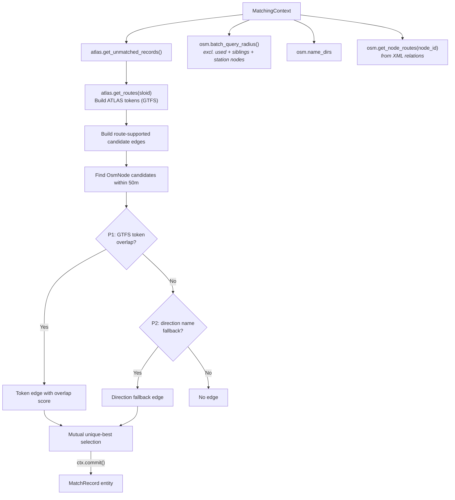

# Route Matching

Route matching is the **fourth predicate run** in the pipeline, before the distance-matching block, and correlates ATLAS platforms with OSM nodes based on **shared GTFS transit routes and directions**.

## Overview

While the previous predicates rely on exact UICs or names, **Route Matching** provides an earlier disambiguation layer before the purely distance-driven predicates run.

Importantly, this is still a **spatial, stop-to-stop matching process**, not just linking abstract routes. For every unmatched ATLAS stop, the predicate looks for unmatched OSM stops within a 50m radius. Route data acts as the proof that two physically close points are indeed the same stop, but the predicate is intentionally conservative: it only commits route-supported edges that are the **unique strongest choice on both sides**. Candidate collection uses `batch_query_radius(..., include_stations=False)`, which excludes `public_transport=station` and `railway=station`; `aerialway=station` stays eligible because `OsmNode.is_station` explicitly returns `False` for aerialway stations.

**Result**: {{stat:matching_stages.route.count}} route-based matches

Unlike the exact, name, and distance predicates, route matching builds a global set of route-supported candidate edges and commits only mutual unique-best edges. This prevents the old greedy behavior where the first route-compatible ATLAS row could consume an OSM node even when another unmatched ATLAS stop had stronger route evidence.

## Required Data

Route matching relies entirely on data owned by the state layer — the predicate performs no file I/O:

- `OsmNode` candidates found via batched `OsmState.batch_query_radius()` within `max_distance`
- `OsmState.name_dirs` — per-node direction strings (parsed from XML relations)
- `OsmState._node_routes` via `ctx.osm.get_node_routes(node_id)` — per-node GTFS route memberships derived from OSM XML relations during `OsmState.from_xml_file()`
- `AtlasState._routes_by_sloid` via `ctx.atlas.get_routes(sloid)` — GTFS route entries loaded from `atlas_routes.csv`, `atlas_route_directions.csv`, and `atlas_route_stops.csv` during `AtlasState.from_dataframe()`

## Token-Based Matching

Route data is converted into comparable tokens. The predicate tries two priority levels:

### P1: GTFS Route-ID Tokens

The predicate primarily compares per-stop GTFS route tokens that are already loaded into `AtlasState` and `OsmState`:

- **ATLAS Tokens**: `{(route_id_normalized, direction_id)}` built from the normalized GTFS route CSVs. Rows without both fields are skipped.
- **OSM Candidates**: For each nearby node, `ctx.osm.get_node_routes(node_id)` contributes `(gtfs_route_id, direction_id)` and `(normalize_route_id(gtfs_route_id), direction_id)` tokens derived from the XML relation pass.

If `RouteState` already contains an in-process mapping for an OSM relation ID, the predicate also adds that mapped ATLAS route ID and its normalized form to the OSM candidate token set before intersecting it with the ATLAS tokens.

Normalized route IDs are therefore carried on the ATLAS side in `atlas_routes.csv` and computed on the OSM side at match time. `RouteState` uses the same normalization helper when it is populated.

If `ref_trips` does not yield a direction, OSM route extraction currently emits both direction buckets (`0` and `1`) for that relation membership so route-id evidence can still participate.

### P2: Name-Based Direction Fallback

ATLAS direction names are compared against OSM route relation direction strings (first/last member names like `"Zurich HB → Bern"`), stored in `OsmState.name_dirs`. The current implementation checks exact direction-string membership.

## Selection Rule

The predicate does not match greedily per ATLAS row.

1. Build every candidate token edge within 50 m and score it by GTFS token overlap size.
2. For each ATLAS stop, keep only its unique best-scoring token edge.
3. For each OSM node, keep only its unique best-scoring token edge.
4. Commit only edges that are unique-best from both directions.
5. If no token edge survives for an entity, retry the same mutual unique-best rule using exact direction-name fallback edges.
6. If the best score is tied, that ambiguity is left unmatched so later distance predicates can decide.

## Data Sources

| Source | File / Origin | Loaded by | Description |
|--------|--------------|-----------|-------------|
| GTFS routes | `data/processed/atlas_routes.csv` (and related normalized files) | `AtlasState` | Timetable-derived route entries per SLOID for stop-level matching |
| OSM routes | OSM XML relations | `OsmState.from_xml_file()` | Route memberships per OSM node (via relation ID) |
| Equivalency cache | `data/processed/atlas_routes.csv` + `data/processed/osm_routes.csv` | `RouteState` | Optional atlas-route crosswalk, primarily populated by the route import path |

## Related Documentation

- [1.2 GTFS](1.2%20GTFS%20ATLAS%20data.md) – GTFS route extraction
- [1.3 OSM data](1.3%20OSM%20data.md) – OSM route extraction
- [1.4 Route-Route Matching](1.4%20Route-Route%20Matching.md) – Route-level ATLAS↔OSM linking in importer

(Route provenance is tracked in the output via `match_type`: `route_gtfs_tokens` for token-overlap matches and `route_gtfs_direction` for exact direction-name fallback matches.)

## When Route Matching Succeeds

Route matching is particularly effective for:

1. **Platforms without UIC**: Some `OsmNode` entities lack `uic_ref` but have route memberships
2. **Ambiguous proximity**: When multiple `OsmNode` entities are nearby, shared routes disambiguate
3. **Direction conflicts**: When nearby ATLAS platforms share a UIC but serve opposite directions, route evidence prevents early distance locking from picking the wrong side

## Code Reference

| Class / Method | Description |
|----------------|-------------|
| `RouteMatchPredicate` | Predicate class; leverages `RouteState` and `batch_query_radius()` |
| `ctx.atlas.get_routes(sloid)` | Returns ATLAS route assignments for a SLOID |
| `ctx.osm.get_node_routes(node_id)` | Returns relation memberships for an OSM node |
| `RouteState.get_atlas_route()` | Returns the mapped ATLAS route for a given OSM relation ID |

All predicate logic is in [predicates/route_matching_gtfs.py](../matching_and_import_db/predicates/route_matching_gtfs.py). Route state logic lives in [route_state.py](../matching_and_import_db/route_state.py).
