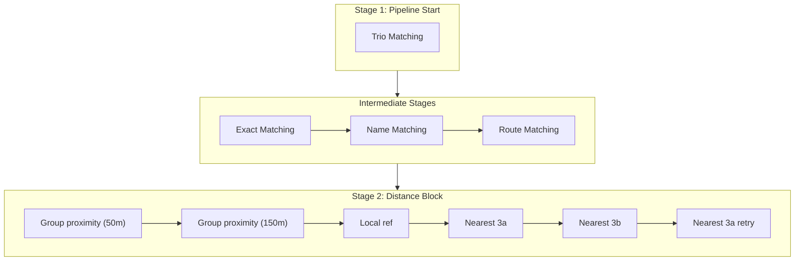
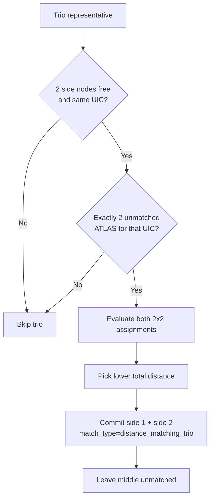
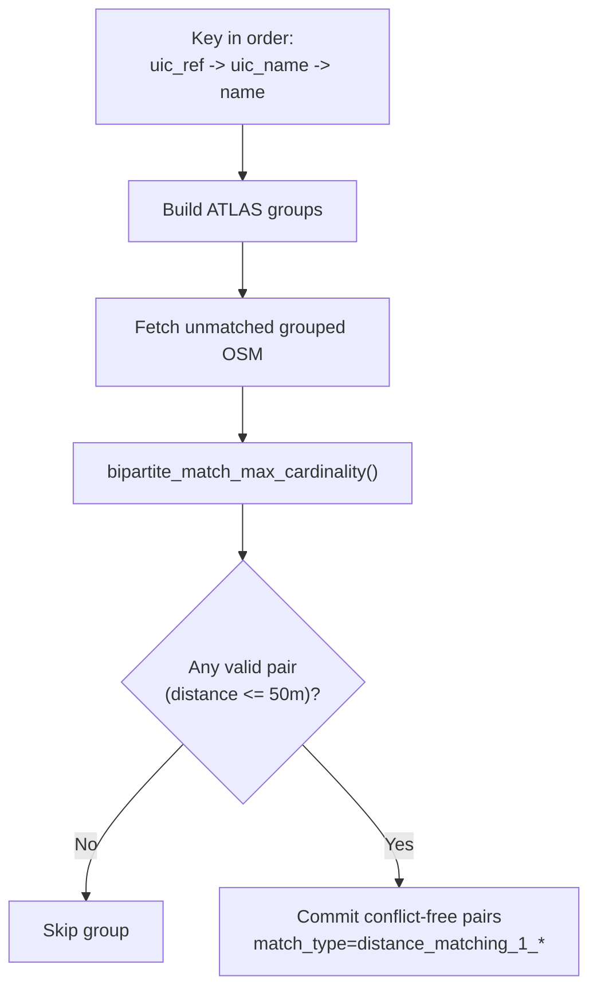
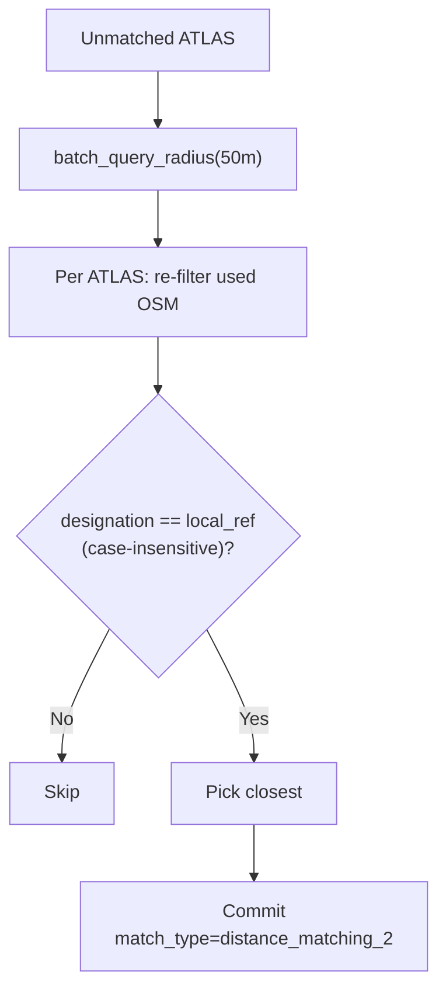
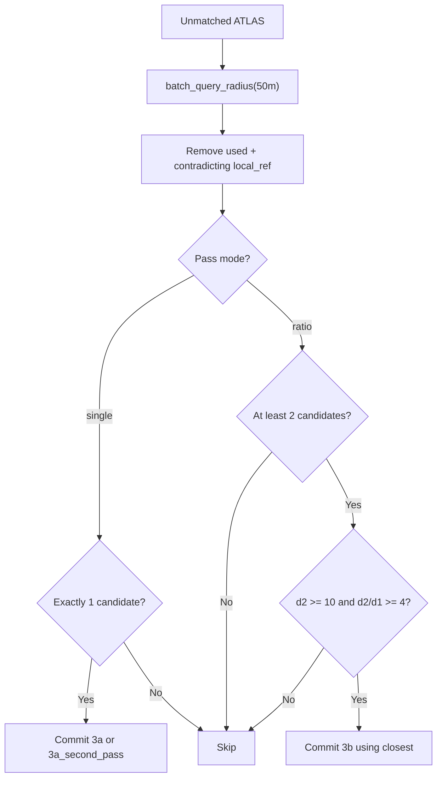

# Distance Matching

Distance matching uses spatial proximity to produce matches. It consists of **five predicate classes** contributing **seven sequential predicate runs**. 

> [!IMPORTANT]
> **Trio matching** runs as the **absolute first predicate** in the pipeline. The remaining distance predicates run at the end of the pipeline (after route matching), progressively loosening the matching constraints.



## Overview

| Predicate Class | match_type | Matches |
|-----------------|------------|---------|
| `TrioDistanceMatchingPredicate` | `distance_matching_trio` | {{stat:matching_stages.distance.breakdown.stage0_trio}} |
| `GroupProximityPredicate` | `distance_matching_1_*` | {{stat:matching_stages.distance.breakdown.stage1_group}} |
| `LongDistanceGroupProximityPredicate` | `long_distance_group_proximity_*` | {{stat:matching_stages.distance.breakdown.stage1b_long_group}} |
| `LocalRefDistancePredicate` | `distance_matching_2` | {{stat:matching_stages.distance.breakdown.stage2_local_ref}} |
| `NearestDistancePredicate` (single pass 1) | `distance_matching_3a` | {{stat:matching_stages.distance.breakdown.stage3a_single_pass1}} |
| `NearestDistancePredicate` (ratio) | `distance_matching_3b` | {{stat:matching_stages.distance.breakdown.stage3b_relative}} |
| `NearestDistancePredicate` (single pass 2) | `distance_matching_3a_second_pass` | {{stat:matching_stages.distance.breakdown.stage3a_single_pass2}} |

**Total**: {{stat:matching_stages.distance.count}} distance matches

## Predicates

Distance matching contributes seven sequential predicate executions in the pipeline: trio, group proximity at 50m, group proximity at 150m, local-ref, nearest 3a, nearest 3b, and nearest 3a retry. These runs do **not** execute in parallel. Each run operates on `AtlasNode` and `OsmNode` domain entities and records matches via `ctx.commit()`. The runner refreshes unmatched records between calls, so every stage sees the updated post-commit state.

## TrioDistanceMatchingPredicate - Trio Side Matching First



This stage runs before all other distance predicates.

For each pre-grouped trio (`osm_trio`):

Before this predicate even runs, trio registration already enforces one spatial locality guard: both non-middle side nodes must be within `15 m` of the middle `stop_position`. If that guard fails, the UIC is not treated as a trio and the nodes remain available for the later pair-grouping paths.

1. Identify the two side nodes and the explicit middle node from trio metadata.
2. Read unmatched ATLAS rows for the trio UIC.
3. Continue only if exactly two ATLAS rows are available.
4. Evaluate both possible 2x2 assignments and choose the one with lower total haversine distance.
5. Keep the middle node intentionally unmatched in this stage.

All matches created here use `match_type = distance_matching_trio`.

If a trio does not satisfy the cardinality constraints at execution time, the predicate skips it and leaves later stages to decide.

## GroupProximityPredicate - Group-Based Conflict-Free Assignment (50m)



Tries three grouping strategies in order:
1. **UIC reference**: `AtlasNode.uic_ref` ↔ `OsmNode.uic_ref`
2. **UIC name**: `AtlasNode.designation_official` ↔ `OsmNode.uic_name`
3. **Official name**: `AtlasNode.designation_official` ↔ `OsmNode.name`

For each group, calls the shared `bipartite_match_max_cardinality()` helper.

Matching objective inside each group is deterministic and conflict-free:

1. Maximize number of matched pairs with distance <= 50m.
2. Among those maximum-cardinality solutions, minimize total matched distance.

This allows **partial group matching**: if a group contains outliers, matchable rows are still committed and only rows without valid edges remain unmatched.

The helper builds a full pairwise haversine distance matrix using **numpy broadcasting** and solves a one-to-one assignment with dummy unmatched slots using `scipy.optimize.linear_sum_assignment`.

Grouped lookup is representative-aware: when an OSM representative has siblings, the representative is indexed by key values found on itself and on its siblings. This preserves UIC/name anchor visibility after pre-grouping.

The current implementation does not perform a separate stop-position-only retry. It groups whatever unmatched, non-station OSM entities are available in `OsmState` for the active key and attempts a single conflict-free bipartite assignment.

## LongDistanceGroupProximityPredicate - Same Group Logic at 150m

This second pass reuses the exact same grouping keys, grouped OSM lookups, and `bipartite_match_max_cardinality()` helper as the first group-proximity stage.

The only behavioral difference is the distance cap:

1. The original group stage only accepts edges with distance <= `50m`.
2. The second group stage accepts edges with distance <= `150m`.
3. It runs after the 50m stage, so it only considers ATLAS and OSM entities that remain unmatched after the stricter pass.

It keeps the same key order:

1. `uic_ref`
2. `uic_name`
3. `name`

All matches created here use `match_type = long_distance_group_proximity_*`:

1. `long_distance_group_proximity_uic_ref`
2. `long_distance_group_proximity_uic_name`
3. `long_distance_group_proximity_name`

This preserves the existing strict-first pipeline while adding a second conflict-free group assignment stage for longer-distance candidates.

## LocalRefDistancePredicate - Exact local_ref Within Radius



Matches where `AtlasNode.designation` exactly equals `OsmNode.local_ref`, case-insensitively, within 50m. Uses KDTree spatial index via `batch_query_radius()` to find nearby candidates. When multiple candidates match, the closest wins.

Before picking a winner, the current implementation now re-validates the batched candidate list against the live `used_ids` set. This is necessary because earlier rows in the same predicate run can consume an `OsmNode` after the original batch query was computed.

## NearestDistancePredicate - Single Candidate / Ratio Test / Single Retry



**local_ref contradiction filter**: Before evaluating candidates, any `OsmNode` whose `local_ref` contradicts the `AtlasNode.designation` is excluded (case-insensitive comparison). If either value is empty, no contradiction exists and the candidate passes through. This prevents false matches where a nearby OSM node clearly belongs to a different stop.

The predicate is executed three times in the pipeline:

1. **Pass 1 (3a)**: single-candidate only
2. **Pass 2 (3b)**: ratio-test only
3. **Pass 3 (3a retry)**: single-candidate only

Pass 3 exists to capture ATLAS rows that become unambiguous only after pass 2 consumes a competing OSM candidate.

Two decision sub-cases:

**Case 3a — Single candidate**: If exactly **one** non-contradicting, unused `OsmNode` that passes `OsmNode.is_station` filtering exists within 50m of an `AtlasNode` → match (`distance_matching_3a` on pass 1, `distance_matching_3a_second_pass` on pass 3).

**Case 3b — Ratio test**: When multiple non-contradicting candidates exist within 50m, applies a ratio test to determine if the closest is sufficiently closer than the second-closest:

```
Match if:  d₂ ≥ 10m  AND  d₂ / d₁ ≥ 4
```

| Candidate | Distance | Decision |
|-----------|----------|----------|
| OSM A | 5m | Matched (d₂/d₁ = 25/5 = 5 ≥ 4) |
| OSM B | 25m | — |
| OSM C | 40m | — |

Constants: `RATIO_TEST_MIN_D2 = 10` metres, `RATIO_TEST_FACTOR = 4`.

## Commit-Safe Candidate Revalidation

`LocalRefDistancePredicate` and `NearestDistancePredicate` both use a batched KDTree query for performance, but they no longer trust that batch blindly until commit time.

The important sequence is:

1. `batch_query_radius()` returns candidate snapshots for all unmatched ATLAS rows.
2. The predicate loop processes those rows one by one.
3. `ctx.commit()` immediately marks the chosen OSM representative as used.
4. Later rows re-filter their old candidate snapshot against the current `used_ids` set before deciding whether they have 0, 1, or multiple candidates.

Without this revalidation step, a later row could incorrectly treat an already-consumed OSM representative as its only candidate and produce a bad `distance_matching_3a` match.

## Spatial Index: KDTree

The local-ref and nearest-distance predicates use a **KDTree** spatial index for efficient radius queries, built on **unit-sphere coordinates** (3D xyz) rather than raw lat/lon. Group proximity instead builds a pairwise distance matrix, while trio matching evaluates its two possible assignments directly with haversine distances.

The `LocalRefDistancePredicate` and `NearestDistancePredicate` use **batched queries**: all unmatched `AtlasNode` coordinates are collected into a list and passed to `OsmState.batch_query_radius()`, which calls `query_ball_point(points, workers=-1)` once — delegating the entire loop to SciPy's multithreaded C backend.

```python
# Batched query (used by LocalRefDistancePredicate, NearestDistancePredicate)
coords = [(e.lat, e.lon) for e in unmatched]
batch_candidates = ctx.osm.batch_query_radius(coords, ctx.max_distance)
```

The spatial index is built once from available nodes that pass the current `include_stations` / `OsmNode.is_station` filter and reused across queries. `used_ids` and sibling nodes are filtered at query time, not at build time. Implementation is in [utils/spatial_index.py](../matching_and_import_db/utils/spatial_index.py) and [state.py](../matching_and_import_db/state.py).

## No-Nearby-OSM Detection

After all predicates complete, the importer flags unmatched ATLAS entries that have no OSM node at all within 50m. This does not create matches — it identifies entries for problem detection.

## Used-Node Prevention

**No single OSM representative** is matched more than once within the distance predicates — `ctx.commit()` immediately locks nodes via `mark_used()`, and later rows re-check that live state before committing. However, this does not imply a strict 1:1 relationship at the station level: since OSM often includes multiple nodes for a single stop (e.g. `platform` and `stop_position`), the distance matching process can validly match these distinct `OsmNode` entities to separate `AtlasNode` entries.

## Code Reference

| Class / Function | Description |
|------------------|-------------|
| `TrioDistanceMatchingPredicate` | Trio-first distance matching for side nodes with explicit middle-node exclusion |
| `GroupProximityPredicate` | Conflict-free maximum-cardinality proximity assignment within UIC/name groups |
| `LocalRefDistancePredicate` | Exact `local_ref` matching within 50m radius (batched KDTree queries) |
| `NearestDistancePredicate` | Multi-pass nearest matching: 3a pass 1, 3b ratio, 3a pass 2 (batched KDTree queries) |
| `bipartite_match_max_cardinality(atlas, osm, max_distance)` | Shared helper: vectorized distance matrix + max-cardinality min-distance assignment |

Distance predicates are in [predicates/distance_matching.py](../matching_and_import_db/predicates/distance_matching.py) plus [predicates/trio_distance_matching.py](../matching_and_import_db/predicates/trio_distance_matching.py), with spatial utilities in [utils/spatial_index.py](../matching_and_import_db/utils/spatial_index.py) and [state.py](../matching_and_import_db/state.py).
