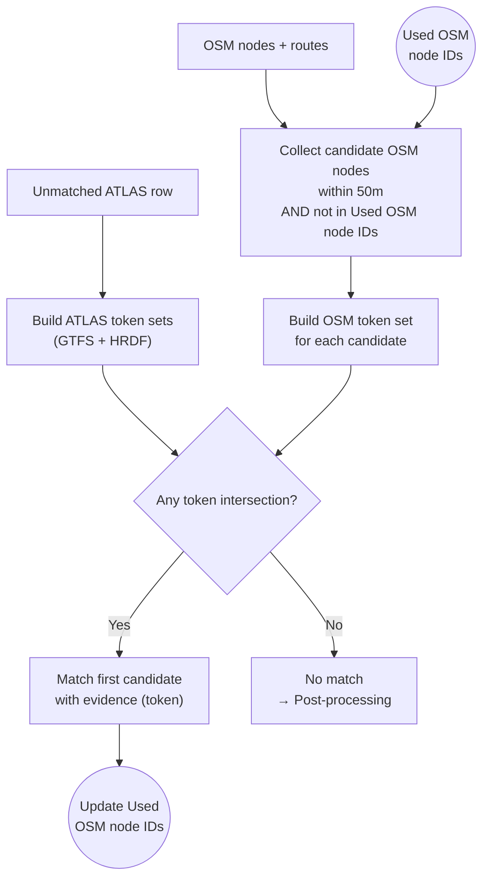

# Route Matching

Route matching is the **fourth stage**, correlating ATLAS platforms with OSM nodes based on **shared transit routes and directions**.

## Overview

When spatial proximity fails, route information provides an alternative: if an ATLAS platform and an OSM node share **the same transit lines in the same directions**, they likely represent the same stop.

**Result**: 6,944 route-based matches

## Inputs / Outputs

**Input**
- ATLAS: precomputed route entries (from `atlas_routes_unified.csv`) for the ATLAS stop/UIC
- OSM: per-node route memberships (from `osm_nodes_with_routes.csv`) + optional directions from the OSM XML
- State: `used_osm_node_ids` from earlier stages

**Operational constraint**
- Route matching only considers OSM nodes within `max_distance` (default **50m**) and excludes already-used nodes.

## Token-Based Matching

Route data is converted into comparable tokens and intersections are found:

### ATLAS Tokens
| Priority | Source | Token Format |
|----------|--------|--------------|
| P1 | GTFS | `(route_id, direction_id)` |
| P2 | GTFS | `(route_id_normalized, direction_id)` |
| P3 | HRDF | `(line_name, direction_uic)` |
| P4 | HRDF | `(line_name, direction_name)` |

### OSM Tokens
- `(ref, from_station)` / `(ref, to_station)`
- `(name, uic_ref)` when route has UIC reference

## Data Sources

| Source | File | Description |
|--------|------|-------------|
| GTFS | `atlas_routes_unified.csv` | Timetable-derived routes |
| HRDF | `atlas_routes_unified.csv` | Railway-specific route data |
| OSM | `osm_nodes_with_routes.csv` | Route relations referencing nodes |

## Related Documentation

- [1.1.1 GTFS](1.1.1%20GTFS%20ATLAS%20data.md) – GTFS route extraction
- [1.1.2 HRDF](1.1.2%20HRDF%20ATLAS%20data.md) – HRDF route parsing
- [1.2 OSM data](1.2%20OSM%20data.md) – OSM route extraction

(Route provenance is tracked in the output via `match_type` and accompanying evidence fields.)

## When Route Matching Succeeds

Route matching is particularly effective for:

1. **Platforms without UIC**: Some OSM nodes lack `uic_ref` but have route memberships
2. **Ambiguous proximity**: When multiple OSM nodes are nearby, shared routes disambiguate
3. **Distant matches**: Platforms that aren't spatially close but serve identical routes

## Code Reference

| Component | File | Function |
|-----------|------|----------|
| Main matcher | [route_matching_unified.py](../matching_process/route_matching_unified.py) | `perform_unified_route_matching()` |
| Token builder | [route_matching_unified.py](../matching_process/route_matching_unified.py) | `build_atlas_route_tokens()`, `build_osm_route_tokens()` |
| Route generation | [get_atlas_data.py](../Download_and_process_data/get_atlas_data.py) | `write_unified_routes_csv_direct()` |
| OSM route extraction | [get_osm_data.py](../Download_and_process_data/get_osm_data.py) | Route relation parsing |
