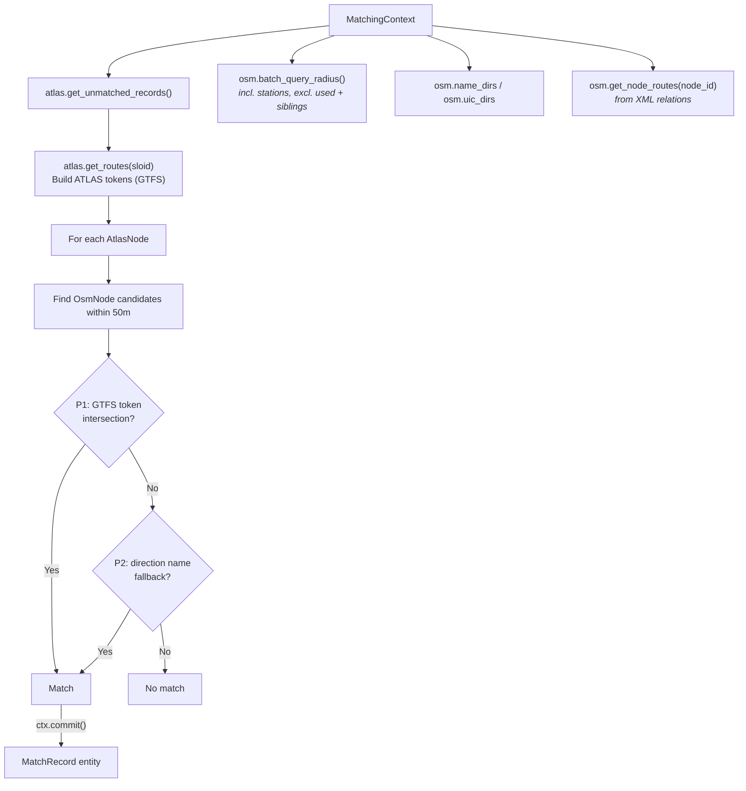

# Route Matching

Route matching is the **fourth stage**, correlating ATLAS platforms with OSM nodes based on **shared GTFS transit routes and directions**.

## Overview

When spatial proximity fails, route information provides an alternative: if an ATLAS platform and an OSM node share strong GTFS route-token evidence or compatible direction-name evidence, they likely represent the same stop.

**Result**: {{stat:matching_stages.route.count}} route-based matches

## Important Concept

Unlike the exact, name, and distance predicates, route matching does **not** filter out `is_station` nodes. Station-level `OsmNode` entities can still be matched via route tokens (the predicate calls `batch_query_radius()` with `include_stations=True`).

Like the distance predicates, route matching now re-validates each batched candidate list against the current `used_ids` set before selecting a match. This prevents an OSM representative consumed earlier in the same predicate run from being re-used by a later ATLAS row.

## Required Data

Route matching relies entirely on data owned by the state layer — the predicate performs no file I/O:

- `OsmNode` candidates found via batched `OsmState.batch_query_radius()` within `max_distance`
- `OsmState.name_dirs` / `OsmState.uic_dirs` — per-node direction strings (loaded from `osm_directions.csv` sidecar or parsed from XML relations)
- `OsmState._node_routes` via `ctx.osm.get_node_routes(node_id)` — per-node GTFS route memberships derived from OSM XML relations during `OsmState.from_xml_file()`
- `AtlasState._routes_by_sloid` via `ctx.atlas.get_routes(sloid)` — GTFS route entries loaded from `atlas_routes_unified.csv` during `AtlasState.from_dataframe()`

## Token-Based Matching

Route data is converted into comparable tokens. The predicate tries two priority levels:

### P1: GTFS Token Intersection

ATLAS tokens: `{(route_id_normalized, direction_id)}`
OSM tokens: `{(gtfs_route_id, direction_id), (normalized_gtfs_route_id, direction_id)}`

Route IDs are normalized by replacing journey numbers (`-j123` → `-jXX`) so different journeys on the same line match.

### P2: Name-Based Direction Fallback

ATLAS direction names are compared against OSM route relation direction strings (first/last member names like `"Zurich HB → Bern"`), stored in `OsmState.name_dirs`. The current implementation uses substring containment rather than strict equality.

## Data Sources

| Source | File / Origin | Loaded by | Description |
|--------|--------------|-----------|-------------|
| GTFS | `data/processed/atlas_routes_unified.csv` | `AtlasState.from_dataframe()` | Timetable-derived routes per SLOID |
| OSM routes | OSM XML relations (`gtfs:route_id`, `ref_trips`) | `OsmState.from_xml_file()` | Route memberships per OSM node, derived in the relation pass |
| OSM Dirs | `data/processed/osm_directions.csv` (or XML fallback) | `OsmState.from_xml_file()` | Direction strings derived from relation first/last node ordering |

## Related Documentation

- [1.2 GTFS](1.2%20GTFS%20ATLAS%20data.md) – GTFS route extraction
- [1.3 OSM data](1.3%20OSM%20data.md) – OSM route extraction
- [3. Route-Route Matching](3.%20Route-Route%20Matching.md) – Route-level ATLAS↔OSM linking in importer

(Route provenance is tracked in the output via `match_type` — currently `route_unified_gtfs` — and accompanying evidence in `notes`.)

## When Route Matching Succeeds

Route matching is particularly effective for:

1. **Platforms without UIC**: Some `OsmNode` entities lack `uic_ref` but have route memberships
2. **Ambiguous proximity**: When multiple `OsmNode` entities are nearby, shared routes disambiguate
3. **Station-level recovery within the 50 m search radius**: When platform-level predicates fail, shared route evidence can still match a nearby station or stop node

## Code Reference

| Class / Method | Description |
|----------------|-------------|
| `RouteMatchPredicate` | Predicate class; builds tokens, finds candidates via KDTree, matches by priority |
| `ctx.atlas.get_routes(sloid)` | Returns `{'gtfs': [...]}` route entries for a SLOID |
| `ctx.osm.get_node_routes(node_id)` | Returns `[{gtfs_route_id, direction_id, route_name}, ...]` for an OSM node |
| `normalize_route_id()` | Normalizes journey numbers in route IDs (from `utils.route_id`) |

All predicate logic is in [predicates/route_matching_unified.py](../matching_and_import_db/predicates/route_matching_unified.py). Route data loading lives in [state.py](../matching_and_import_db/state.py).
