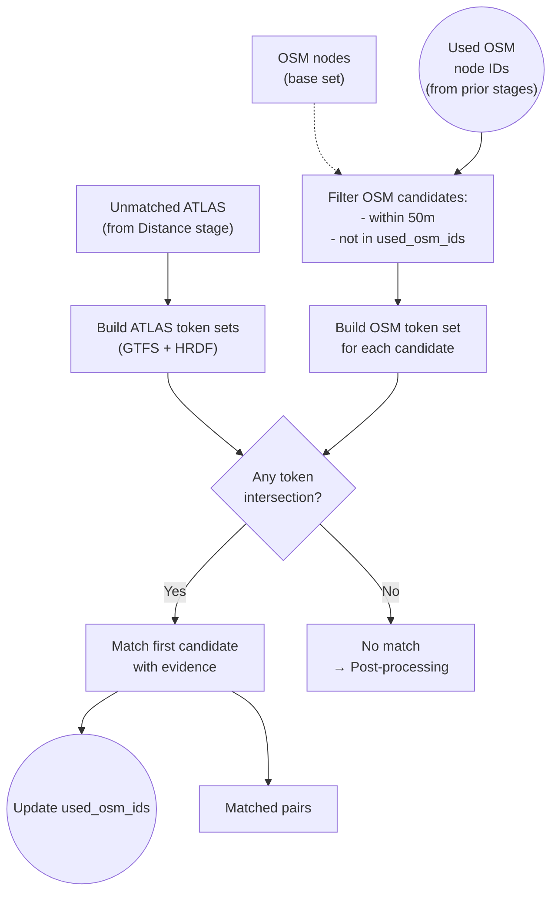

# Route Matching

Route matching is the **fourth stage**, correlating ATLAS platforms with OSM nodes based on **shared transit routes and directions**.

## Overview

When spatial proximity fails, route information provides an alternative: if an ATLAS platform and an OSM node share **the same transit lines in the same directions**, they likely represent the same stop.

**Result**: {{stat:matching_stages.route.count}} route-based matches

## Important Concept

Unlike the exact, name, and distance predicates, route matching does **not** filter out `railway=station` nodes. Station-level nodes can still be matched via route tokens.

## Required Data

Route matching relies on the following data:

**Internal Context:**
- `osm_nodes`: full OSM node set (used via KDTree spatial index for candidates within `max_distance`)
- `osm_xml_file`: path to the raw OSM XML (parsed for route relation direction info)

**External Data** (loaded by the predicate):
- `atlas_routes_unified.csv`: precomputed ATLAS route entries (GTFS + HRDF sources)
- `osm_nodes_with_routes.csv`: per-node route memberships from OSM route relations
- OSM XML: parsed for direction strings from route relation member ordering

## Token-Based Matching

Route data is converted into comparable tokens. The predicate tries three priority levels:

### P1: GTFS Token Intersection

ATLAS tokens: `{(route_id, direction_id), (route_id_normalized, direction_id)}`
OSM tokens: `{(gtfs_route_id, direction_id), (normalized_gtfs_route_id, direction_id)}`

Route IDs are normalized by replacing journey numbers (`-j123` → `-jXX`) so different journeys on the same line match.

### P2: HRDF UIC Direction

ATLAS tokens: `{(line_name, direction_uic)}`
Matched against direction UIC strings extracted from OSM route relations (first/last member UIC refs).

### P3: Name-Based Direction Fallback

ATLAS direction names compared against OSM route relation direction strings (first/last member names like `"Zürich HB → Bern"`).

## Data Sources

| Source | File | Description |
|--------|------|-------------|
| GTFS | `data/processed/atlas_routes_unified.csv` | Timetable-derived routes |
| HRDF | `data/processed/atlas_routes_unified.csv` | Railway-specific route data |
| OSM | `data/processed/osm_nodes_with_routes.csv` | Route relations referencing nodes |
| OSM XML | `data/raw/osm_data.xml` | Direction info from relation member ordering |

## Related Documentation

- [1.2.1 GTFS](1.2.1%20GTFS%20ATLAS%20data.md) – GTFS route extraction
- [1.2.2 HRDF](1.2.2%20HRDF%20ATLAS%20data.md) – HRDF route parsing
- [1.3 OSM data](1.3%20OSM%20data.md) – OSM route extraction

(Route provenance is tracked in the output via `match_type` and accompanying evidence fields.)

## When Route Matching Succeeds

Route matching is particularly effective for:

1. **Platforms without UIC**: Some OSM nodes lack `uic_ref` but have route memberships
2. **Ambiguous proximity**: When multiple OSM nodes are nearby, shared routes disambiguate
3. **Distant matches**: Platforms that aren't spatially close but serve identical routes

## Code Reference

| Function | Description |
|----------|-------------|
| `route_match(ctx)` | Predicate entry point; builds tokens, finds candidates via KDTree, matches by priority |
| `_load_unified_routes()` | Loads ATLAS route tokens from unified CSV |
| `_load_osm_routes()` | Loads OSM per-node route memberships |
| `_get_osm_directions_from_xml()` | Extracts direction strings from OSM XML route relations |
| `_normalize_route_id_for_matching()` | Normalizes journey numbers in route IDs |

All functions are in [route_matching_unified.py](../matching_process/route_matching_unified.py).
