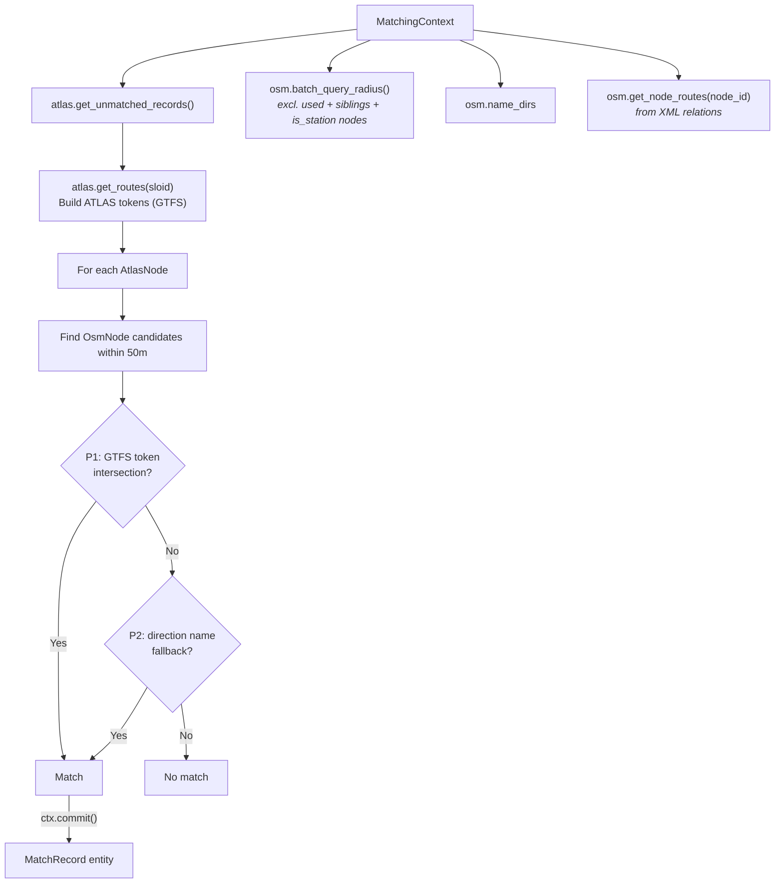

# Route Matching

Route matching is the **ninth predicate run** in the pipeline, after the full distance-matching block, and correlates ATLAS platforms with OSM nodes based on **shared GTFS transit routes and directions**.

## Overview

While the previous predicates rely on exact UICs, names, or purely closest distance, **Route Matching** provides an alternative way to confidently match stops. 

Importantly, this is still a **spatial, stop-to-stop matching process**, not just linking abstract routes. For every unmatched ATLAS stop, the predicate looks for unmatched OSM stops within a 50m radius. If an ATLAS platform and a nearby OSM node share strong GTFS route-token evidence or compatible direction-name evidence, they are matched together. Route data acts as the "proof" that two physically close points are indeed the same stop. The spatial candidate filter uses `OsmNode.is_station`, so aerialway stations remain eligible.

**Result**: {{stat:matching_stages.route.count}} route-based matches

Unlike the exact, name, and distance predicates, route matching now re-validates each batched candidate list against the current `used_ids` set before selecting a match. This prevents an OSM representative consumed earlier in the same predicate run from being re-used by a later ATLAS row.

## Required Data

Route matching relies entirely on data owned by the state layer — the predicate performs no file I/O:

- `OsmNode` candidates found via batched `OsmState.batch_query_radius()` within `max_distance`
- `OsmState.name_dirs` — per-node direction strings (loaded from `osm_directions.csv` sidecar or parsed from XML relations)
- `OsmState._node_routes` via `ctx.osm.get_node_routes(node_id)` — per-node GTFS route memberships derived from OSM XML relations during `OsmState.from_xml_file()`
- `AtlasState._routes_by_sloid` via `ctx.atlas.get_routes(sloid)` — GTFS route entries loaded from `atlas_routes_gtfs.csv` during `AtlasState.from_dataframe()`

## Token-Based Matching

Route data is converted into comparable tokens. The predicate tries two priority levels:

### P1: Entity Equivalency via RouteState

ATLAS and OSM route data are now matched using the central `RouteState` module, which performs $O(1)$ equivalency mapping based on pre-computed relationships:

- **ATLAS Tokens**: `{(route_id, direction_id), (normalized_route_id, direction_id)}`  
  Pre-calculated and loaded during the pipeline phase.
- **OSM Candidates**: The OSM relation ID assigned to the stop is looked up in `RouteState.get_atlas_route(osm_relation_id)`.
  If an ATLAS route is mapped to that OSM relation, that ATLAS ID (and its normalized counterpart) is checked against the target ATLAS stop's tokens.

Route IDs are normalized (replacing journey numbers like `-j24` with `-jXX`) during the `RouteState` preload phase.

If `ref_trips` does not yield a direction, OSM route extraction currently emits both direction buckets (`0` and `1`) for that relation membership so route-id evidence can still participate.

### P2: Name-Based Direction Fallback

ATLAS direction names are compared against OSM route relation direction strings (first/last member names like `"Zurich HB → Bern"`), stored in `OsmState.name_dirs`. The current implementation checks exact direction-string membership.

## Data Sources

| Source | File / Origin | Loaded by | Description |
|--------|--------------|-----------|-------------|
| GTFS routes | `data/processed/atlas_routes*.csv` | `AtlasState` | Timetable-derived routes per SLOID |
| OSM routes | OSM XML relations | `OsmState.from_xml_file()` | Route memberships per OSM node (via relation ID) |
| Equivalency | Entity-first route CSVs | `RouteState` | Maps OSM relation IDs to ATLAS route IDs |

## Related Documentation

- [1.2 GTFS](1.2%20GTFS%20ATLAS%20data.md) – GTFS route extraction
- [1.3 OSM data](1.3%20OSM%20data.md) – OSM route extraction
- [1.4 Route-Route Matching](1.4%20Route-Route%20Matching.md) – Route-level ATLAS↔OSM linking in importer

(Route provenance is tracked in the output via `match_type` — currently `route_gtfs_gtfs` — and accompanying evidence in `notes`.)

## When Route Matching Succeeds

Route matching is particularly effective for:

1. **Platforms without UIC**: Some `OsmNode` entities lack `uic_ref` but have route memberships
2. **Ambiguous proximity**: When multiple `OsmNode` entities are nearby, shared routes disambiguate

## Code Reference

| Class / Method | Description |
|----------------|-------------|
| `RouteMatchPredicate` | Predicate class; leverages `RouteState` and `batch_query_radius()` |
| `ctx.atlas.get_routes(sloid)` | Returns ATLAS route assignments for a SLOID |
| `ctx.osm.get_node_routes(node_id)` | Returns relation memberships for an OSM node |
| `RouteState.get_atlas_route()` | Returns the mapped ATLAS route for a given OSM relation ID |

All predicate logic is in [predicates/route_matching_gtfs.py](../matching_and_import_db/predicates/route_matching_gtfs.py). Route state logic lives in [route_state.py](../matching_and_import_db/route_state.py).
