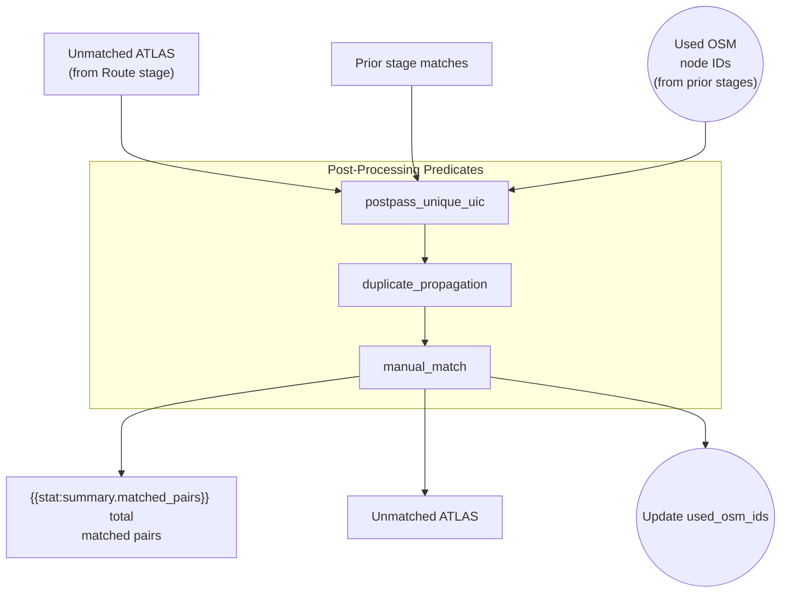

# Post-Processing

Post-processing is the **final stage**, consisting of three separate predicates that apply cleanup rules and manual corrections to maximize match coverage.

## Operations

| Predicate | match_type | Matches Added | Description |
|-----------|------------|---------------|-------------|
| `postpass_unique_uic` | `exact_postpass` | {{stat:matching_stages.post_processing.unique_by_uic}} | Match isolated OSM nodes by UIC |
| `duplicate_propagation` | `duplicate_propagation` | {{stat:matching_stages.post_processing.duplicate_propagation}} | Spread matches across ATLAS duplicates |
| `manual_match` | `manual` | Variable | Human-curated corrections |

## 1. Unique-by-UIC Consolidation (`postpass_unique_uic`)

Catches OSM nodes with valid `uic_ref` that weren't matched due to missing platform-level disambiguation.

**Logic**: If exactly ONE unused, non-station OSM node remains for a given UIC → match all remaining unmatched ATLAS entries with that UIC to that node.

This is intentionally a **many-to-one** step.

## 2. Duplicate Propagation (`duplicate_propagation`)

ATLAS sometimes contains duplicate platform entries (same `number` + `designation`). When one duplicate gets matched, propagate to all identical entries.

The predicate:
1. Indexes all existing matches by SLOID
2. For each duplicate group in `ctx.duplicate_sloid_map`, finds the best (closest distance) matched member
3. Copies the OSM fields from the source match to each unmatched group member, replacing ATLAS fields with the target's own data

This can create **many-to-one** outputs (multiple ATLAS rows pointing to the same OSM node), but only within a duplicate group.

**Why duplicates exist**:
- Different data sources (GTFS vs HRDF)
- Historical data retention
- Administrative boundary overlaps

## 3. Manual Matches (`manual_match`)

Human-curated corrections stored in the `PersistentData` table override algorithmic decisions. These can be created through the web interface and persist across pipeline re-runs.

Manual matches are applied **only** when:
- the ATLAS `sloid` is still unmatched (`sloid not in ctx.matched_atlas_ids`)
- the OSM node is not already used (`node_id not in ctx.used_osm_ids`)

See [4.2 User Input DB](4.2%20User%20Input%20DB.md) for details.

## Final Statistics

| Metric | Count |
|--------|-------|
| Total matched pairs | {{stat:summary.matched_pairs}} |
| Match rate | {{stat:summary.match_rate_percent}}% |
| Remaining unmatched ATLAS | {{stat:summary.unmatched_atlas}} |

## Code Reference

| Function | Description |
|----------|-------------|
| `postpass_unique_uic(ctx)` | Match when only one unused OSM node remains for a UIC |
| `duplicate_propagation(ctx)` | Propagate matches to unmatched duplicate group members |
| `manual_match(ctx)` | Apply persistent manual matches from the user-input database |

All functions are in [postpass_matching.py](../matching_process/postpass_matching.py).
