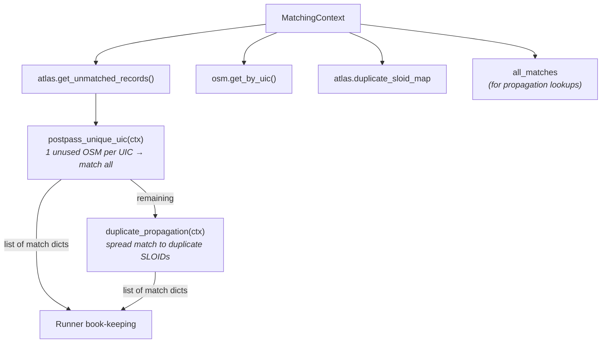

# Post-Processing

Post-processing is the **final stage**, consisting of two separate predicates that apply cleanup rules to maximize match coverage.

## Operations

| Predicate | match_type | Matches Added | Description |
|-----------|------------|---------------|-------------|
| `postpass_unique_uic` | `exact_postpass` | {{stat:matching_stages.post_processing.unique_by_uic}} | Match isolated OSM nodes by UIC |
| `duplicate_propagation` | `duplicate_propagation` | {{stat:matching_stages.post_processing.duplicate_propagation}} | Spread matches across ATLAS duplicates |
## 1. Unique-by-UIC Consolidation (`postpass_unique_uic`)

Catches OSM nodes with valid `uic_ref` that weren't matched due to missing platform-level disambiguation.

**Logic**: If exactly ONE unused, non-station OSM node remains for a given UIC → match all remaining unmatched ATLAS entries with that UIC to that node.

This is intentionally a **many-to-one** step.

## 2. Duplicate Propagation (`duplicate_propagation`)

ATLAS sometimes contains duplicate platform entries (same `number` + `designation`). When one duplicate gets matched, propagate to all identical entries.

The predicate:
1. Indexes all existing matches by SLOID
2. For each duplicate group in `ctx.duplicate_sloid_map`, finds the best (closest distance) matched member
3. Copies the OSM fields from the source match to each unmatched group member, replacing ATLAS fields with the target's own data

This can create **many-to-one** outputs (multiple ATLAS rows pointing to the same OSM node), but only within a duplicate group.

**Why duplicates exist**:
- Different data sources (GTFS vs HRDF)
- Historical data retention
- Administrative boundary overlaps

## Final Statistics

| Metric | Count |
|--------|-------|
| Total matched pairs | {{stat:summary.matched_pairs}} |
| Match rate | {{stat:summary.match_rate_percent}}% |
| Remaining unmatched ATLAS | {{stat:summary.unmatched_atlas}} |

## Code Reference

| Function | Description |
|----------|-------------|
| `postpass_unique_uic(ctx)` | Match when only one unused OSM node remains for a UIC |
| `duplicate_propagation(ctx)` | Propagate matches to unmatched duplicate group members |
All functions are in [postpass_matching.py](../matching_and_import_db/postpass_matching.py).
