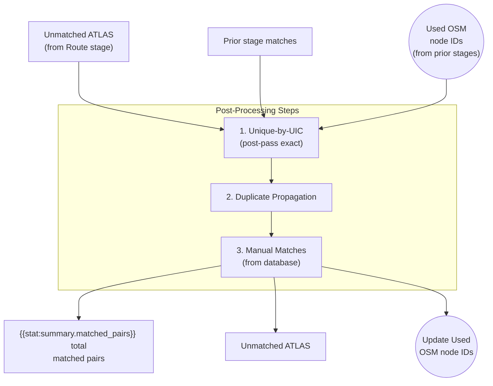

# Post-Processing

Post-processing is the **final stage**, applying cleanup rules and manual corrections to maximize match coverage.

## Operations

| Operation | Matches Added | Description |
|-----------|---------------|-------------|
| Unique-by-UIC | {{stat:matching_stages.post_processing.unique_by_uic}} | Match isolated OSM nodes by UIC |
| Duplicate propagation | {{stat:matching_stages.post_processing.duplicate_propagation}} | Spread matches across ATLAS duplicates |
| Manual matches | Variable | Human-curated corrections |

## 1. Unique-by-UIC Consolidation

Catches OSM nodes with valid `uic_ref` that weren't matched due to missing platform-level disambiguation.

**Logic**: If exactly ONE unused, non-station OSM node remains for a given UIC → match all remaining unmatched ATLAS entries with that UIC to that node.

This is intentionally a **many-to-one** step.

## 2. Duplicate Propagation

ATLAS sometimes contains duplicate platform entries (same `number` + `designation`). When one duplicate gets matched, propagate to all identical entries.

This can also create **many-to-one** outputs (multiple ATLAS rows pointing to the same OSM node), but only within a duplicate group.

**Why duplicates exist**:
- Different data sources (GTFS vs HRDF)
- Historical data retention
- Administrative boundary overlaps

## 3. Manual Matches

Human-curated corrections stored in the `PersistentData` table override algorithmic decisions. These can be created through the web interface and persist across pipeline re-runs.

Manual matches are applied **only** when:
- the ATLAS `sloid` is still unmatched
- the OSM node is not already used by other stages

See [4.2 Persistent Data](4.2%20Persistent%20Data.md) for details.

## Final Statistics

| Metric | Count |
|--------|-------|
| Total matched pairs | {{stat:summary.matched_pairs}} |
| Match rate | {{stat:summary.match_rate_percent}}% |
| Remaining unmatched ATLAS | {{stat:summary.unmatched_atlas}} |
