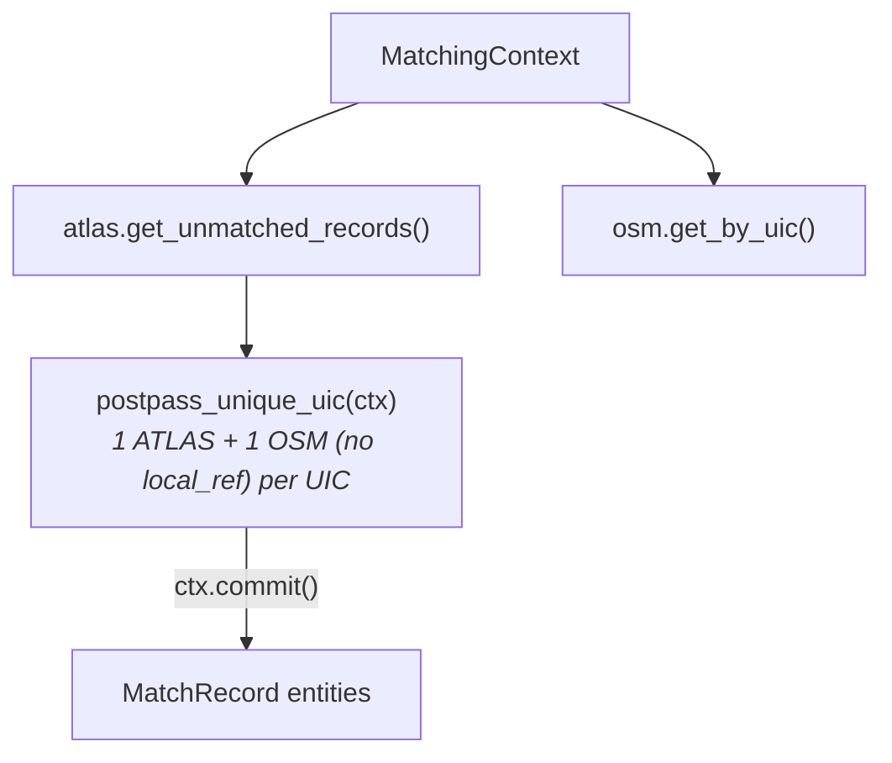

# Post-Processing

Post-processing is the **final stage** of the predicate pipeline, consisting of a single cleanup predicate that maximises match coverage.

> [!NOTE]
> Both **duplicate propagation** (ATLAS groups) and **OSM group propagation** (platform ↔ stop_position / tram groups) are handled automatically by `commit()` via the polymorphic entity model. When a representative is matched, all siblings receive propagated match records (`duplicate_propagation` and `osm_group_propagation` match types respectively). See [§ ATLAS Duplicate Grouping](2.%20Matching%20process.md#atlas-duplicate-grouping).

## Operations

| Predicate | match_type | Matches Added | Description |
|-----------|------------|---------------|-------------|
| `postpass_unique_uic` | `exact_postpass` | {{stat:matching_stages.post_processing.unique_by_uic}} | Match isolated OSM nodes by UIC |

## Unique-by-UIC Consolidation (`postpass_unique_uic`)

Catches residual unmatched pairs from originally multi-node UIC groups where `local_ref` refinement resolved some but not all entries.

**Logic**: If exactly **one** unmatched ATLAS entry and exactly **one** unused, non-station OSM node remain for a given UIC, **and** the OSM node has no `local_ref` → match them.

## Final Statistics

| Metric | Count |
|--------|-------|
| Total matched pairs | {{stat:summary.matched_pairs}} |
| Match rate | {{stat:summary.match_rate_percent}}% |
| Remaining unmatched ATLAS | {{stat:summary.unmatched_atlas}} |

## Code Reference

| Function | Description |
|----------|-------------|
| `postpass_unique_uic(ctx)` | Match when only one unused OSM node remains for a UIC |

All functions are in [postpass_matching.py](../matching_and_import_db/predicates/postpass_matching.py).
