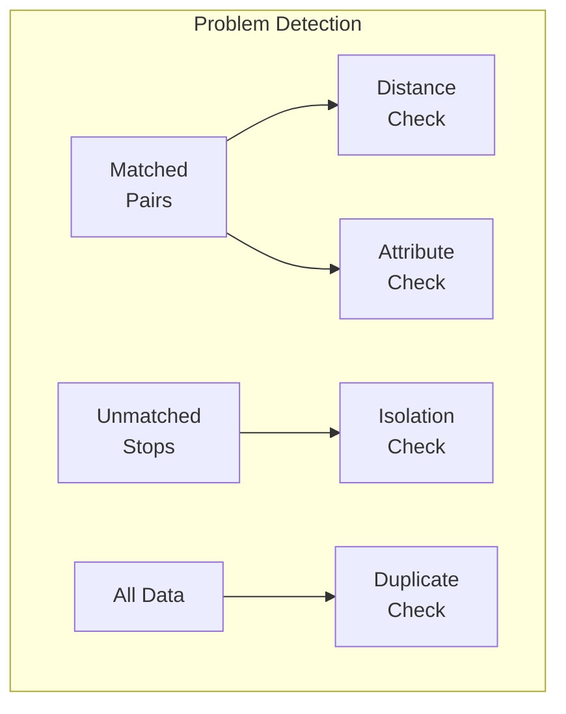

# Problem Detection and Prioritization

After matching completes, the system identifies data quality issues and assigns priorities to help operators focus on the most critical problems first.

## Problem Types



| Problem Type | Description | Priorities |
|--------------|-------------|------------|
| **Distance** | Matched pairs too far apart | P1, P2, P3 |
| **Unmatched** | Stops without a counterpart | P1, P2, P3 |
| **Attributes** | Inconsistent data for matched pairs | P1, P2, P3 |
| **Duplicates** | Redundant entries | P2, P3 |

## Priority Levels

- **P1 (High)**: Critical issues requiring immediate attention
- **P2 (Medium)**: Significant issues for review
- **P3 (Low)**: Minor issues for eventual resolution

---

## 1. Distance Problems

Flag matched pairs where physical distance exceeds tolerance.

| Priority | Condition | Rationale |
|----------|-----------|-----------|
| **P1** | Non-SBB AND distance > 80m | Large displacement |
| **P2** | Non-SBB AND 25m < distance ≤ 80m | Moderate displacement |
| **P3** | SBB AND distance > 25m OR 15m < d ≤ 25m | Railway tolerance |

> **Note**: SBB (Swiss Federal Railways) has higher tolerance due to large platform areas.

---

## 2. Unmatched Problems

Identify stops that failed to match.

| Priority | Condition | Rationale |
|----------|-----------|-----------|
| **P1** | No OSM within 80m OR no opposite UIC | Completely isolated |
| **P2** | No opposite within 50m OR platform count mismatch | Partially isolated |
| **P3** | Remaining unmatched | Has nearby candidates |

---

## 3. Attribute Problems

Flag inconsistencies between matched pairs.

| Priority | Condition | Rationale |
|----------|-----------|-----------|
| **P1** | Different UIC or official name | Critical identifier mismatch |
| **P2** | Different `local_ref` | Platform identifier discrepancy |
| **P3** | Different operator (after normalization) | Operator inconsistency |

---

## 4. Duplicate Problems

Identify redundant entries.

| Priority | Condition |
|----------|-----------|
| **P2** | ATLAS duplicates (same `sloid`) |
| **P3** | OSM duplicates (same `uic_ref` + `local_ref`) |

---

## Problem Resolution

Solutions are stored with user attribution and can be marked persistent to survive data re-imports:

```python
problem.solution = "Manual match created"
problem.is_persistent = True
problem.created_by_user_id = current_user.id
```

## Code Reference

| Component | File |
|-----------|------|
| Problem detection | [problem_detection.py](../matching_process/problem_detection.py) |
| API endpoints | [problems.py](../backend/blueprints/problems.py) |
| Database import | [import_data_db.py](../import_data_db.py) |
