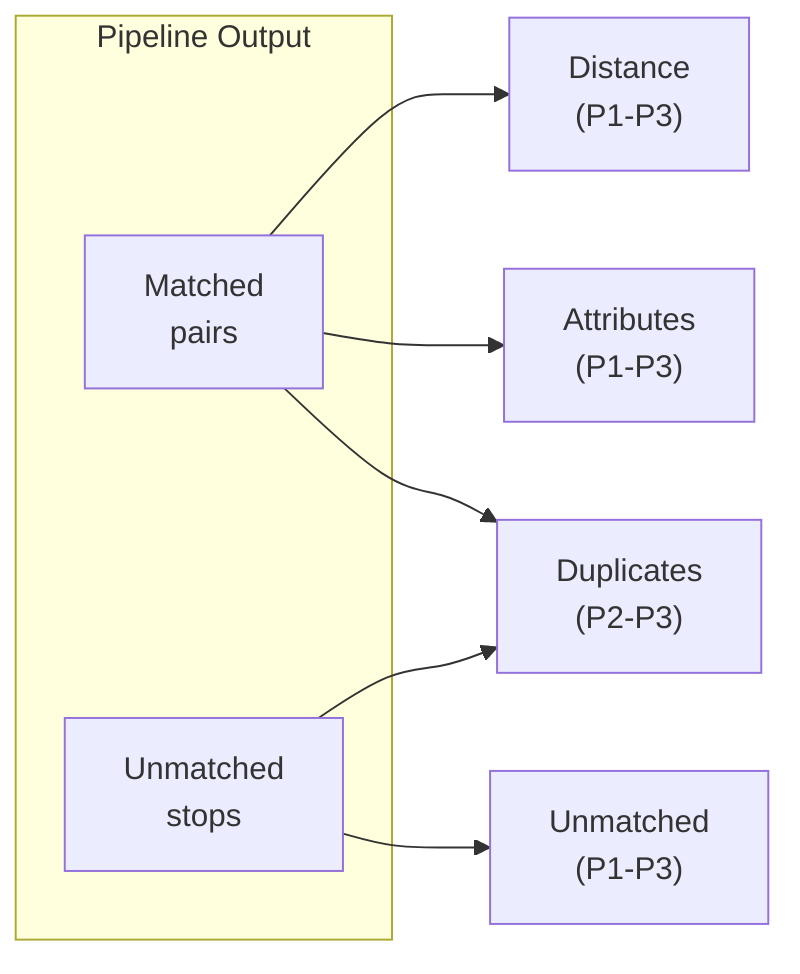

# Problem Detection and Prioritization

After matching completes, the system identifies data quality issues and assigns priorities to help operators focus on the most critical problems first.

## Problem Types



| Problem Type | Description | Priorities | Source |
|--------------|-------------|------------|--------|
| **Distance** | Matched pairs too far apart | P1, P2, P3 | Matched |
| **Unmatched** | Stops without a counterpart | P1, P2, P3 | Unmatched ATLAS/OSM |
| **Attributes** | Inconsistent data for matched pairs | P1, P2, P3 | Matched |
| **Duplicates** | Redundant entries | P2, P3 | All |

## Priority Levels

| Level | Meaning | Action |
|-------|---------|--------|
| **P1** | Critical | Immediate attention required |
| **P2** | Significant | Review when possible |
| **P3** | Minor | Eventual resolution |

---

## 1. Distance Problems

Flag matched pairs where physical distance exceeds tolerance.

### Thresholds (from code)

```python
DISTANCE_THRESHOLD_P1 = 80   # meters
DISTANCE_THRESHOLD_P2 = 25   # meters
DISTANCE_THRESHOLD_P3 = 15   # meters
```

### Priority Logic

| Priority | Condition | Rationale |
|----------|-----------|-----------|
| **P1** | Non-SBB AND distance > 80m | Large displacement for non-railway |
| **P2** | Non-SBB AND 25m < distance ≤ 80m | Moderate displacement |
| **P3** | SBB AND distance > 25m | Railway tolerance (large platforms) |
| **P3** | Any operator AND 15m < distance ≤ 25m | Minor displacement |

> **Note**: SBB (Swiss Federal Railways) platforms can span 400m+, so higher distance tolerance is applied.

---

## 2. Unmatched Problems

Identify stops that failed to match. Priority is computed differently for ATLAS vs OSM stops.

### ATLAS Unmatched Priority

| Priority | Condition | Rationale |
|----------|-----------|-----------|
| **P1** | No OSM nodes with same UIC in entire dataset | Completely missing counterpart |
| **P1** | Nearest OSM node > 80m away | Completely isolated |
| **P2** | Nearest OSM node > 50m away | Partially isolated |
| **P2** | Platform count mismatch (ATLAS vs OSM for same UIC) | Data inconsistency |
| **P3** | All other unmatched | Has nearby candidates |

### OSM Unmatched Priority

| Priority | Condition | Rationale |
|----------|-----------|-----------|
| **P1** | No ATLAS stops with same UIC in entire dataset | Completely missing counterpart |
| **P2** | Nearest ATLAS stop > 50m away | Partially isolated |
| **P2** | Platform count mismatch (ATLAS vs OSM for same UIC) | Data inconsistency |
| **P3** | All other unmatched | Has nearby candidates |

### Isolation Detection

Isolation is computed using spatial index queries with a **50m radius** (`ISOLATION_CHECK_RADIUS_M`).

---

## 3. Attribute Problems

Flag inconsistencies between matched pairs.

### Priority Logic

| Priority | Condition | Fields Compared |
|----------|-----------|-----------------|
| **P1** | Different UIC reference | `number` (ATLAS) vs `osm_uic_ref` |
| **P1** | Different official name | `designationOfficial` vs `osm_uic_name` |
| **P2** | Different local reference | `designation` vs `osm_local_ref` |
| **P3** | Different operator | `csv_business_org_abbr` vs `osm_operator` |

> **Note**: Name and local_ref comparisons are case-insensitive. UIC comparisons are exact.

---

## 4. Duplicate Problems

Identify redundant entries in either dataset.

| Priority | Type | Condition | Detection |
|----------|------|-----------|-----------|
| **P2** | ATLAS | Same `sloid` appears multiple times | Duplicate propagation during matching |
| **P3** | OSM | Same `(uic_ref, local_ref)` for platform-like nodes | Pre-computed before import |

OSM duplicates are only flagged for nodes with `public_transport` = `platform` or `stop_position`.

---

## Problem Resolution

Solutions are stored in the database with user attribution and can be marked persistent to survive data re-imports:

```python
problem.solution = "Manual match created"
problem.is_persistent = True
problem.created_by_user_id = current_user.id
```

See [4.2 Persistent Data](4.2%20Persistent%20Data.md) for details on persistence.

---

## Code Reference

| Component | File | Key Functions |
|-----------|------|---------------|
| Problem detection | [problem_detection.py](../matching_process/problem_detection.py) | `compute_distance_priority()`, `compute_attributes_priority()`, `detect_atlas_isolation()` |
| Priority computation | [import_data_db.py](../import_data_db.py) | `compute_unmatched_priority_for_atlas()`, `compute_unmatched_priority_for_osm()` |
| API endpoints | [problems.py](../backend/blueprints/problems.py) | Problem listing and resolution |

### Configuration Constants

| Constant | Value | Location |
|----------|-------|----------|
| `ISOLATION_CHECK_RADIUS_M` | 50m | `problem_detection.py` |
| `DISTANCE_THRESHOLD_P1` | 80m | `problem_detection.py` |
| `DISTANCE_THRESHOLD_P2` | 25m | `problem_detection.py` |
| `DISTANCE_THRESHOLD_P3` | 15m | `problem_detection.py` |
