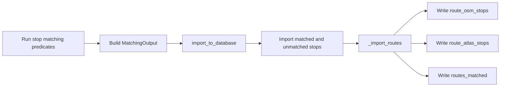
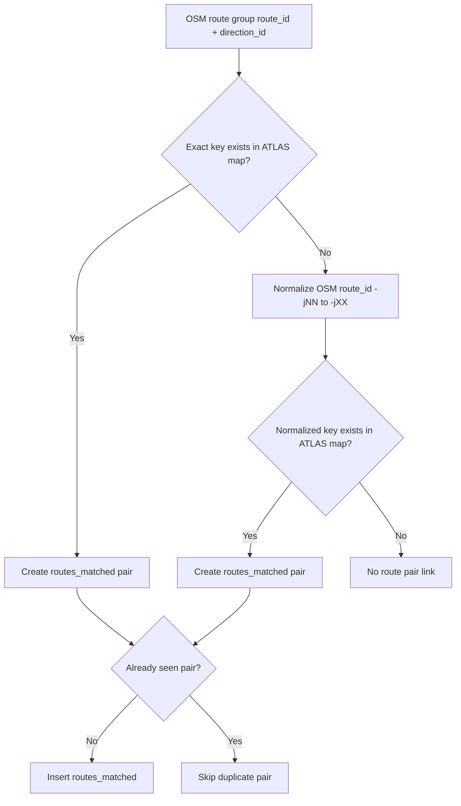

# Route-Route Matching

This section explains how ATLAS routes are linked to OSM routes in the import database.

Important distinction:

- [2.4 Route Matching](2.4%20Route%20Matching.md) is stop-level matching (ATLAS stop <-> OSM stop).
- This section is route-level linking (ATLAS route <-> OSM route) and writes `routes_matched`.

## Where It Happens In The Pipeline

Route-route matching runs during database import, not during predicate matching.

Concretely, it is executed in `matching_and_import_db/database/importer.py` inside `import_to_database()` step `#4. Import Routes`.

## Inputs

Route-route matching depends on two preloaded mappings built by `load_all_route_data()`:

- `atlas_route_dir_to_sloids` from `data/processed/atlas_routes_unified.csv`
- `osm_route_dir_to_nodes` from `data/processed/osm_nodes_with_routes.csv`

Both sides are keyed by `(route_id, direction_id)`.

## Matching Rules

The linker applies the following route-pair rules for each OSM `(route_id, direction_id)` group:

1. Exact key match first
   - If `(osm_route_id, direction_id)` exists in ATLAS route-direction groups, link directly.

2. Normalized route-id fallback
   - If no exact key match exists, normalize OSM route id with `normalize_route_id()`.
   - Normalization rule: replace `-jNN` with `-jXX` (for example `11-T-j25-1` -> `11-T-jXX-1`).
   - Match normalized route id plus same direction against ATLAS normalized groups.

3. Unique pair write guard
   - `routes_matched` is deduplicated with an in-memory `seen_route_matches` set.
   - At most one `(atlas_route_id, osm_route_id)` pair is inserted.

4. Atlas stop membership guard
   - `route_atlas_stops` rows are inserted only when their `sloid` already exists in imported ATLAS stop rows (`known_sloids`).
   - Unknown SLOIDs are skipped and counted.

## Resolution Flow

## What This Step Does Not Do

- It does not run spatial distance checks.
- It does not run fuzzy text similarity matching.
- It does not consume stop predicate scores.

Its responsibility is deterministic route-id and direction linking using prepared route tables.

## Output Tables Affected

- `route_osm_stops`: ordered OSM route membership rows.
- `route_atlas_stops`: ordered ATLAS route membership rows.
- `routes_matched`: route-route links between ATLAS and OSM.

## Related Documentation

- [1.2 GTFS ATLAS data](1.2%20GTFS%20ATLAS%20data.md)
- [1.3 OSM data](1.3%20OSM%20data.md)
- [2.4 Route Matching (stop-level)](2.4%20Route%20Matching.md)
- [5.2 Import Process](5.2%20Import%20Process.md)
