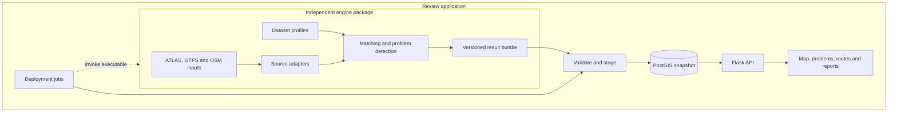

# A3 Application Architecture & Deployment

The codebase contains two independently runnable projects. `engine/` is an installable Python package with its own tests, examples, Dockerfile and canonical documentation. The repository root is the review application: Flask, PostGIS, browser UI, app documentation and deployment jobs. They remain in one checkout during review, but their source and documentation boundaries now match the intended two-repository layout.

## Dependency rules

- Core predicates receive normalized records, per-run state and explicit configuration. They do not read files, environment variables, or database state.
- Adapters own downloads and source formats. Swiss SLOID, duplicate-group and route-year rules belong to the Swiss adapter/profile.
- The engine imports no `backend`, Flask or SQLAlchemy code.
- The app imports no `transport_matcher` code. Its importer implements the published result contract and maintains its own SQL projection.
- The scheduler composes command-line execution and bundle import. `MATCHER_COMMAND` may refer to an executable in another environment; `--mode import` only needs `PIPELINE_BUNDLE`.

## Runtime services

| Service | Responsibility |
|---|---|
| `app` | Flask API/UI; its image excludes engine sources and engine dependencies. |
| `scheduler` | Deployment composition: invoke the engine executable, validate and publish the result, update runtime status. |
| `db` | App-owned PostgreSQL/PostGIS tables and active bundle manifest. |
| `migrator` | One-shot Alembic schema upgrades before app and scheduler start. |
| `test` | App tests without an engine installation. Engine tests run separately. |

Long-running Compose services use `restart: unless-stopped`; one-shot migrator and test services do not restart automatically. This is process recovery configuration, not proof of production deployment.

## State ownership

Engine matching state is allocated afresh for each call. There is no global route singleton. Input caches are local to the engine acquisition workspace and contain source fingerprints and HTTP validators.

The review app owns imported data, schema migrations, status/lock files under `data/runtime`, asynchronous reports and presentation settings. The current application has no separate persisted human-review decision model. Any such future records must live outside the replaceable snapshot tables and use stable exported problem/entity keys.

## Configuration

`REVIEW_CONFIG` points to a JSON presentation profile, such as `config/switzerland.json` or `config/gtfs-example.json`. It controls title, flag, source label, map center/bounds and optional views. Dataset matching policies are separate Python profiles inside the engine.

See [result publication (A1.1)](1.1%20Import%20Process.md), [builds and dependencies (A3.1)](3.1%20Dependency%20Management%20&%20Build%20Strategy.md), [scheduling (A3.3)](3.3%20Background%20Scheduler.md), [engine source caching (E5.1)](../engine/documentation/5.1%20Atlas-Cached%20Import%20Optimization.md), [engine pipeline performance (E5.2)](../engine/documentation/5.2%20Pipeline%20Performance.md), and [contributing](Contributing.md).
