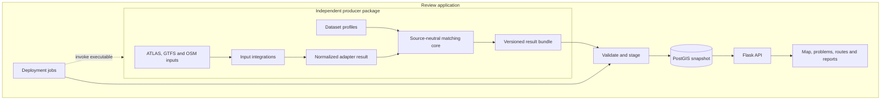

# A3 Application Architecture & Deployment

The system consists of two independently runnable repositories developed as sibling checkouts. The engine repository is an installable Python package with its own tests, examples, Dockerfile and canonical documentation. This repository is the review application: Flask, PostGIS, browser UI, app documentation and deployment jobs. Docker receives the pinned sibling checkout as a named build context; the source repositories remain independent.

## Dependency rules

- Core predicates receive normalized records, per-run state and explicit configuration. They do not read files, environment variables, or database state.
- Format adapters parse explicit inputs into normalized records. Network acquisition is a separate optional layer.
- Swiss SLOID, GTFS-to-ATLAS identity, duplicate-group and route-year behavior belongs to the first-party Swiss integration/profile, not the generic core.
- The distribution includes only curated, maintained generic adapters and first-party integrations. Other datasets can use external adapters that implement the public adapter contract; they do not need to be added to this repository.
- The engine imports no `backend`, Flask or SQLAlchemy code.
- The app imports no `transport_matcher` code. Its importer implements the published result contract and maintains its own SQL projection.
- The scheduler composes command-line execution and bundle import. `MATCHER_COMMAND` may refer to an executable in another environment; `--mode import` only needs `PIPELINE_BUNDLE`.

## Runtime services

| Service | Responsibility |
|---|---|
| `app` | Flask API/UI; its image excludes engine sources and engine dependencies. |
| `scheduler` | Deployment composition: invoke the engine executable, validate and publish the result, update runtime status. |
| `db` | App-owned PostgreSQL/PostGIS tables and active bundle manifest. |
| `migrator` | One-shot Alembic schema upgrades before app and scheduler start. |
| `test` | App tests without an engine installation. Engine tests run separately. |

Long-running Compose services use `restart: unless-stopped`; one-shot migrator and test services do not restart automatically. This is process recovery configuration, not proof of production deployment.

## State ownership

Engine matching state is allocated afresh for each call. There is no global route singleton. Input caches are local to the engine acquisition workspace and contain source fingerprints and HTTP validators.

The review app owns imported data, schema migrations, status/lock files under `data/runtime`, asynchronous reports and presentation settings. The current application has no separate persisted human-review decision model. Any such future records must live outside the replaceable snapshot tables and use stable exported problem/entity keys.

## Configuration

`REVIEW_CONFIG` points to a JSON presentation profile, such as `config/switzerland.json` or `config/gtfs-example.json`. It controls title, flag, source label, map center/bounds and optional views. Dataset matching policies are separate Python profiles inside the engine.

## Schema-1 compatibility terminology

The current application database and some Python/UI internals retain legacy names such as `atlas_stops`, `sloid` and `unmatched_atlas`. The importer projects generic namespaced source keys into those consumer-owned fields; that terminology does not make ATLAS parsing an application responsibility. A generic stop bundle can use the configurable presentation, while Swiss-only route-identity views remain capability-gated.

Those names are acknowledged compatibility debt, not the desired producer model. Generic engine adapters already use `source_*` route-product names. Removing the consumer's legacy terminology requires an application migration and a coordinated future result-schema version rather than an unversioned schema-1 rename.

See [result publication (A1.1)](1.1%20Import%20Process.md), [builds and dependencies (A3.1)](3.1%20Dependency%20Management%20&%20Build%20Strategy.md), [scheduling (A3.3)](3.3%20Background%20Scheduler.md), [engine source caching (E5.1)](../engine/documentation/5.1%20Atlas-Cached%20Import%20Optimization.md), [engine pipeline performance (E5.2)](../engine/documentation/5.2%20Pipeline%20Performance.md), and [contributing](Contributing.md).
