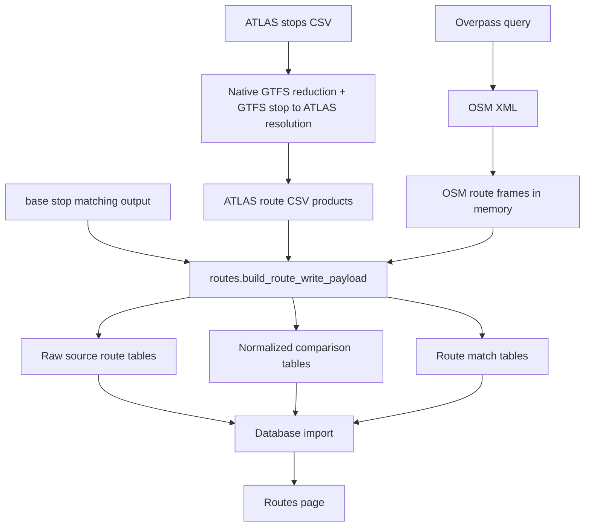

# Route Pipeline Data Flow

This page explains how route data moves from source files to the imported route browser model.

The route pipeline has three layers:

1. **Source artifacts** generated by adapters
2. **Normalized comparison tables** generated by the pure route comparator
3. **Match tables** that link equivalent ATLAS and OSM route entities

## Source Layer

Adapters produce two source-specific route models. Swiss source products are cached as CSV; OSM products are derived in memory from the current XML.

### ATLAS side

The ATLAS stops CSV does not contain native line-family or itinerary entities, so the pipeline reconstructs them from GTFS.

The GTFS side uses four files:

| File | Role |
|---|---|
| `stops.txt` | stop IDs, names, coordinates, and stop metadata |
| `stop_times.txt` | ordered stop sequence per `trip_id` |
| `trips.txt` | assigns each `trip_id` to a `route_id` and `direction_id` |
| `routes.txt` | line-level metadata such as short name, long name, and route type |

Conceptually:

- `route_id` becomes the ATLAS line-family key
- raw trips are grouped into itinerary buckets inside each line family
- each emitted itinerary keeps one representative ordered stop sequence
- each stop call keeps the resolved physical stop identity when available

The resulting source tables are:

- `atlas_line_families.csv`
- `atlas_itineraries.csv`
- `atlas_itinerary_stop_calls.csv`

### OSM side

On the OSM PTv2 side, the route structure is entity-first:

1. stop and platform elements
2. `type=route` relations
3. optional `type=route_master` relations above them

The adapter preserves that hierarchy in the following frames (shown using their optional diagnostic CSV filenames):

- `osm_route_masters.csv`
- `osm_route_master_tags.csv`
- `osm_route_master_members.csv`
- `osm_route_relations.csv`
- `osm_route_relation_tags.csv`
- `osm_route_relation_members.csv`
- `osm_route_relation_stops.csv`

In this model, the OSM `type=route` relation is the itinerary or variant layer, while `type=route_master` is the family layer when present.

## Normalized Comparison Layer

`engine/src/transport_matcher/routes.py` converts both source products into a shared comparison model.

The normalized tables are:

- `line_families`
- `itineraries`
- `stop_calls`

### `line_families`

This table stores one comparable family row per source-side family.

- ATLAS rows are created from `atlas_line_id`
- OSM rows are grouped by `route_master_id` when present
- if no route master exists, the loader falls back to normalized `gtfs_route_id`
- if that is still missing, it falls back again to a synthetic key built from `route`, `ref`, `operator`, and `network`, or to the relation itself

### `itineraries`

This table stores one comparable itinerary row per source-side itinerary.

- ATLAS itineraries come from `atlas_itineraries.csv`
- OSM itineraries come from the `osm_route_relations` frame
- both sides carry a `direction_id`, display label, and stop count when available

### `stop_calls`

This table stores ordered stop membership for each itinerary.

- ATLAS stop calls carry GTFS stop IDs, resolved SLOIDs, platform codes, and stop labels
- OSM stop calls carry resolved node IDs, member roles, canonical stop keys, and stop labels

The engine prefers a shared physical stop identity whenever it can resolve one. On the OSM side that resolution uses the base stop-matching output first, then single-candidate UIC fallbacks, then the raw OSM canonical key.

## Match Layer

After normalization, the route comparator builds two match tables:

- `line_family_matches`
- `itinerary_matches`

The family match table links one ATLAS line family to one OSM family.
The itinerary match table links one ATLAS itinerary to one OSM itinerary inside an already matched family.

The pairing rules are documented in [3.2 Route-Route Matching](3.2%20Route-Route%20Matching.md).

## Relationship to Stop Matching

Route data is used in two different places in the system:

1. **Stop-level route matching** inside the matching pipeline, where route tokens help decide whether a nearby ATLAS and OSM stop are the same physical stop
2. **Route-level comparison** inside the engine, after stop matching, where whole line families and itineraries are normalized and paired

That distinction is important:

- [2.3 Stop-stop matching using routes](2.3%20Stop-stop%20matching%20using%20routes.md) is about stop matching
- this chapter is about the route model and route comparison tables

## Main Code Paths

| Module | Role |
|--------|------|
| `engine/src/transport_matcher/adapters/get_atlas_gtfs.py` | Resolves GTFS identities and integrates route evidence; `gtfs_columnar.py` handles the default native feed reduction |
| `engine/src/transport_matcher/adapters/acquisition.py` | Orchestrates separately cached ATLAS, GTFS, and GTFS-to-ATLAS stages |
| `engine/src/transport_matcher/adapters/get_atlas_data.py` | Filters ATLAS data and constructs ATLAS-side itinerary frames/cache artifacts |
| `engine/src/transport_matcher/adapters/get_osm_data.py` | Builds current-run OSM route frames and optionally writes diagnostic CSVs |
| `engine/src/transport_matcher/routes.py` | Normalizes adapter-supplied frames and builds route match payloads without reading files |
| `backend/importing/importer.py` | Persists the source tables, normalized tables, and route match tables |

Performance details, candidate indexes and score-only sequence alignment are described in [Pipeline Performance](7.5%20Pipeline%20Performance.md).
