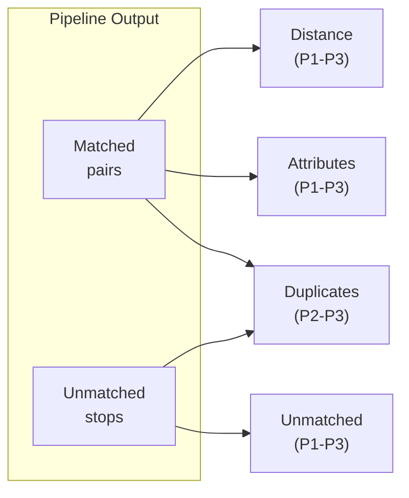

# 3.1 Stop Problems

Stop problems are detected **after the matching pipeline completes** and identify data quality issues regarding stops data. Detection occurs during database import via the `analyze_stop_problems()` function in [`import_data_db.py`](../import_data_db.py).

## Stop Problem Types

The diagram below shows how matching pipeline outputs flow into problem detection:



| Problem Type | Description | Priorities | Source |
|--------------|-------------|------------|--------|
| **Distance** | Matched pairs too far apart | P1, P2, P3 | Matched |
| **Unmatched** | Stops without a counterpart | P1, P2, P3 | Unmatched ATLAS/OSM |
| **Attributes** | Inconsistent data for matched pairs | P1, P2, P3 | Matched |
| **Duplicates** | Redundant entries | P2, P3 | All |


---

## 3.1.1. Distance Problems

Flag matched pairs where physical distance exceeds tolerance. This typically indicates either a matching error or significant coordinate discrepancy between datasets.

### Thresholds (from code)

```python
DISTANCE_THRESHOLD_P1 = 80   # meters
DISTANCE_THRESHOLD_P2 = 25   # meters
DISTANCE_THRESHOLD_P3 = 15   # meters
```

### Priority Logic

| Priority | Condition | Rationale |
|----------|-----------|-----------|
| **P1** | Non-SBB AND distance > 80m | Large displacement for non-railway |
| **P2** | Non-SBB AND 25m < distance ≤ 80m | Moderate displacement |
| **P3** | SBB AND distance > 25m | Railway tolerance (large platforms) |
| **P3** | Any operator AND 15m < distance ≤ 25m | Minor displacement |

> [!NOTE]
> **SBB** platforms can span many meters, so higher distance tolerance is applied. 

**Example**: A bus stop matched with 85m distance would be flagged as **P1** (critical), while a train platform with the same distance would be **P3** (minor).

---

## 3.1.2. Unmatched Problems

Identify stops that failed to match. Priority is computed differently for ATLAS vs OSM stops.

### ATLAS Unmatched Priority

| Priority | Condition | Rationale |
|----------|-----------|-----------|
| **P1** | No OSM nodes with same UIC in entire dataset | Completely missing counterpart |
| **P1** | Nearest OSM node > 80m away | Completely isolated |
| **P2** | Nearest OSM node > 50m away | Partially isolated |
| **P2** | Platform count mismatch (ATLAS vs OSM for same UIC) | Data inconsistency |
| **P3** | All other unmatched | Has nearby candidates |

### OSM Unmatched Priority

| Priority | Condition | Rationale |
|----------|-----------|-----------|
| **P1** | No ATLAS stops with same UIC in entire dataset | Completely missing counterpart |
| **P2** | Nearest ATLAS stop > 50m away | Partially isolated |
| **P2** | Platform count mismatch (ATLAS vs OSM for same UIC) | Data inconsistency |
| **P3** | All other unmatched | Has nearby candidates |

### Isolation Detection

Isolation is computed using spatial index queries with a **50m radius** (`ISOLATION_CHECK_RADIUS_M`).

---

## 3.1.3. Attribute Problems

Flag inconsistencies between matched pairs.

### Priority Logic

| Priority | Condition | Fields Compared |
|----------|-----------|-----------------|
| **P1** | Different UIC reference | `number` (ATLAS) vs `osm_uic_ref` |
| **P1** | Different official name | `designationOfficial` vs `osm_uic_name` |
| **P2** | Different local reference | `designation` vs `osm_local_ref` |
| **P3** | Different operator | `csv_business_org_abbr` vs `osm_operator` |

> **Note**: Name and local_ref comparisons are case-insensitive. UIC comparisons are exact.

---

## 3.1.4. Duplicate Problems

Identify redundant entries in either dataset.

| Priority | Type | Condition | Detection |
|----------|------|-----------|-----------|
| **P2** | ATLAS | Same `sloid` appears multiple times | Duplicate propagation during matching |
| **P3** | OSM | Same `(uic_ref, local_ref)` for platform-like nodes | Pre-computed before import |

OSM duplicates are only flagged for nodes with `public_transport` = `platform` or `stop_position`.

