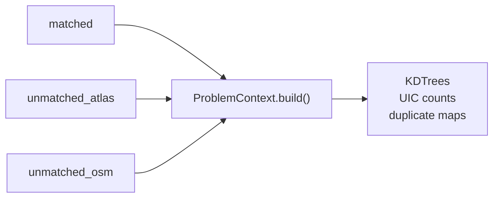
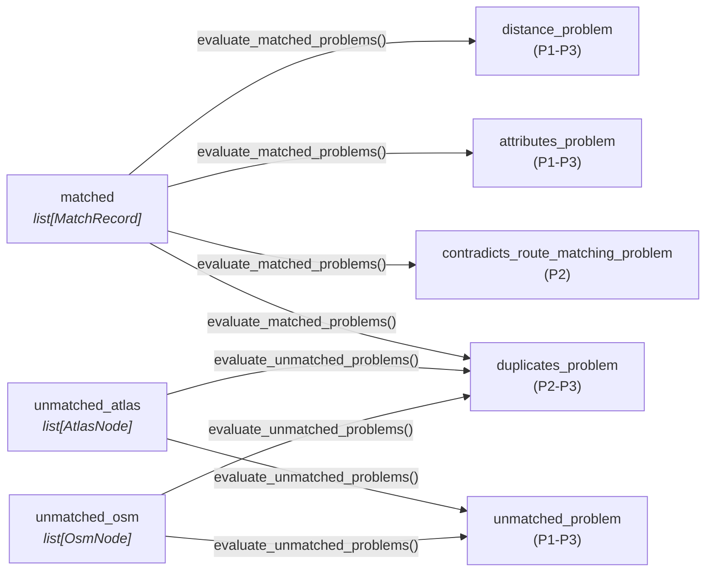

# 3.1 Stop Problems

Stop problems are detected **after the matching pipeline completes** and identify data quality issues regarding individual stops.

Detection uses a **predicate pipeline** mirroring the matching pipeline architecture. During database import, `ProblemContext.build()` precomputes shared indexes (KDTrees, UIC counts, duplicate maps, and route evidence lookups) from the `MatchingOutput`. Each stop is then evaluated by the five problem predicates.

**Code**: [matching_and_import_db/problem_detection/](https://github.com/openTdataCH/stop_sync_osm_atlas/tree/main/matching_and_import_db/problem_detection/)

## How Detection Runs

#### 1. Context construction — `ProblemContext.build(MatchingOutput)`

All three lists from the matching output are consumed **once** to precompute shared indexes (KDTrees, UIC counts, duplicate maps). The resulting `ProblemContext` is then passed as the `ctx` argument to every predicate call.



#### 2. Invocation — which records are evaluated by which predicates

Each record is passed individually as the `stop_dict` argument. Predicates use `isinstance` checks to decide whether they apply and return `[]` when the record type is irrelevant.



### Invocation Paths

**Matched records** use `MatchRecord.evaluate_matched_problems()`, which calls each predicate with the `MatchRecord` itself. The predicates access `record.atlas_node` and `record.osm_node` directly:

```python
current_match.evaluate_matched_problems(problem_ctx, STOP_PROBLEM_PIPELINE)
```

**Unmatched records** are passed as bare `AtlasNode` or `OsmNode` entities to `evaluate_unmatched_problems()`:

```python
problems = evaluate_unmatched_problems(STOP_PROBLEM_PIPELINE, problem_ctx, atlas_node)
```

Each predicate uses `isinstance` checks to decide whether it applies — `distance_problem` returns `[]` for bare nodes, `unmatched_problem` returns `[]` for `MatchRecord`, etc.

## `ProblemContext`

Built once from `PipelineResult` via `ProblemContext.build()`, providing precomputed indexes:

| Index | Type | Purpose |
|-------|------|---------|
| `osm_kdtree` | `KDTree` | Spatial queries for isolation detection (all OSM coords) |
| `atlas_kdtree` | `KDTree` | Spatial queries for OSM isolation detection (all ATLAS coords) |
| `atlas_count_by_uic` | `dict[str, int]` | ATLAS platform count per UIC |
| `osm_count_by_uic` | `dict[str, int]` | OSM node count per UIC |
| `osm_platform_count_by_uic` | `dict[str, int]` | OSM platform-like node count per UIC |
| `duplicate_sloid_map` | `dict[str, list[str]]` | ATLAS duplicate groups |
| `duplicate_osm_group_map` | `dict[str, list[str]]` | OSM duplicate groups by `(uic_ref, local_ref)` |
| `duplicate_osm_node_ids` | `set[str]` | All OSM node IDs in a duplicate group |
| `handled_duplicate_sloids` | `set[str]` | ATLAS duplicates already consumed by `duplicate_propagation`, so they are not re-flagged as problems |
| `atlas_routes_by_sloid` | `dict[str, dict[str, list]]` | Per-SLOID GTFS route evidence used for route-contradiction checks |
| `osm_node_routes` | `dict[str, list[dict]]` | Per-node OSM route memberships used for route-contradiction checks |
| `osm_name_dirs` | `dict[str, set[str]]` | Per-node direction strings used for route-contradiction fallback checks |

## Stop Problem Types

| Problem Type | Description | Priorities | Applies to |
|--------------|-------------|------------|------------|
| **Distance** | Matched pairs too far apart | P1, P2, P3 | `MatchRecord` only |
| **Attributes** | Inconsistent data for matched pairs | P1, P2, P3 | `MatchRecord` only |
| **Contradicts Route Matching** | Matched pair conflicts with its own route evidence | P2 | `MatchRecord` only |
| **Unmatched** | Stops without a counterpart | P1, P2, P3 | `AtlasNode` / `OsmNode` only |
| **Duplicates** | Redundant entries | P2, P3 | All three types |

---

## 3.1.1. Distance Problems

Flag matched pairs where physical distance exceeds tolerance. This typically indicates either a matching error or significant coordinate discrepancy between datasets.

The predicate reads `record.distance_m` and `record.atlas_node.business_org_abbr` directly from the `MatchRecord`.

### Thresholds

```python
DISTANCE_THRESHOLD_P1 = 80   # meters
DISTANCE_THRESHOLD_P2 = 25   # meters
DISTANCE_THRESHOLD_P3 = 15   # meters
```

### Priority Logic

| Priority | Condition | Rationale |
|----------|-----------|-----------|
| **P1** | Non-SBB AND distance > 80m | Large displacement for non-railway |
| **P2** | Non-SBB AND 25m < distance <= 80m | Moderate displacement |
| **P3** | SBB AND distance > 25m | Railway tolerance (large platforms) |
| **P3** | Any operator AND 15m < distance <= 25m | Minor displacement |

> [!NOTE]
> **SBB** platforms can span many meters, so higher distance tolerance is applied. The SBB check uses `AtlasNode.business_org_abbr`.

**Example**: A bus stop matched with 85m distance would be flagged as **P1** (critical), while a train platform with the same distance would be **P3** (minor).

---

## 3.1.2. Unmatched Problems

Identify stops that failed to match. The predicate receives bare `AtlasNode` or `OsmNode` entities and uses `ProblemContext` spatial indexes to compute isolation.

### ATLAS Unmatched Priority

Uses `ctx.nearest_osm_distance()` (KDTree query) and `ctx.osm_count_by_uic`:

| Priority | Condition | Rationale |
|----------|-----------|-----------|
| **P1** | `ctx.osm_count_by_uic` has 0 entries for this `AtlasNode.uic_ref` | Completely missing counterpart |
| **P1** | Nearest OSM node > 80m away (or none) | Completely isolated |
| **P2** | Nearest OSM node > 50m away | Partially isolated |
| **P2** | Platform count mismatch (ATLAS vs OSM for same UIC) | Data inconsistency |
| **P3** | All other unmatched | Has nearby candidates |

### OSM Unmatched Priority

Uses `ctx.nearest_atlas_distance()` (KDTree query) and `ctx.atlas_count_by_uic`:

| Priority | Condition | Rationale |
|----------|-----------|-----------|
| **P1** | `ctx.atlas_count_by_uic` has 0 entries for this `OsmNode.uic_ref` | Completely missing counterpart |
| **P2** | Nearest ATLAS stop > 50m away (or none) | Spatially isolated, but still lower than the no-ATLAS-by-UIC case |
| **P2** | Platform count mismatch (ATLAS vs OSM for same UIC) | Data inconsistency |
| **P3** | All other unmatched | Has nearby candidates |

### Isolation Detection

Isolation is computed using `ProblemContext.nearest_osm_distance()` / `nearest_atlas_distance()`, which query the precomputed KDTrees. Separately from problem detection, the importer marks unmatched ATLAS entries with no OSM node within 50m as `match_type='no_nearby_counterpart'` in `stops_matched`.

---

## 3.1.3. Attribute Problems

Flag inconsistencies between matched pairs. The predicate reads fields directly from `record.atlas_node` and `record.osm_node` on the `MatchRecord`.

### Priority Logic

| Priority | Condition | Fields Compared |
|----------|-----------|-----------------|
| **P1** | Different UIC reference | `AtlasNode.uic_ref` vs `OsmNode.uic_ref` |
| **P1** | Different official name | `AtlasNode.designation_official` vs `OsmNode.uic_name` |
| **P2** | Different local reference | `AtlasNode.designation` vs `OsmNode.local_ref` |
| **P3** | Different operator | `AtlasNode.business_org_abbr` vs `OsmNode.operator` |

> **Note**: Name and local_ref comparisons are case-insensitive. UIC comparisons are exact. Each check can be individually toggled via `ENABLE_*_CHECK` constants in `context.py`.

---

## 3.1.4. Contradicts Route Matching Problems

Flag matched pairs whose own route evidence contradicts the chosen ATLAS↔OSM stop pairing. This predicate reads route evidence from `ProblemContext.atlas_routes_by_sloid`, `ProblemContext.osm_node_routes`, and `ProblemContext.osm_name_dirs`, then reuses the same route-alignment classifier as the matching pipeline.

### Priority Logic

| Priority | Condition | Evidence Compared |
|----------|-----------|-------------------|
| **P2** | Token-level GTFS route contradiction | ATLAS GTFS route/direction tokens vs OSM GTFS route/direction tokens |
| **P2** | Direction-name contradiction | ATLAS direction names vs OSM relation direction strings |
---

## 3.1.5. Duplicate Problems

Identify redundant entries in either dataset. This predicate is **polymorphic** — it handles `MatchRecord`, `AtlasNode`, and `OsmNode`.

| Priority | Type | Condition | Detection |
|----------|------|-----------|-----------|
| **P3** | OSM | Same `(uic_ref, local_ref)` for `public_transport in {platform, stop_position}` nodes, excluding pre-grouped OSM pairs | Pre-computed in `ProblemContext._build_osm_duplicate_map()` |
| **P2** | ATLAS | `sloid` appears in `duplicate_sloid_map` and was not already handled by `duplicate_propagation` | From matching pipeline's `AtlasState` plus `handled_duplicate_sloids` |

OSM duplicates are only flagged for nodes with `OsmNode.public_transport` equal to `platform` or `stop_position`. When both ATLAS and OSM duplicates exist, only the OSM duplicate is flagged (OSM-side takes precedence). ATLAS duplicates that already produced a `duplicate_propagation` match are deliberately suppressed to avoid double-reporting the same grouping behavior.
