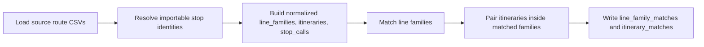

# Route-Route Matching

This page explains how route equivalency is built during import preparation in `matching_and_import_db/database/route_loader.py`.

Important distinction:

- [2.3 Stop-stop matching using routes](2.3%20Stop-stop%20matching%20using%20routes.md) is stop-level matching (ATLAS stop <-> OSM stop)
- this page is route-level linking (ATLAS line family <-> OSM family, then itinerary <-> itinerary)

## Where It Happens In The Pipeline

Route-route matching runs after stop matching has already produced the set of importable ATLAS SLOIDs.

The active route-level linker is not the `RouteState` singleton used by the stop-matching runtime. It is the normalized route-loader path inside `build_route_write_payload()`.

## Inputs

The route loader consumes:

- `atlas_line_families.csv`
- `atlas_itineraries.csv`
- `atlas_itinerary_stop_calls.csv`
- `osm_route_masters.csv`
- `osm_route_relations.csv`
- `osm_route_relation_members.csv`
- `osm_route_relation_stops.csv`
- base stop-matching output from `run_matching()`

The base stop-matching output matters because it lets the route loader reuse already matched physical stop identities when comparing OSM and ATLAS stop sequences.

## Step 1: Normalize Line Families

The loader first creates comparable family rows in `line_families`.

### ATLAS family rows

- one family row per `atlas_line_id`
- `normalized_route_id` comes from the exported GTFS-normalized route ID
- public display metadata comes from GTFS route fields such as `route_short_name` and `route_long_name`

### OSM family rows

OSM relations are grouped into families using a fallback chain:

1. parent `route_master_id` when present
2. normalized `gtfs_route_id`
3. synthetic key built from `route`, `ref`, `operator`, and `network`
4. the relation itself as a last resort

This is why the OSM side can still produce a family row even when no route master exists and no GTFS tag is available.

## Step 2: Match Line Families

After normalization, the loader scores candidate ATLAS/OSM family pairs.

Scoring rules:

1. **Exact GTFS route ID** → score `1.0`, reason `exact_gtfs_route_id`
2. **Normalized GTFS route ID** → score `0.95`, reason `normalized_gtfs_route_id`
3. **Display route ID fallback** → score `0.9`, reason `display_route_id_match`

OSM families explicitly flagged with `is_non_gtfs` are skipped for deterministic pairing.

Candidate pairs are sorted by score and then chosen greedily one-to-one, so any ATLAS family and any OSM family can appear in at most one `line_family_matches` row.

## Step 3: Normalize Itineraries and Stop Calls

Inside each side, the loader turns source itineraries into shared `itineraries` and `stop_calls` rows.

### ATLAS itinerary rows

- come from `atlas_itineraries.csv`
- keep `direction_id`, `representative_headsign`, `direction_label`, `trip_count`, `shape_id`, and `headsign_or_pattern_hash`

### OSM itinerary rows

- come from `osm_route_relations.csv`
- one relation becomes one OSM itinerary row
- `direction_id` is taken from the stop rows when available
- `headsign_or_pattern_hash` is built from the ordered stop sequence hash

### Shared stop-call identity

For OSM stop-call normalization, the loader prefers shared physical stop identities in this order:

1. matched OSM node -> ATLAS `sloid` from the base stop-matching output
2. unique ATLAS `sloid` for a shared `uic_ref`
3. raw canonical fallback key such as `uic:<uic_ref>` or `osm:<node_id>`

This is what allows the itinerary matcher to compare the same physical stop even when the OSM side started from a node ID and the ATLAS side started from a GTFS-derived `sloid`.

## Step 4: Pair Itineraries

For each matched family, the loader scores every possible ATLAS/OSM itinerary pair.

The rules are:

1. `direction_id` must match exactly
2. stop sequences are aligned in order
3. stop-call equality uses resolved ATLAS `sloid` identity first
4. shared `uic_ref` is used only when both calls do not carry conflicting resolved identities; if both sides have resolved identities and they differ, the calls do not match
5. the pair is eligible only when

$$
\frac{\text{matched stop count}}{\max(\text{atlas stop count},\ \text{osm stop count})} \ge 0.8
$$

Eligible pairs are chosen greedily one-to-one by:

1. higher matched-stop count
2. higher stop ratio
3. stable itinerary ID order

The resulting `itinerary_matches` rows keep the debugging scores written by the loader: `direction_score`, `stop_score`, `geometry_score` (currently `NULL`), `overall_score`, and `match_reason`.

## Output Tables Affected

- `line_family_matches`: matched ATLAS/OSM family pairs
- `itinerary_matches`: matched itinerary pairs inside already matched families

## Related Documentation

- [1.2 GTFS ATLAS data](1.2%20GTFS%20ATLAS%20data.md)
- [1.3 OSM data](1.3%20OSM%20data.md)
- [3.1 Route Pipeline Data Flow](3.1%20Route%20Pipeline%20Data%20Flow.md)
- [2.3 Stop-stop matching using routes](2.3%20Stop-stop%20matching%20using%20routes.md)
- [5.1 Import Process](5.1%20Import%20Process.md)
