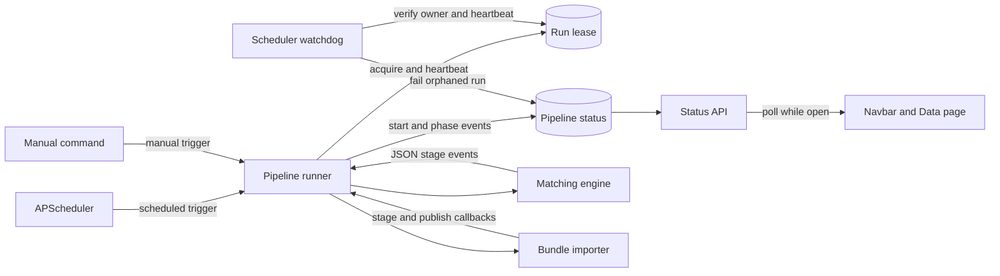
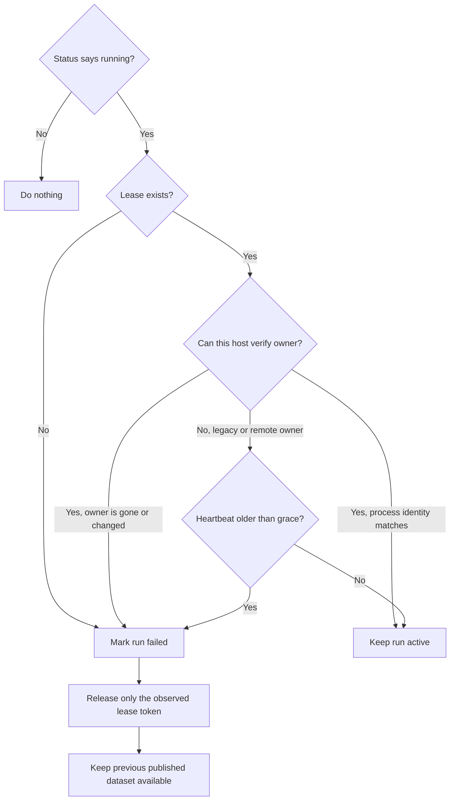

# A3.3 Deployment Scheduling

The scheduler lives in `backend/jobs/`. It composes an independently installed engine executable with the review app's bundle importer. It does not import engine modules.

APScheduler runs `backend.jobs.job_runner.run_pipeline` at `PIPELINE_SCHEDULE_INTERVAL_HOURS` in `PIPELINE_TIMEZONE`. The existing shared status store and heartbeat lock prevent overlapping jobs on the same deployment.

## How the pieces fit together



There are two deliberately separate runtime records:

- The **status record** explains the run to people: run ID, phase, message, stage timings, outcome and next scheduled time.
- The **lease record** proves that a particular runner process still owns the run. Its heartbeat is for liveness, not presentation.

Keeping them separate prevents a stale status message from being mistaken for proof that a process is alive.

## Runtime-state ownership

The scheduler and the pipeline runner share `pipeline_status.json`, but they own different fields:

| Writer | Owned fields |
|---|---|
| Scheduler service | `next_run_at` and its `schedule_updated_at` timestamp only |
| Active pipeline runner | Run state (`status`, `phase`, messages, counters, timestamps, phase history and result metadata) |
| Import completion | `last_pipeline_data_import_ended_at` and published result metadata |

Starting or restarting the scheduler must never reset the execution state to `idle`. A manual run may begin at almost the same moment as the long-running scheduler process; treating scheduler startup as an execution-state event would hide that active run from the website.

Status changes are atomic field patches. The file backend takes the shared runtime guard before reading, merging and replacing the JSON file. The Redis backend performs the same merge with `WATCH`/`MULTI`, retrying if another writer wins the race. Consequently, a `next_run_at` update cannot restore an older copy of the runner's phase, and a runner phase update cannot discard the next scheduled time.

The heartbeat lock is the authoritative active-run lease. The runner acquires it before publishing `status=running`, records its host, PID, process start identity and container/PID-namespace lifetime, refreshes a `heartbeat_at` timestamp throughout long engine work, and releases the lease after success or failure. A four-hour TTL is only the final overlap backstop; it is not how long the UI waits to notice a dead runner.

The scheduler runs a liveness watchdog at startup and every `PIPELINE_WATCHDOG_INTERVAL_SECONDS`. On the same runtime it verifies that the recorded PID still identifies the original process; after a container restart, the changed runtime identity proves immediately that the old owner cannot still exist. For legacy or cross-host leases whose owner cannot be verified locally, the watchdog requires the heartbeat to be older than `PIPELINE_LOCK_STALE_SECONDS` before recovery. Recovery releases only the observed token, marks that run failed with an interruption message, and leaves the last published dataset active. It never reports a dead runner as running for the full four-hour overlap lease.

As a compatibility safeguard in the opposite direction, the status reader projects an unfinished `idle` record with a live lease as `running`; it infers the next phase from phase history until the runner writes its next normal update. This repairs state left by older deployments that reset an active run during scheduler startup without masking an orphan forever.

The resulting liveness decisions are:



This is deliberately conservative across hosts, where the scheduler cannot inspect the owner process. On the same host or after a container restart, process and runtime identity allow immediate proof that the old owner is gone. The next watchdog pass performs the repair; scheduler startup also runs the check immediately.

| Mode | Behavior |
|---|---|
| `full` | Invoke `transport-matcher swiss --download`, then import the complete bundle. |
| `match-import` | Invoke matching with existing source snapshots, then import. |
| `import` | Import `PIPELINE_BUNDLE`; an engine installation is unnecessary. |

```bash
python -m backend.jobs.job_runner --mode full --trigger manual
python -m backend.jobs.job_runner --mode import --trigger manual
```

`MATCHER_COMMAND` defaults to `transport-matcher`. It is parsed into executable arguments without invoking a shell. `PIPELINE_WORKSPACE` supplies the acquisition workspace; `PIPELINE_BUNDLE_DIR` stores immutable completed runs.

Download, matching and staging happen while the current public snapshot remains readable. PostgreSQL briefly serializes the final table switch. The existing Routes maintenance guard remains available for deployments that explicitly mark maintenance; lock/statement timeout handlers also cover a race with publication.

Success updates the active run ID and timestamps. Engine failures or rejected imports produce failed status and preserve the prior dataset. Files left by failed unpublished runs are not imported. The publication code independently serializes concurrent switches even if a caller bypasses the scheduler.

Status and export progress use shared JSON files under `STATE_DIR`, with atomic writes and file locks. Async report state belongs to the app; source freshness metadata belongs to the engine workspace.

## Live status in the web interface

Every page polls `/api/system/pipeline_status`. Idle polling occurs every ten seconds; while a run is active it occurs every 1.5 seconds. The navbar is also rendered with the current server-side state, so an already-running pipeline is identified before the first browser poll.

The pipeline card is independent from the published analytics snapshot. It remains visible during the first-ever run, when `stats.json` does not exist yet; the no-stats notice appears below the live card until publication succeeds.

The Data page turns the phase history into a live elapsed-time timeline. Its public phases describe user-visible work rather than process boundaries:

| Phase | Work represented |
|---|---|
| Check sources | Probe ATLAS and GTFS freshness, validate reusable caches and prepare the geographic boundary. |
| Prepare source files | Download/filter or reuse ATLAS, download/extract or reuse GTFS, prepare timetable patterns and identities/routes, then download the current OSM extract. |
| Load matching inputs | Read ATLAS stops and cached timetable products, optionally prepare a supplied GTFS feed, then parse OSM stops, route relations and evidence. |
| Stop matching | Group OSM stop structures, run the stop-matching rules and detect stop problems. Internal algorithm names are intentionally kept out of the main UI label. |
| Route matching | Normalize and compare line families, itineraries, directions and stop sequences. |
| Build result bundle | Record fingerprints and quality metrics, serialize and compress the result, write checksums and validate the bundle. |
| Stage database | Validate the bundle independently, project application rows, load an isolated PostgreSQL schema, and build indexes. Readers continue using the previous snapshot. |
| Publish dataset | Atomically switch the staged tables into public view, generate analytics and update publication metadata. This publishes data; it does not deploy the website. |

The runner streams the engine's JSON `stage_started` and `stage_progress` records while preserving them in the scheduler log. Versioned events carry the parent phase and order; diagnostic cache-decision logs do not drive the UI. Explicit `stage_outcome` events mark cached preparation substages as `Reused`; modes that intentionally omit work mark it as `Skipped`. Import code reports staging and the real atomic table switch directly, so publication is no longer represented by a metadata-only step after the switch.

These eight phases and their bullets follow execution order. Cards report “N/M finished”, including completed, reused and skipped work. See [pipeline progress (A3.5)](3.5%20Pipeline%20Progress.md) for the version-2 contract and coordinated engine/application update.

### Stage timestamps and history

Yes, every observed stage event should have a timestamp. The status store records UTC ISO 8601 values; the browser converts them to the viewer's local time. The compact time shown below each bar is:

| Stage state | Time displayed | Duration |
|---|---|---|
| Running | `phase_started_at` | Browser clock minus the stage start, refreshed each second |
| Completed or failed | The history entry's `started_at` | `finished_at - started_at`, calculated by the backend |
| Reused | The instant the cache-hit decision was received | `0`; the UI says `Reused` instead of `0s` |
| Skipped | The instant the run-mode decision was recorded | `0`; the UI says `Skipped` instead of `0s` |
| Waiting | No timestamp yet | No duration yet |

The backend now records reuse and skip decisions as timestamped, zero-duration history events. This fills the missing timestamp shown in older timelines without pretending that cached work took time. If an older completed run never recorded a stage event, its UI continues to show `—`: an exact historical time cannot be reconstructed safely.

A completed measured stage looks like this:

```json
{
  "phase": "stop_matching",
  "started_at": "2026-09-21T14:18:23.120000+00:00",
  "finished_at": "2026-09-21T14:46:45.390000+00:00",
  "duration_seconds": 1702.27
}
```

A cache decision uses the same schema, which keeps the UI and API simple:

```json
{
  "phase": "atlas",
  "started_at": "2026-09-21T14:18:23.100000+00:00",
  "finished_at": "2026-09-21T14:18:23.100000+00:00",
  "duration_seconds": 0.0,
  "status": "reused"
}
```

Timestamp meanings elsewhere in the status record are intentionally distinct:

| Field | Meaning |
|---|---|
| `started_at` | Start of the whole run; immutable for that run. |
| `phase_started_at` | Start of the currently active phase; cleared when the run ends. |
| `phase_history[].started_at` / `finished_at` | Measured boundaries of completed, failed, reused or skipped stages. |
| `updated_at` | Last status mutation; not a stage boundary or liveness proof. |
| `finished_at` | End of the run, whether successful or failed. |
| `last_success_at` | End of the most recent successful run. |
| `last_pipeline_data_import_ended_at` | Publication metadata used by the analytics snapshot. |
| `schedule_updated_at` / `next_run_at` | Scheduler metadata, independent of run execution. |
| Lease `acquired_at` / `heartbeat_at` / `expires_at` | Lock ownership and health; never used as stage timings. |

Timeline behavior:

- Completed stages show a green check, the active stage shows a spinner, and stages that have not started remain white and visible at their minimum width on the right.
- The active stage's elapsed counter and width update in the browser once per second; this animation does not wait for another API request.
- A completed stage keeps its measured duration as its flex weight. The active stage gains one unit of weight per elapsed second. Therefore, as a later stage runs, earlier stages occupy a decreasing percentage of total elapsed time and their boundaries move left.
- On success, all stages use their measured durations. If historic duration data is unavailable, the template's static proportions provide a readable fallback.
- A failed stage remains visually distinct and the preceding successful stages keep their measured proportions.
- Labels are confined to their own stage widths and use an ellipsis when necessary. A truncated label receives a hover and keyboard-focus tooltip with its complete name. Narrow screens use a two-column layout rather than allowing labels to overlap.
- Each non-empty time has a hover description such as `Started at`, `Reuse decided at` or `Skip decided at`, including the full local date and time. This makes the otherwise compact `HH:MM:SS` row unambiguous.

This display is a representation of elapsed time, not an ETA. `processed`, `total` and `eta_seconds` may still be exposed for status text, but they do not fabricate stage duration.

## Operational checks

For a manual run, start the services first and then execute the job in the existing scheduler container:

```bash
docker compose up -d db migrator app scheduler
docker compose ps
docker exec stop_sync_osm_atlas_scheduler \
  python -m backend.jobs.job_runner --mode full --trigger manual
```

The code is safe if scheduler startup and manual execution overlap, but checking service readiness makes logs and failure diagnosis clearer. During a run, `/api/system/pipeline_status` must report `status: "running"`; the lock file under `STATE_DIR` should continue receiving `heartbeat_at` updates. If the runner is killed, the scheduler changes the status to failed at startup or on the next watchdog pass, releases the stale token and permits a new run.

For a compact live inspection:

```bash
curl -s http://localhost:5001/api/system/pipeline_status \
  | jq '{status, phase, message, started_at, phase_started_at, phase_history}'
```

Interpret it as follows:

- `status: "running"` plus a current lease heartbeat and a verifiable owner means the process is genuinely alive.
- A changing `updated_at` alone is not enough; scheduler metadata may also update the status record.
- `phase_history` is append-only within a run except when a reuse/skip marker is superseded because that stage actually starts.
- `status: "failed"` with the interruption error means the watchdog recovered an abandoned run. It does not mean the previously published dataset was removed.

| Setting | Default | Meaning |
|---|---:|---|
| `PIPELINE_LOCK_TTL_SECONDS` | `14400` | Maximum lease expiry, retained as the overlap safety backstop. |
| `PIPELINE_LOCK_HEARTBEAT_SECONDS` | `60` | Runner heartbeat frequency. |
| `PIPELINE_LOCK_STALE_SECONDS` | `135` | Maximum heartbeat silence when process ownership cannot be checked directly. |
| `PIPELINE_WATCHDOG_INTERVAL_SECONDS` | `60` | Scheduler liveness reconciliation interval. |
