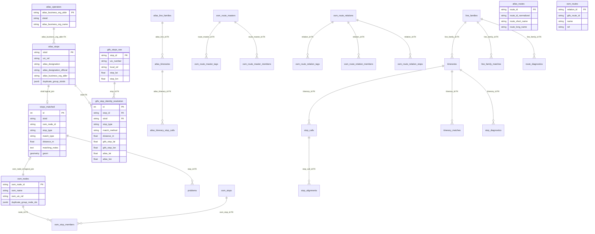

# 4. Database

The project uses a single PostgreSQL database named `import_db` for reproducibly imported stops, routes, diagnostics, and supporting metadata.

The import schema is treated as disposable. The migrator applies migrations before the app starts. The data import itself then truncates and repopulates the import tables from the current pipeline output.

The active schema has three layers:

- raw source tables for ATLAS, GTFS, and OSM route data
- normalized comparison tables used for line-family, itinerary, and stop-call matching
- diagnostics tables used by the web application and exports


| Database | Env Var | Behavior | Contains |
|----------|---------|----------|----------|
| **Import DB** (`import_db`) | `DATABASE_URI` | Migrations applied at startup, then import tables truncated and rebuilt on every run | Raw source tables, normalized comparison tables, diagnostics, and stop-linking tables |

We use **PostgreSQL** with **PostGIS** for spatial queries. The migration history is intentionally flattened to a single baseline in [migrations/versions/](/Users/guillemmassague/Desktop/stop_sync_osm_atlas/migrations/versions) because the schema is not maintained for in-place upgrades.

## Configuration

The import pipeline configures the database connection in [matching_and_import_db/database/session.py](../matching_and_import_db/database/session.py):

```python
DATABASE_URI = os.getenv('DATABASE_URI', '...')
engine = create_engine(DATABASE_URI)
```

The Flask application initializes the same database in [backend/app.py](../backend/app.py), so the importer and web app operate on the same schema.

## Docker Setup

1. waits for PostgreSQL
2. applies any pending migrations

That keeps the running database aligned with the current code without carrying legacy revisions or upgrade branches.

## Schema Overview

The active route product is represented by the raw source tables and the normalized comparison layer.

Raw source tables:

- `gtfs_stops_raw`
- `gtfs_stop_identity_resolution`
- `atlas_line_families`
- `atlas_itineraries`
- `atlas_itinerary_stop_calls`
- `osm_route_masters`
- `osm_route_master_tags`
- `osm_route_master_members`
- `osm_route_relations`
- `osm_route_relation_tags`
- `osm_route_relation_members`
- `osm_route_relation_stops`

Normalized comparison tables:

- `line_families`
- `itineraries`
- `stop_calls`
- `line_family_matches`
- `itinerary_matches`
- `stop_alignments`

Diagnostics tables:

- `route_diagnostics`
- `stop_diagnostics`

The `stops_matched` table remains the central stop-linking table for map rendering, while the GTFS diagnostic map reads from `gtfs_stops_raw` and `gtfs_stop_identity_resolution`.

The deleted legacy route tables are no longer part of the schema.



> [!NOTE]
> This ER diagram shows the main relationships and selected columns. Full table details are documented below.

## Why Some Relationships Use Logical Joins

The `StopsMatched` ORM model defines its relationships to `AtlasStop` and `OsmNode` using explicit SQLAlchemy join conditions rather than database-level foreign keys:

```python
atlas_stop_details = db.relationship(
    'AtlasStop',
    primaryjoin='StopsMatched.sloid == AtlasStop.sloid',
    foreign_keys='AtlasStop.sloid',
    uselist=False,
)
```

That choice is intentional for the central stop-linking layer because:

1. Unmatched ATLAS rows have `osm_node_id = NULL`, and unmatched OSM rows have `sloid = NULL`.
2. The importer can bulk-load the stop tables independently before higher-level relationships are consumed by the web layer.
3. The application can treat `sloid` and `osm_node_id` as natural linkage keys without introducing an extra stop-link table.

This does **not** mean the schema avoids foreign keys entirely. Tables such as `problems`, `osm_stop_members`, `gtfs_stop_identity_resolution`, `atlas_itineraries`, `atlas_itinerary_stop_calls`, and the normalized comparison tables do use database-level FKs where cascade behavior is desirable and the parent entity is canonical.

## Why GTFS Coordinates Live on `gtfs_stop_identity_resolution`

The GTFS diagnostic map needs to render:

- matched GTFS <-> ATLAS pairs
- GTFS-only unmatched stops
- ATLAS-only unmatched stops

To make those queries simple and self-contained, the importer copies both GTFS and ATLAS coordinates onto `gtfs_stop_identity_resolution` rows. That lets the Routes map service build one deduplicated coordinate source for each side without depending on `stops_matched` or adding extra geometry columns to `atlas_stops`.

## Table Reference

The schema reference below only covers the active route model.

### Table: `stops_matched`

The central table representing every map marker: matched pairs, unmatched ATLAS stops, and unmatched OSM nodes.

| Column | Type | Description |
|--------|------|-------------|
| `id` | Integer | Primary key |
| `sloid` | String(100) | Swiss Location ID. Logical link to `atlas_stops`; NULL for unmatched OSM |
| `osm_node_id` | String(100) | OSM node ID. Logical link to `osm_nodes`; NULL for unmatched ATLAS |
| `stop_type` | String(50) | `matched`, `effectively_matched`, `atlas_unmatched`, `osm_unmatched` |
| `match_type` | String(50) | Examples: `exact`, `name`, `distance_matching_*`, `route_gtfs_*`, `duplicate_propagation`, `osm_group_propagation`, `no_nearby_counterpart` |
| `atlas_lat` / `atlas_lon` | Float | ATLAS coordinates when available |
| `osm_lat` / `osm_lon` | Float | OSM coordinates when available |
| `distance_m` | Float | Distance between ATLAS and OSM coordinates |
| `matching_notes` | Text | Matching pipeline notes |
| `geom` | Geometry(POINT, 4326) | PostGIS geometry used for viewport and bbox queries |

### Table: `atlas_stops`

ATLAS-specific attributes keyed by `sloid`.

| Column | Type | Description |
|--------|------|-------------|
| `sloid` | String(100) | **PK** Swiss Location ID |
| `uic_ref` | String(100) | UIC reference from ATLAS |
| `atlas_designation` | String(255) | Platform designation |
| `atlas_designation_official` | String(255) | Official stop name |
| `atlas_business_org_abbr` | String(100) | **FK** to `atlas_operators.atlas_business_org_abbr` (`ON DELETE SET NULL`) |
| `representative_sloid` | String(100) | Representative SLOID for duplicate groups |
| `duplicate_group_sloids` | JSONB | Canonical ATLAS duplicate-group membership |

### Table: `atlas_operators`

Canonical ATLAS operator entities keyed by business organization abbreviation.

| Column | Type | Description |
|--------|------|-------------|
| `atlas_business_org_abbr` | String(100) | **PK** operator abbreviation |
| `sboid` | String(100) | Unique ATLAS business organization ID |
| `atlas_business_org_name` | String(255) | Canonical operator name |

### Table: `gtfs_stops_raw`

Canonical raw GTFS stop table used by the GTFS `stop_id` <-> `sloid` map.

| Column | Type | Description |
|--------|------|-------------|
| `stop_id` | String(255) | **PK** GTFS stop identifier |
| `stop_name` | String(255) | GTFS stop name |
| `uic_number` | String(64) | Parsed Swiss UIC number |
| `local_ref` | String(64) | Raw local/platform suffix parsed from `stop_id` |
| `normalized_local_ref` | String(64) | Normalized local ref used by strict matching |
| `stop_lat` / `stop_lon` | Float | GTFS coordinates |

### Table: `gtfs_stop_identity_resolution`

Materialized GTFS/ATLAS state table for the Routes diagnostic map.

This table stores both matched pairs and per-side unmatched rows.

| Column | Type | Description |
|--------|------|-------------|
| `id` | Integer | Primary key |
| `stop_id` | String(255) | **FK** to `gtfs_stops_raw.stop_id`; NULL for ATLAS-only unmatched rows |
| `sloid` | String(100) | **FK** to `atlas_stops.sloid`; NULL for GTFS-only unmatched rows |
| `stop_type` | String(50) | `matched`, `gtfs_unmatched`, or `atlas_unmatched` |
| `match_method` | String(50) | `strict`, `coordinate_proximity`, `unique_number`, or NULL |
| `distance_m` | Float | Coordinate-rescue distance when applicable |
| `gtfs_stop_lat` / `gtfs_stop_lon` | Float | GTFS-side coordinates copied onto the state row |
| `atlas_lat` / `atlas_lon` | Float | ATLAS-side coordinates copied onto the state row |

The unique constraint on (`stop_id`, `sloid`) prevents duplicate matched-pair rows while still allowing one-sided unmatched rows where the opposite side is NULL.

### Table: `osm_nodes`

OSM-specific stop attributes keyed by `osm_node_id`.

| Column | Type | Description |
|--------|------|-------------|
| `osm_node_id` | String(100) | **PK** OSM node or pseudo-node ID |
| `osm_name` | String(255) | Name from the OSM `name` tag |
| `osm_uic_name` | String(255) | Value from `uic_name` |
| `osm_uic_ref` | String(255) | Value from `uic_ref` |
| `osm_local_ref` | String(100) | Platform identifier from `local_ref` |
| `osm_network` | String(255) | Network tag |
| `osm_public_transport` | String(255) | `public_transport` tag |
| `osm_railway` | String(255) | `railway` tag |
| `osm_amenity` | String(255) | `amenity` tag |
| `osm_aerialway` | String(255) | `aerialway` tag |
| `osm_operator` | String(255) | Normalized operator |
| `osm_node_type` | String(50) | Derived stop type |
| `duplicate_group_node_ids` | JSONB | Canonical OSM duplicate-group membership |

`osm_nodes` stores node-level stop attributes and duplicate metadata only. OSM ways that behave like stops are imported as pseudo-nodes and can be identified by the `way_` prefix in `osm_node_id`.

### Table: `osm_stops`

Canonical OSM stop-unit table used for counting and filtering semantics.

| Column | Type | Description |
|--------|------|-------------|
| `id` | Integer | Primary key |
| `stop_kind` | String(20) | `single`, `pair`, `trio` |
| `group_kind` | String(50) | Pair/trio subtype such as `osm_pair_*` or `osm_trio` |
| `representative_node_id` | String(100) | **FK** to `osm_nodes.osm_node_id` |

### Table: `osm_stop_members`

Membership rows mapping raw OSM nodes to canonical stop units.

| Column | Type | Description |
|--------|------|-------------|
| `osm_stop_id` | Integer | **FK** to `osm_stops.id` |
| `node_id` | String(100) | **FK** to `osm_nodes.osm_node_id`; globally unique across stop units |
| `member_role` | String(20) | `single`, `pair_a`, `pair_b`, `trio_middle`, `trio_side` |

The primary key is composite: (`osm_stop_id`, `node_id`).

### Table: `problems`

Detected stop-level issues linked to `stops_matched`.

| Column | Type | Description |
|--------|------|-------------|
| `id` | Integer | Primary key |
| `stop_id` | Integer | **FK** to `stops_matched.id` with `ON DELETE CASCADE` |
| `problem_type` | String(50) | Stop problem category |
| `priority` | Integer | Priority inside the category |

### Table: `atlas_routes`

Canonical ATLAS route entities imported from GTFS-derived CSVs.

| Column | Type | Description |
|--------|------|-------------|
| `route_id` | String(100) | **PK** GTFS/ATLAS route ID |
| `route_id_normalized` | String(100) | Normalized route ID used by matching helpers |
| `agency_id` | String(100) | GTFS agency identifier |
| `route_short_name` | String(255) | Short route name |
| `route_long_name` | String(255) | Long route name |
| `route_desc` | Text | GTFS route description |
| `route_type` | String(50) | GTFS route type |

### Table: `atlas_route_directions`

Per-route direction summaries for ATLAS routes.

| Column | Type | Description |
|--------|------|-------------|
| `id` | Integer | Primary key |
| `route_id` | String(100) | **FK** to `atlas_routes.route_id` |
| `direction_id` | String(20) | Direction identifier |
| `representative_headsign` | String(255) | Representative trip headsign |
| `direction_label` | String(255) | Derived human-readable direction label |
| `trip_count` | Integer | Number of trips contributing to the group |

### Table Group: Raw Route Inputs

These tables preserve source-specific route structures before normalization.

- `atlas_line_families`: GTFS-derived line-family entities keyed by `atlas_line_id`
- `atlas_itineraries`: GTFS-derived itinerary entities keyed by `atlas_itinerary_id`
- `atlas_itinerary_stop_calls`: ordered stop calls per itinerary
- `osm_route_masters`: OSM line-level `type=route_master` relations
- `osm_route_master_tags` / `osm_route_master_members`: tag and membership expansions for route masters
- `osm_route_relations`: OSM itinerary-level `type=route` relations
- `osm_route_relation_tags` / `osm_route_relation_members` / `osm_route_relation_stops`: tag, membership, and stop expansions for route relations

### Table Group: Normalized Comparison Layer

These tables express the clean product model used by the routes page and diagnostics.

- `line_families`: normalized route families across ATLAS and OSM
- `itineraries`: normalized itinerary rows under a line family
- `stop_calls`: ordered normalized stop calls under an itinerary
- `line_family_matches`: cross-dataset family matches
- `itinerary_matches`: cross-dataset itinerary matches
- `stop_alignments`: aligned ATLAS and OSM stop calls for diagnostics

### Table Group: Route Diagnostics

- `route_diagnostics`: family-level route findings
- `stop_diagnostics`: itinerary or stop-call level route findings

## Indexes

We maintain several indexes to support the web app's query patterns.

### Spatial Index

```sql
CREATE INDEX idx_stops_geom_gist ON stops_matched USING GIST (geom);
```

This supports fast viewport queries such as `/api/data` bounding-box requests.

### Stop and Problem Indexes

| Table | Index | Purpose |
|-------|-------|---------|
| `stops_matched` | `idx_stop_type_match_type` | Filter by stop type and match type |
| `stops_matched` | `idx_distance_m` | Sort and filter by distance |
| `stops_matched` | `sloid`, `osm_node_id` | Logical join performance |
| `atlas_operators` | `idx_atlas_operator_sboid` | Operator SBOID lookups |
| `atlas_stops` | `idx_atlas_operator` | Operator filtering |
| `problems` | `idx_problem_type`, `idx_problem_stop_id`, `idx_problem_priority` | Problem list queries |

### OSM Stop-Unit Indexes

| Table | Index | Purpose |
|-------|-------|---------|
| `osm_stops` | `idx_osm_stops_stop_kind` | Filter by single/pair/trio |
| `osm_stops` | `idx_osm_stops_group_kind` | Filter by OSM stop-group subtype |
| `osm_stops` | `idx_osm_stops_representative_node_id` | Representative-node lookup |
| `osm_stop_members` | `uq_osm_stop_members_node_id` | Enforce one stop-unit membership per node |

### GTFS Diagnostic Indexes

| Table | Index | Purpose |
|-------|-------|---------|
| `gtfs_stops_raw` | `idx_gtfs_stops_raw_uic_number` | Same-UIC candidate lookup for matching and popup previews |
| `gtfs_stops_raw` | `idx_gtfs_stops_raw_coords` | Bounding-box style GTFS viewport filtering |
| `gtfs_stop_identity_resolution` | `idx_gtfs_stop_identity_resolution_stop_type` | Split matched vs unmatched GTFS/ATLAS state |
| `gtfs_stop_identity_resolution` | `idx_gtfs_stop_identity_resolution_stop_id` | GTFS-side joins and popup previews |
| `gtfs_stop_identity_resolution` | `idx_gtfs_stop_identity_resolution_sloid` | ATLAS-side joins and popup previews |
| `gtfs_stop_identity_resolution` | `idx_gtfs_stop_identity_resolution_method` | Match-method summaries and diagnostics |

### Route Indexes

| Table | Index | Purpose |
|-------|-------|---------|
| `atlas_itinerary_stop_calls` | `idx_atlas_itinerary_stop_calls_sequence` | Ordered ATLAS itinerary traversal |
| `osm_route_relation_stops` | `idx_osm_route_relation_stops_sequence` | Ordered OSM itinerary traversal |
| `line_family_matches` | `idx_line_family_matches_status` | Matched/unmatched family queries |
| `itinerary_matches` | `idx_itinerary_matches_status` | Matched/unmatched itinerary queries |
| `stop_alignments` | `idx_stop_alignments_status` | Stop-alignment diagnostics |

## Related Documentation

- **[4.1 Import Process](4.1%20Import%20Process.md)** — How `matching_and_import_db/database/importer.py` rebuilds and repopulates the import database
- **[1.2 GTFS ATLAS data](1.2%20GTFS%20ATLAS%20data.md)** — How GTFS `stop_id` values map to ATLAS `sloid` values before import
- **[5.6 Routes Pages](5.6%20Routes%20Pages.md)** — How the route browser and GTFS diagnostic map consume the normalized route and GTFS identity tables
- **[6.5 Atlas-Cached Import Optimization](6.5%20Atlas-Cached%20Import%20Optimization.md)** — Proposed selective-refresh strategy for ATLAS/GTFS-cached runs