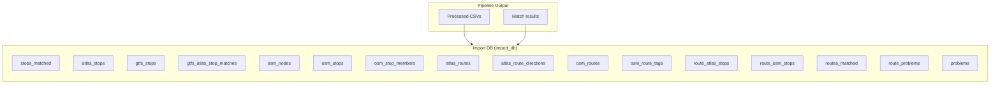
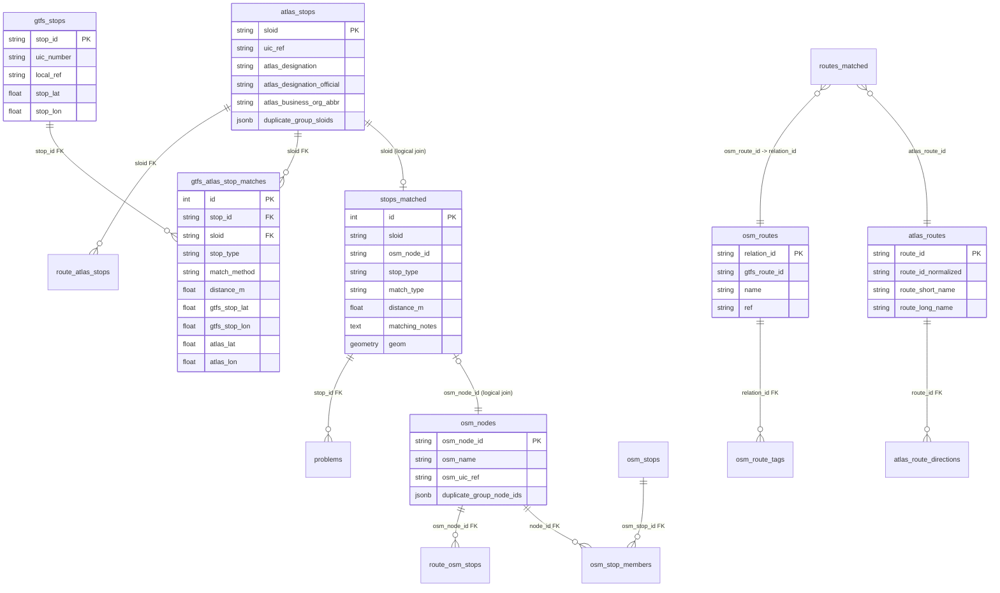

# 4. Database

The project uses a **PostgreSQL** database named `import_db` for reproducibly imported stops, routes, problems, and supporting metadata.

The database is designed to be fully rebuilt from source files on every import run. That keeps the web application aligned with the latest pipeline output and avoids drift between intermediate CSVs and the live UI.

In addition to the main OSM <-> ATLAS stop-linking tables, the schema now includes a dedicated GTFS `stop_id` <-> ATLAS `sloid` state model used by the Routes diagnostic map.

## High-Level Architecture



| Database | Env Var | Behavior | Contains |
|----------|---------|----------|----------|
| **Import DB** (`import_db`) | `DATABASE_URI` | **Truncated and rebuilt** on every import | Stops, routes, problems, and derived linkage tables |

We use **PostgreSQL** with **PostGIS** for spatial queries. Schema changes are managed through Alembic migrations in [migrations/versions/](https://github.com/openTdataCH/stop_sync_osm_atlas/tree/main/migrations/versions/).

## Configuration

The import pipeline configures the database connection in [matching_and_import_db/database/session.py](../matching_and_import_db/database/session.py):

```python
DATABASE_URI = os.getenv('DATABASE_URI', '...')
engine = create_engine(DATABASE_URI)
```

The Flask application initializes the same database in [backend/app.py](../backend/app.py), so the importer and web app operate on the same schema.

## Docker Setup

The PostgreSQL container initializes the database on first boot. Import runs then migrate the schema to HEAD and repopulate the import tables from scratch.

## Schema Overview

The `stops_matched` table is the central table for map rendering. It provides a single row per visible stop marker and links out to ATLAS details, OSM details, route membership, and derived problems.

For the GTFS diagnostic view, `gtfs_stops` and `gtfs_atlas_stop_matches` provide a second, dedicated representation: one canonical GTFS stop table plus a materialized state table containing matched rows and per-side unmatched rows with copied coordinates.



> [!NOTE]
> This ER diagram shows the main relationships and selected columns. Full table details are documented below.

## Why Some Relationships Use Logical Joins

The `StopsMatched` ORM model defines its relationships to `AtlasStop` and `OsmNode` using explicit SQLAlchemy join conditions rather than database-level foreign keys:

```python
atlas_stop_details = db.relationship(
    'AtlasStop',
    primaryjoin='StopsMatched.sloid == AtlasStop.sloid',
    foreign_keys='AtlasStop.sloid',
    uselist=False,
)
```

That choice is intentional for the central stop-linking layer because:

1. Unmatched ATLAS rows have `osm_node_id = NULL`, and unmatched OSM rows have `sloid = NULL`.
2. The importer can bulk-load the stop tables independently before higher-level relationships are consumed by the web layer.
3. The application can treat `sloid` and `osm_node_id` as natural linkage keys without introducing an extra stop-link table.

This does **not** mean the schema avoids foreign keys entirely. Other tables, such as `problems`, `osm_stop_members`, `osm_route_tags`, and route membership tables, do use database-level FKs where cascade behavior is desirable and the parent entity is canonical.

## Why GTFS Coordinates Live on `gtfs_atlas_stop_matches`

The GTFS diagnostic map needs to render:

- matched GTFS <-> ATLAS pairs
- GTFS-only unmatched stops
- ATLAS-only unmatched stops

To make those queries simple and self-contained, the importer copies both GTFS and ATLAS coordinates onto `gtfs_atlas_stop_matches` rows. That lets the Routes map service build one deduplicated coordinate source for each side without depending on `stops_matched` or adding extra geometry columns to `atlas_stops`.

## Table Reference

### Table: `stops_matched`

The central table representing every map marker: matched pairs, unmatched ATLAS stops, and unmatched OSM nodes.

| Column | Type | Description |
|--------|------|-------------|
| `id` | Integer | Primary key |
| `sloid` | String(100) | Swiss Location ID. Logical link to `atlas_stops`; NULL for unmatched OSM |
| `osm_node_id` | String(100) | OSM node ID. Logical link to `osm_nodes`; NULL for unmatched ATLAS |
| `stop_type` | String(50) | `matched`, `effectively_matched`, `atlas_unmatched`, `osm_unmatched` |
| `match_type` | String(50) | Examples: `exact`, `name`, `distance_matching_*`, `route_gtfs_*`, `duplicate_propagation`, `osm_group_propagation`, `no_nearby_counterpart` |
| `atlas_lat` / `atlas_lon` | Float | ATLAS coordinates when available |
| `osm_lat` / `osm_lon` | Float | OSM coordinates when available |
| `distance_m` | Float | Distance between ATLAS and OSM coordinates |
| `matching_notes` | Text | Matching pipeline notes |
| `geom` | Geometry(POINT, 4326) | PostGIS geometry used for viewport and bbox queries |

### Table: `atlas_stops`

ATLAS-specific attributes keyed by `sloid`.

| Column | Type | Description |
|--------|------|-------------|
| `sloid` | String(100) | **PK** Swiss Location ID |
| `uic_ref` | String(100) | UIC reference from ATLAS |
| `atlas_designation` | String(255) | Platform designation |
| `atlas_designation_official` | String(255) | Official stop name |
| `atlas_business_org_abbr` | String(100) | Operator abbreviation |
| `representative_sloid` | String(100) | Representative SLOID for duplicate groups |
| `duplicate_group_sloids` | JSONB | Canonical ATLAS duplicate-group membership |

### Table: `gtfs_stops`

Canonical GTFS stop table used by the GTFS `stop_id` <-> `sloid` map.

| Column | Type | Description |
|--------|------|-------------|
| `stop_id` | String(255) | **PK** GTFS stop identifier |
| `stop_name` | String(255) | GTFS stop name |
| `uic_number` | String(64) | Parsed Swiss UIC number |
| `local_ref` | String(64) | Raw local/platform suffix parsed from `stop_id` |
| `normalized_local_ref` | String(64) | Normalized local ref used by strict matching |
| `stop_lat` / `stop_lon` | Float | GTFS coordinates |

### Table: `gtfs_atlas_stop_matches`

Materialized GTFS/ATLAS state table for the Routes diagnostic map.

This table stores both matched pairs and per-side unmatched rows.

| Column | Type | Description |
|--------|------|-------------|
| `id` | Integer | Primary key |
| `stop_id` | String(255) | **FK** to `gtfs_stops.stop_id`; NULL for ATLAS-only unmatched rows |
| `sloid` | String(100) | **FK** to `atlas_stops.sloid`; NULL for GTFS-only unmatched rows |
| `stop_type` | String(50) | `matched`, `gtfs_unmatched`, or `atlas_unmatched` |
| `match_method` | String(50) | `strict`, `coordinate_proximity`, `unique_number`, or NULL |
| `distance_m` | Float | Coordinate-rescue distance when applicable |
| `gtfs_stop_lat` / `gtfs_stop_lon` | Float | GTFS-side coordinates copied onto the state row |
| `atlas_lat` / `atlas_lon` | Float | ATLAS-side coordinates copied onto the state row |

The unique constraint on (`stop_id`, `sloid`) prevents duplicate matched-pair rows while still allowing one-sided unmatched rows where the opposite side is NULL.

### Table: `osm_nodes`

OSM-specific stop attributes keyed by `osm_node_id`.

| Column | Type | Description |
|--------|------|-------------|
| `osm_node_id` | String(100) | **PK** OSM node or pseudo-node ID |
| `osm_name` | String(255) | Name from the OSM `name` tag |
| `osm_uic_name` | String(255) | Value from `uic_name` |
| `osm_uic_ref` | String(255) | Value from `uic_ref` |
| `osm_local_ref` | String(100) | Platform identifier from `local_ref` |
| `osm_network` | String(255) | Network tag |
| `osm_public_transport` | String(255) | `public_transport` tag |
| `osm_railway` | String(255) | `railway` tag |
| `osm_amenity` | String(255) | `amenity` tag |
| `osm_aerialway` | String(255) | `aerialway` tag |
| `osm_operator` | String(255) | Normalized operator |
| `osm_node_type` | String(50) | Derived stop type |
| `duplicate_group_node_ids` | JSONB | Canonical OSM duplicate-group membership |

`osm_nodes` stores node-level stop attributes and duplicate metadata only. OSM ways that behave like stops are imported as pseudo-nodes and can be identified by the `way_` prefix in `osm_node_id`.

### Table: `osm_stops`

Canonical OSM stop-unit table used for counting and filtering semantics.

| Column | Type | Description |
|--------|------|-------------|
| `id` | Integer | Primary key |
| `stop_kind` | String(20) | `single`, `pair`, `trio` |
| `group_kind` | String(50) | Pair/trio subtype such as `osm_pair_*` or `osm_trio` |
| `representative_node_id` | String(100) | **FK** to `osm_nodes.osm_node_id` |

### Table: `osm_stop_members`

Membership rows mapping raw OSM nodes to canonical stop units.

| Column | Type | Description |
|--------|------|-------------|
| `osm_stop_id` | Integer | **FK** to `osm_stops.id` |
| `node_id` | String(100) | **FK** to `osm_nodes.osm_node_id`; globally unique across stop units |
| `member_role` | String(20) | `single`, `pair_a`, `pair_b`, `trio_middle`, `trio_side` |

### Table: `problems`

Detected stop-level issues linked to `stops_matched`.

| Column | Type | Description |
|--------|------|-------------|
| `id` | Integer | Primary key |
| `stop_id` | Integer | **FK** to `stops_matched.id` with `ON DELETE CASCADE` |
| `problem_type` | String(50) | Stop problem category |
| `priority` | Integer | Priority inside the category |

### Table: `atlas_routes`

Canonical ATLAS route entities imported from GTFS-derived CSVs.

| Column | Type | Description |
|--------|------|-------------|
| `route_id` | String(100) | **PK** GTFS/ATLAS route ID |
| `route_id_normalized` | String(100) | Normalized route ID used by matching helpers |
| `agency_id` | String(100) | GTFS agency identifier |
| `route_short_name` | String(255) | Short route name |
| `route_long_name` | String(255) | Long route name |
| `route_desc` | Text | GTFS route description |
| `route_type` | String(50) | GTFS route type |
| `run_id` | String(100) | Import run identifier |

### Table: `atlas_route_directions`

Per-route direction summaries for ATLAS routes.

| Column | Type | Description |
|--------|------|-------------|
| `id` | Integer | Primary key |
| `route_id` | String(100) | **FK** to `atlas_routes.route_id` |
| `direction_id` | String(20) | Direction identifier |
| `representative_headsign` | String(255) | Representative trip headsign |
| `direction_label` | String(255) | Derived human-readable direction label |
| `trip_count` | Integer | Number of trips contributing to the group |

### Table: `osm_routes`

Canonical OSM route relations.

| Column | Type | Description |
|--------|------|-------------|
| `relation_id` | String(100) | **PK** OSM route relation ID |
| `route` | String(100) | OSM `route=*` value |
| `name` | String(255) | OSM route name |
| `ref` | String(100) | OSM `ref` value |
| `operator` | String(255) | OSM operator |
| `network` | String(255) | OSM network |
| `gtfs_route_id` | String(255) | GTFS-linked route ID stored on the OSM relation |
| `run_id` | String(100) | Import run identifier |

> [!IMPORTANT]
> `osm_routes.relation_id` is the internal OSM route key. `route_osm_stops.osm_route_id` and `routes_matched.osm_route_id` both point to that relation ID, while `osm_routes.gtfs_route_id` stores the GTFS-facing route identifier used for display and cross-dataset comparison.

### Table: `osm_route_tags`

Key-value tags preserved for each imported OSM route relation.

| Column | Type | Description |
|--------|------|-------------|
| `id` | Integer | Primary key |
| `relation_id` | String(100) | **FK** to `osm_routes.relation_id` |
| `tag_key` | String(255) | OSM tag key |
| `tag_value` | Text | OSM tag value |

### Table: `route_atlas_stops`

Ordered mapping of ATLAS stops to ATLAS routes.

| Column | Type | Description |
|--------|------|-------------|
| `atlas_route_id` | String(100) | ATLAS route ID |
| `direction_id` | String(20) | Direction identifier |
| `sloid` | String(100) | **FK** to `atlas_stops.sloid` |
| `stop_sequence` | Integer | Stop order within the direction |

### Table: `route_osm_stops`

Ordered mapping of OSM stop members to OSM route relations.

| Column | Type | Description |
|--------|------|-------------|
| `osm_route_id` | String(100) | Internal OSM route key. This stores the OSM `relation_id`, not `gtfs_route_id` |
| `direction_id` | String(20) | Derived direction identifier |
| `osm_node_id` | String(100) | **FK** to `osm_nodes.osm_node_id` |
| `stop_sequence` | Integer | Stop order within the OSM relation |

### Table: `routes_matched`

Cross-dataset route matches between ATLAS routes and OSM route relations.

| Column | Type | Description |
|--------|------|-------------|
| `id` | Integer | Primary key |
| `atlas_route_id` | String(100) | Matched ATLAS route ID |
| `osm_route_id` | String(100) | Matched OSM relation ID |
| `match_type` | String(50) | Match classification |
| `match_confidence` | Float | Match confidence score |
| `match_reason` | String(255) | Human-readable reason |
| `match_version` | String(50) | Matcher version |

### Table: `route_problems`

Route-level problems derived after route import and route matching.

| Column | Type | Description |
|--------|------|-------------|
| `id` | Integer | Primary key |
| `problem_type` | String(50) | Route problem category |
| `priority` | Integer | Problem priority |
| `atlas_route_id` | String(100) | Related ATLAS route when present |
| `osm_route_id` | String(100) | Related OSM relation when present |
| `details` | JSONB | Structured route-problem payload |

## Indexes

We maintain several indexes to support the web app's query patterns.

### Spatial Index

```sql
CREATE INDEX idx_stops_geom_gist ON stops_matched USING GIST (geom);
```

This supports fast viewport queries such as `/api/data` bounding-box requests.

### Stop and Problem Indexes

| Table | Index | Purpose |
|-------|-------|---------|
| `stops_matched` | `idx_stop_type_match_type` | Filter by stop type and match type |
| `stops_matched` | `idx_distance_m` | Sort and filter by distance |
| `stops_matched` | `sloid`, `osm_node_id` | Logical join performance |
| `atlas_stops` | `idx_atlas_operator` | Operator filtering |
| `problems` | `idx_problem_type`, `idx_problem_stop_id`, `idx_problem_priority` | Problem list queries |

### OSM Stop-Unit Indexes

| Table | Index | Purpose |
|-------|-------|---------|
| `osm_stops` | `idx_osm_stops_stop_kind` | Filter by single/pair/trio |
| `osm_stops` | `idx_osm_stops_group_kind` | Filter by OSM stop-group subtype |
| `osm_stops` | `idx_osm_stops_representative_node_id` | Representative-node lookup |
| `osm_stop_members` | `uq_osm_stop_members_node_id` | Enforce one stop-unit membership per node |

### GTFS Diagnostic Indexes

| Table | Index | Purpose |
|-------|-------|---------|
| `gtfs_stops` | `idx_gtfs_stops_uic_number` | Same-UIC candidate lookup for matching and popup previews |
| `gtfs_stops` | `idx_gtfs_stops_coords` | Bounding-box style GTFS viewport filtering |
| `gtfs_atlas_stop_matches` | `idx_gtfs_atlas_stop_matches_stop_type` | Split matched vs unmatched GTFS/ATLAS state |
| `gtfs_atlas_stop_matches` | `idx_gtfs_atlas_stop_matches_stop_id` | GTFS-side joins and popup previews |
| `gtfs_atlas_stop_matches` | `idx_gtfs_atlas_stop_matches_sloid` | ATLAS-side joins and popup previews |
| `gtfs_atlas_stop_matches` | `idx_gtfs_atlas_stop_matches_method` | Match-method summaries and diagnostics |

### Route Indexes

| Table | Index | Purpose |
|-------|-------|---------|
| `route_atlas_stops` | `idx_atlas_route_dir_seq` | Ordered route traversal |
| `route_atlas_stops` | `uq_route_atlas_stops_seq` | Prevent duplicate route-stop rows |
| `route_osm_stops` | `idx_osm_route_dir_seq` | Ordered route traversal |
| `route_osm_stops` | `uq_route_osm_stops_seq` | Prevent duplicate route-stop rows |
| `routes_matched` | `atlas_route_id`, `osm_route_id` | Cross-dataset route linkage |

## Related Documentation

- **[4.1 Import Process](4.1%20Import%20Process.md)** — How `matching_and_import_db/database/importer.py` rebuilds and repopulates the import database
- **[1.2 GTFS ATLAS data](1.2%20GTFS%20ATLAS%20data.md)** — How GTFS `stop_id` values map to ATLAS `sloid` values before import
- **[5.6 Routes Pages](5.6%20Routes%20Pages.md)** — How the GTFS diagnostic map consumes `gtfs_stops` and `gtfs_atlas_stop_matches`