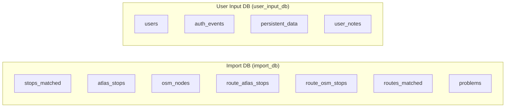

# 4. Databases

The project is structured around **two PostgreSQL databases**: one for reproducible imported data and one reserved for user-input/auth data.

The split is fully present at the migration and import-pipeline level. The user-input side exists structurally, but most of its higher-level application features are not yet wired into the active Flask models and importer workflow.

## Architecture



| Database | Env Var | Behavior | Contains |
|----------|---------|----------|----------|
| **Import DB** (`import_db`) | `DATABASE_URI` | **Wiped and rebuilt** on every import | Stops, problems, routes — all derived from source files |
| **User Input DB** (`user_input_db`) | `USER_INPUT_DATABASE_URI` | **Never wiped** | `persistent_data`, `user_notes`, `users`, `auth_events` |

## Why Two Databases?

1. **Bulletproof imports** — `matching_and_import_db/database/importer.py` uses `TRUNCATE CASCADE` to clear all import tables instantly, with zero risk of touching user data.
2. **Independent backups** — Only `user_input_db` needs regular backups. `import_db` can be regenerated from CSV files at any time.
3. **Clean separation** — No careful "delete only these rows" logic. Each database has one clear owner.

## Configuration

The import pipeline configures both databases directly in [matching_and_import_db/database/session.py](../matching_and_import_db/database/session.py):

```python
DATABASE_URI = os.getenv('DATABASE_URI', '...')
USER_INPUT_DATABASE_URI = os.getenv('USER_INPUT_DATABASE_URI', '...')

engine = create_engine(DATABASE_URI)
user_input_engine = create_engine(USER_INPUT_DATABASE_URI)
```

The Flask web app currently initializes only the import database in [backend/app.py](../backend/app.py). The user-input database is provisioned separately for the import pipeline and future application features.

## Docker Setup

The PostgreSQL container creates both databases on first initialization via `docker/postgres-init/01-create-user-input-db.sql`. Schema is managed by a split Alembic migration that targets both engines in [migrations/versions/b5fa82492b15_initial_migration_for_split_databases.py](../migrations/versions/b5fa82492b15_initial_migration_for_split_databases.py).

## Detailed Documentation

- **[4.1 Import DB Schema](4.1%20Import%20DB%20Schema.md)** — Tables, columns, indexes, and relationships in the import database
- **[4.2 Import Process](4.2%20Import%20Process.md)** — How `matching_and_import_db/database/importer.py` transforms pipeline output into database records