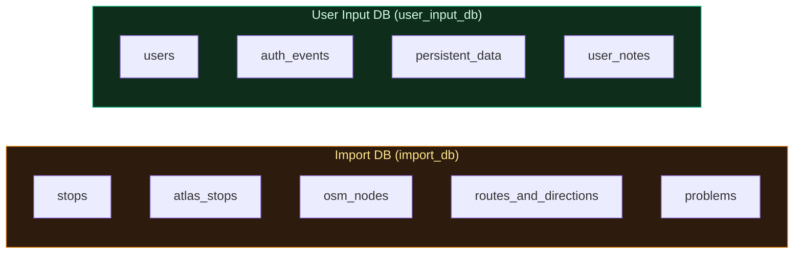

# 4. Databases

We physically separate the data into **two PostgreSQL databases** to isolate reproducible, imported data from irreplaceable user contributions.

## Architecture



| Database | Env Var | Behavior | Contains |
|----------|---------|----------|----------|
| **Import DB** (`import_db`) | `DATABASE_URI` | **Wiped and rebuilt** on every import | Stops, problems, routes — all derived from source files |
| **User Input DB** (`user_input_db`) | `USER_INPUT_DATABASE_URI` | **Never wiped** | Users, auth events, persistent solutions, user notes |

## Why Two Databases?

1. **Bulletproof imports** — `import_data_db.py` uses `TRUNCATE CASCADE` to clear all import tables instantly, with zero risk of touching user data.
2. **Independent backups** — Only `user_input_db` needs regular backups. `import_db` can be regenerated from CSV files at any time.
3. **Clean separation** — No careful "delete only these rows" logic. Each database has one clear owner.

## Configuration

Both databases are configured in `app.py` via Flask-SQLAlchemy binds:

```python
app.config['SQLALCHEMY_DATABASE_URI'] = os.getenv('DATABASE_URI', '...')
app.config['SQLALCHEMY_BINDS'] = {
    'user_input': os.getenv('USER_INPUT_DATABASE_URI', '...'),
}
```

Models in `user_input_db` declare `__bind_key__ = 'user_input'`. Models without a bind key go to the default (import) database.

## Docker Setup

The PostgreSQL container creates both databases on first initialization via `docker/postgres-init/01-create-user-input-db.sql`. Schema is managed by Alembic migrations that target both databases in a single migration file.

## Detailed Documentation

- **[4.1 Import DB Schema](4.1%20Import%20DB%20Schema.md)** — Tables, columns, indexes, and relationships in the import database
- **[4.2 User Input DB](4.2%20User%20Input%20DB.md)** — Auth tables, persistent solutions, and user notes
- **[4.3 Import Process](4.3%20Import%20Process.md)** — How `import_data_db.py` transforms CSV files into database records