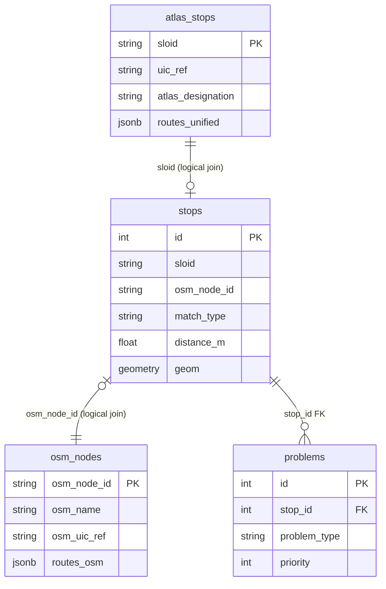

# 4. Stops DB

We use **PostgreSQL** with the **PostGIS** extension for spatial queries. The schema is managed via Alembic migrations in `migrations/versions/`.

## Architecture Overview

The `stops` table serves as the **central linking table** that unifies ATLAS and OSM data. We chose this design so every map marker has a single source of truth for display, regardless of match status. This simplifies frontend queries—instead of querying three tables to render the map, the application queries `stops` and joins to detail tables only when needed.



> [!NOTE]
> This diagram shows **key columns only**. Complete column listings are provided in the tables below.

### Why Logical Joins Instead of Foreign Keys

We define relationships in SQLAlchemy using **explicit join conditions** rather than database-level foreign key constraints:

```python
atlas_stop_details = db.relationship('AtlasStop', 
    primaryjoin='Stop.sloid == AtlasStop.sloid', 
    foreign_keys='AtlasStop.sloid', ...)
```

We chose this approach because:
1. **Flexibility** – Unmatched ATLAS stops have `osm_node_id = NULL`, and unmatched OSM nodes have `sloid = NULL`. Traditional FKs would require nullable constraints and complicate cascade behavior.
2. **Import performance** – We can bulk-insert into each table independently without FK constraint checks, then rely on application-level joins.
3. **Schema simplicity** – The `sloid` and `osm_node_id` columns act as natural keys without requiring an intermediate join table.

---

## Table: `stops`

The central table representing every map marker—matched pairs, unmatched ATLAS stops, and unmatched OSM nodes.

| Column | Type | Description |
|--------|------|-------------|
| `id` | Integer | Primary key |
| `sloid` | String(100) | Swiss Location ID → logical link to `atlas_stops`. NULL for unmatched OSM |
| `osm_node_id` | String(100) | OSM node ID → logical link to `osm_nodes`. NULL for unmatched ATLAS |
| `stop_type` | String(50) | `matched`, `unmatched` |
| `match_type` | String(50) | `exact`, `name`, `distance`, `route`, `manual`, `unmatched_atlas`, `unmatched_osm`, `no_nearby_counterpart` |
| `manual_is_persistent` | Boolean | True if a manual match was saved to persistent storage |
| `atlas_lat` / `atlas_lon` | Float | ATLAS coordinates (NULL for unmatched OSM) |
| `osm_lat` / `osm_lon` | Float | OSM coordinates (NULL for unmatched ATLAS) |
| `distance_m` | Float | Distance in meters between ATLAS and OSM coordinates |
| `osm_node_type` | String(50) | Derived type: `platform`, `stop_position`, `railway_station`, `ferry_terminal`, `aerialway` |
| `atlas_duplicate_sloid` | String(100) | Points to another sloid in the same duplicate group (for highlighting) |
| `geom` | Geometry(POINT, 4326) | PostGIS point for spatial queries. Uses ATLAS coordinates if available, else OSM |

---

## Table: `atlas_stops`

ATLAS-specific attributes, keyed by `sloid`.

| Column | Type | Description |
|--------|------|-------------|
| `sloid` | String(100) | **PK** Swiss Location ID |
| `uic_ref` | String(100) | UIC reference from ATLAS (`number` field) |
| `atlas_designation` | String(255) | Platform identifier (e.g., "1", "A", "Gleis 2") |
| `atlas_designation_official` | String(255) | Official stop name from traffic point data |
| `atlas_business_org_abbr` | String(100) | Operator abbreviation (e.g., "SBB", "BLS") |
| `routes_unified` | JSONB | Aggregated route data from GTFS and HRDF sources |
| `atlas_note` | Text | User-editable note |
| `atlas_note_is_persistent` | Boolean | Whether the note survives data re-imports |
| `atlas_note_user_id` | Integer | User who last modified the note |
| `atlas_note_user_email` | String(255) | Email of user who last modified the note |

---

## Table: `osm_nodes`

OSM-specific attributes, keyed by `osm_node_id`.

| Column | Type | Description |
|--------|------|-------------|
| `osm_node_id` | String(100) | **PK** OSM node ID |
| `osm_name` | String(255) | Stop name from `name` tag |
| `osm_uic_name` | String(255) | UIC name from `uic_name` tag |
| `osm_uic_ref` | String(255) | UIC reference from `uic_ref` tag |
| `osm_local_ref` | String(100) | Platform identifier from `local_ref` tag |
| `osm_network` | String(255) | Network from `network` tag |
| `osm_operator` | String(255) | Operator (normalized) |
| `osm_public_transport` | String(255) | Value of `public_transport` tag |
| `osm_railway` | String(255) | Value of `railway` tag |
| `osm_amenity` | String(255) | Value of `amenity` tag |
| `osm_aerialway` | String(255) | Value of `aerialway` tag |
| `routes_osm` | JSONB | Route relations this node belongs to |
| `osm_note` | Text | User-editable note |
| `osm_note_is_persistent` | Boolean | Whether the note survives data re-imports |
| `osm_note_user_id` | Integer | User who last modified the note |
| `osm_note_user_email` | String(255) | Email of user who last modified the note |

---

## Table: `problems`

Detected issues linked to stops.

| Column | Type | Description |
|--------|------|-------------|
| `id` | Integer | Primary key |
| `stop_id` | Integer | **FK** → `stops.id` (with `ON DELETE CASCADE`) |
| `problem_type` | String(50) | `distance`, `unmatched`, `attributes`, `duplicates` |
| `priority` | Integer | 1 (high), 2 (medium), 3 (low) |
| `solution` | String(500) | User-provided solution text |
| `is_persistent` | Boolean | Whether the solution survives re-imports |
| `created_by_user_id` | Integer | User who set the solution |
| `created_by_user_email` | String(255) | Email of user who set the solution |

---

## Table: `routes_and_directions`

> [!IMPORTANT]  
> This is an **aggregation table** for route-based queries, not a normalized relationship table. It stores denormalized route data with JSONB arrays of stop/node IDs for efficient "find all stops on route X" queries.

| Column | Type | Description |
|--------|------|-------------|
| `id` | Integer | Primary key |
| `direction_id` | String(20) | Direction identifier (typically "0" or "1") |
| `osm_route_id` | String(100) | OSM route relation ID |
| `osm_nodes_json` | JSONB | Array of OSM node IDs on this route+direction |
| `atlas_route_id` | String(100) | GTFS route ID |
| `atlas_sloids_json` | JSONB | Array of sloids on this route+direction |
| `route_name` | String(255) | Route name (from OSM or GTFS) |
| `route_short_name` | String(50) | GTFS `route_short_name` |
| `route_long_name` | String(255) | GTFS `route_long_name` |
| `route_type` | String(50) | Transport mode |
| `match_type` | String(50) | How OSM/ATLAS routes were matched |
| `source` | String(10) | `gtfs` or `hrdf` |
| `atlas_line_name` | String(100) | HRDF line name |
| `direction_uic` | String(50) | HRDF direction UIC |
| `route_id_normalized` | String(100) | Route ID with year codes removed for cross-year matching |

We chose JSONB arrays instead of a normalized many-to-many table because:
1. **Read performance** – Route lookups are frequent; a single row fetch is faster than joining through an intermediate table
2. **Simpler queries** – The web app can query `WHERE atlas_sloids_json @> '["ch:1:sloid:123"]'::jsonb`
3. **Write simplicity** – Routes are fully rebuilt on each import, not incrementally updated

---

## Indexes

We maintain multiple indexes to support the web application's query patterns:

### Spatial Index

```sql
CREATE INDEX idx_stops_geom_gist ON stops USING GIST (geom);
```

Enables fast viewport queries like `ST_DWithin(geom, point, 1000)` and bounding-box filtering for map tiles.

### Composite Indexes on `stops`

| Index | Columns | Purpose |
|-------|---------|---------|
| `idx_atlas_lat_lon` | `atlas_lat`, `atlas_lon` | Legacy coordinate lookups |
| `idx_osm_lat_lon` | `osm_lat`, `osm_lon` | Legacy coordinate lookups |
| `idx_stop_type_match_type` | `stop_type`, `match_type` | Filtering by stop/match type in UI |
| `idx_distance_m` | `distance_m` | Sorting/filtering by distance |

### B-tree Indexes

| Table | Index | Purpose |
|-------|-------|---------|
| `stops` | `sloid`, `osm_node_id` | Logical join performance |
| `atlas_stops` | `uic_ref`, `atlas_business_org_abbr` | UIC lookup, Filter by operator |
| `problems` | `problem_type`, `stop_id`, `priority` | Problem list queries |
| `persistent_data` | `sloid`, `osm_node_id`, `problem_type`, `note_type` | Solution lookups during import |

### Route Indexes on `routes_and_directions`

| Index | Columns | Purpose |
|-------|---------|---------|
| `idx_osm_route_direction` | `osm_route_id`, `direction_id` | Look up stops by OSM route |
| `idx_atlas_route_direction` | `atlas_route_id`, `direction_id` | Look up stops by GTFS route |
| `idx_atlas_line_direction_uic` | `atlas_line_name`, `direction_uic` | Look up stops by HRDF line |
| `idx_source` | `source` | Filter by data source |

---

## Persistent Tables

Tables that survive data re-imports:

| Table | Purpose |
|-------|---------|
| `persistent_data` | Stores problem solutions and notes that should persist across imports |
| `user_notes` | Per-user notes on stops (separate from shared notes) |

See [4.2 Persistent Data](4.2%20Persistent%20Data.md) for details on how persistence works.

---

## Related Documentation

- **[4.1 Database Import](4.1%20Database%20Import.md)** – Process for transforming CSV files into database records
- **[4.2 Persistent Data](4.2%20Persistent%20Data.md)** – Details on preserving user edits across imports
