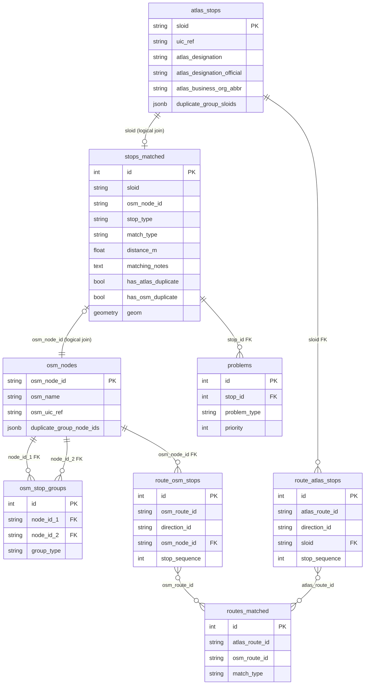

# 4.1 Import DB Schema

We use **PostgreSQL** with the **PostGIS** extension for spatial queries. The schema is managed via Alembic migrations in `migrations/versions/`.

## Architecture Overview

The `stops_matched` table serves as the **central linking table** that unifies ATLAS and OSM data. We chose this design so every map marker has a single source of truth for display, regardless of match status. This simplifies frontend queries: instead of querying three tables to render the map, the application queries `stops_matched` and joins to detail tables only when needed.



> [!NOTE]
> This diagram shows **key columns only**. Complete column listings are provided in the tables below.

### Why Logical Joins Instead of Foreign Keys

We define relationships in SQLAlchemy using **explicit join conditions** rather than database-level foreign key constraints:

```python
atlas_stop_details = db.relationship('AtlasStop',
    primaryjoin='Stop.sloid == AtlasStop.sloid',
    foreign_keys='AtlasStop.sloid', ...)
```

We chose this approach because:
1. **Flexibility** – Unmatched ATLAS stops have `osm_node_id = NULL`, and unmatched OSM nodes have `sloid = NULL`. Traditional FKs would require nullable constraints and complicate cascade behavior.
2. **Import performance** – We can bulk-insert into each table independently without FK constraint checks, then rely on application-level joins.
3. **Schema simplicity** – The `sloid` and `osm_node_id` columns act as natural keys without requiring an intermediate join table.

---

## Table: `stops_matched`

The central table representing every map marker—matched pairs, unmatched ATLAS stops, and unmatched OSM nodes.

| Column | Type | Description |
|--------|------|-------------|
| `id` | Integer | Primary key |
| `sloid` | String(100) | Swiss Location ID → logical link to `atlas_stops`. NULL for unmatched OSM |
| `osm_node_id` | String(100) | OSM node ID → logical link to `osm_nodes`. NULL for unmatched ATLAS |
| `stop_type` | String(50) | `matched`, `atlas_unmatched`, `osm_unmatched` (CHECK constraint enforced) |
| `match_type` | String(50) | Examples: `exact`, `exact_postpass`, `name`, `distance_matching_*`, `route_unified_*`, `duplicate_propagation`, `osm_group_propagation`, `no_nearby_counterpart` |
| `atlas_lat` / `atlas_lon` | Float | ATLAS coordinates (NULL for unmatched OSM) |
| `osm_lat` / `osm_lon` | Float | OSM coordinates (NULL for unmatched ATLAS) |
| `distance_m` | Float | Distance in meters between ATLAS and OSM coordinates |
| `matching_notes` | Text | Free-text notes from the matching pipeline (e.g. ratio test details) |
| `has_atlas_duplicate` | Boolean | True if this stop belongs to an ATLAS duplicate group |
| `has_osm_duplicate` | Boolean | True if this stop belongs to an OSM duplicate group |
| `geom` | Geometry(POINT, 4326) | PostGIS point for spatial queries. Uses ATLAS coordinates if available, else OSM |

---

## Table: `atlas_stops`

ATLAS-specific attributes, keyed by `sloid`.

| Column | Type | Description |
|--------|------|-------------|
| `sloid` | String(100) | **PK** Swiss Location ID |
| `uic_ref` | String(100) | UIC reference from ATLAS (`number` field) |
| `atlas_designation` | String(255) | Platform identifier (e.g., "1", "A", "Gleis 2") |
| `atlas_designation_official` | String(255) | Official stop name from traffic point data |
| `atlas_business_org_abbr` | String(100) | Operator abbreviation (e.g., "SBB", "BLS") |
| `representative_sloid` | String(100) | Representative SLOID for duplicate groups. NULL if this row is the representative or not grouped |
| `duplicate_group_sloids` | JSONB | Array of all SLOIDs in this stop's duplicate group (e.g. `["sloid1", "sloid2"]`). NULL if not a duplicate |

---

## Table: `osm_nodes`

OSM-specific attributes, keyed by `osm_node_id`.

| Column | Type | Description |
|--------|------|-------------|
| `osm_node_id` | String(100) | **PK** OSM node ID |
| `osm_name` | String(255) | Stop name from `name` tag |
| `osm_uic_name` | String(255) | UIC name from `uic_name` tag |
| `osm_uic_ref` | String(255) | UIC reference from `uic_ref` tag |
| `osm_local_ref` | String(100) | Platform identifier from `local_ref` tag |
| `osm_network` | String(255) | Network from `network` tag |
| `osm_operator` | String(255) | Operator (normalized) |
| `osm_public_transport` | String(255) | Value of `public_transport` tag |
| `osm_railway` | String(255) | Value of `railway` tag |
| `osm_amenity` | String(255) | Value of `amenity` tag |
| `osm_aerialway` | String(255) | Value of `aerialway` tag |
| `osm_node_type` | String(50) | Derived type: `platform`, `stop_position`, `railway_station`, `ferry_terminal`, `aerialway` |
| `duplicate_group_node_ids` | JSONB | Array of all OSM node IDs in this node's duplicate group (e.g. `["123", "456"]`). NULL if not a duplicate |

---

## Table: `osm_stop_groups`

Platform / stop_position pairs identified by the pre-matching grouping pass (see [2. Matching process](2.%20Matching%20process.md), OSM Node Grouping section). Each row links two OSM nodes that form a group. Both members are equal — when one is matched to an ATLAS stop, both get their own `stops_matched` row. Coordinates are retrieved from the `osm_nodes` table when needed.

| Column | Type | Description |
|--------|------|-------------|
| `id` | Integer | Primary key |
| `node_id_1` | String(100) | **FK** → `osm_nodes.osm_node_id` (CASCADE). First group member |
| `node_id_2` | String(100) | **FK** → `osm_nodes.osm_node_id` (CASCADE). Second group member |
| `group_type` | String(50) | How the group was formed: `osm_group_uic`, `osm_group_name`, or `osm_group_tram` |

---

## Table: `problems`

Detected issues linked to stops.

| Column | Type | Description |
|--------|------|-------------|
| `id` | Integer | Primary key |
| `stop_id` | Integer | **FK** → `stops_matched.id` (with `ON DELETE CASCADE`) |
| `problem_type` | String(50) | `distance`, `unmatched`, `attributes`, `duplicates` |
| `priority` | Integer | 1 (high), 2 (medium), 3 (low) |

---

## Table: `route_atlas_stops`

Provides the ordered mapping of ATLAS stops natively to their GTFS or HRDF routes.

| Column | Type | Description |
|--------|------|-------------|
| `atlas_route_id` | String(100) | Identifier for the ATLAS route |
| `direction_id` | String(20) | Direction (e.g., "0" or "1") |
| `sloid` | String(100) | Ordered ATLAS stop sloid |
| `stop_sequence` | Integer | Physical order of the stop along the ATLAS route |

---

## Table: `route_osm_stops`

Provides the ordered mapping of OSM nodes to their parent OSM Route Relations.

| Column | Type | Description |
|--------|------|-------------|
| `osm_route_id` | String(100) | Identifier for the OSM route relation |
| `direction_id` | String(20) | Direction identifier |
| `osm_node_id` | String(100) | Ordered OSM stop ID |
| `stop_sequence` | Integer | Physical order of the node along the OSM route relation |

---

## Table: `routes_matched`

Linking table resolving identical routes between OSM and ATLAS databases. Generated during early-phase matching.

| Column | Type | Description |
|--------|------|-------------|
| `id` | Integer | Primary key |
| `atlas_route_id` | String(100) | Links to route_atlas_stops |
| `osm_route_id` | String(100) | Links to route_osm_stops |
| `match_type` | String(50) | E.g. "matched" |

---

## Indexes

We maintain multiple indexes to support the web application's query patterns:

### Spatial Index

```sql
CREATE INDEX idx_stops_geom_gist ON stops_matched USING GIST (geom);
```

Enables fast viewport queries such as the `/api/data` bounding-box filter built on `ST_Intersects(geom, ST_MakeEnvelope(...))`.

### Composite Indexes on `stops_matched`

| Index | Columns | Purpose |
|-------|---------|---------|
| `idx_stop_type_match_type` | `stop_type`, `match_type` | Filtering by stop/match type in UI |
| `idx_distance_m` | `distance_m` | Sorting/filtering by distance |

### B-tree Indexes

| Table | Index | Purpose |
|-------|-------|---------|
| `stops_matched` | `sloid`, `osm_node_id` | Logical join performance |
| `atlas_stops` | `atlas_business_org_abbr` | Filter by operator |
| `atlas_stops` | `uic_ref` | UIC lookup |
| `problems` | `problem_type`, `stop_id`, `priority` | Problem list queries |

### OSM Group Indexes

| Table | Index | Purpose |
|-------|-------|---------|
| `osm_stop_groups` | `node_id_1` | Fast lookup of group partner for a matched stop (used by `/api/data` query) |
| `osm_stop_groups` | `node_id_2` | Bidirectional lookup (either member can be queried) |

### Route Indexes

| Table | Columns | Purpose |
|-------|---------|---------|
| `route_atlas_stops` | `atlas_route_id`, `direction_id`, `stop_sequence` | Linear stop traversal |
| `route_atlas_stops` | `sloid` | Fast lookup of generic routes given an ATLAS stop |
| `route_osm_stops` | `osm_route_id`, `direction_id`, `stop_sequence` | Linear stop traversal |
| `route_osm_stops` | `osm_node_id` | Fast lookup of relations given an OSM node |
| `routes_matched` | `atlas_route_id` / `osm_route_id` | Fast linkage resolution |

---

## Persistent Tables

Tables that survive data re-imports, such as `persistent_data` and `user_notes`, are defined in the separate `user_input_db` migration target rather than in the import schema documented here.

See [4. Databases](4.%20Databases.md) for the current split-database architecture.

---

## Related Documentation

- **[4. Databases](4.%20Databases.md)** – Import DB vs user-input DB architecture
- **[4.2 Import Process](4.2%20Import%20Process.md)** – Process for transforming pipeline output and CSV files into database records
