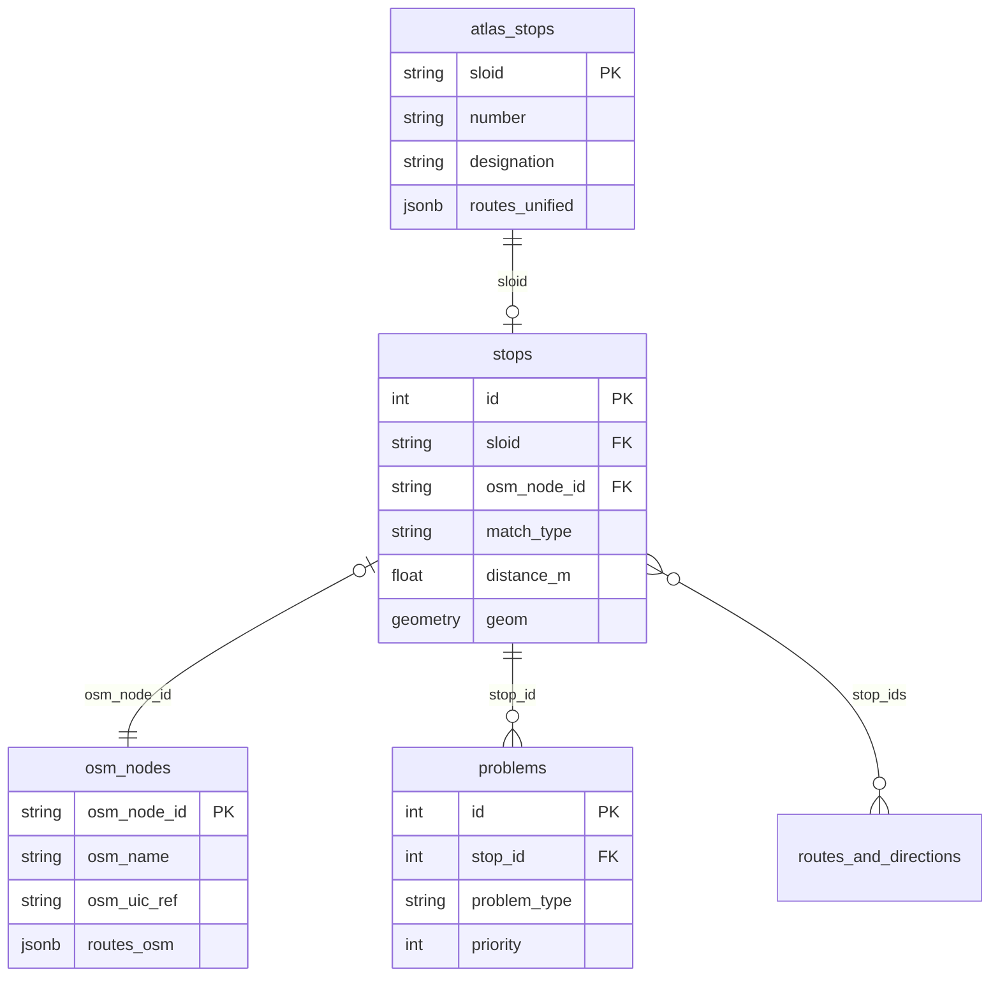

# Stops Database Schema

The database uses a **hub-and-spoke** design with `stops` as the central linking table.



This enables querying "stops" regardless of match status—matched pairs, unmatched ATLAS, or unmatched OSM.

## Table: stops

| Column | Type | Description |
|--------|------|-------------|
| `id` | Integer | Primary key |
| `sloid` | String | FK → `atlas_stops`. NULL if unmatched OSM |
| `osm_node_id` | String | FK → `osm_nodes`. NULL if unmatched ATLAS |
| `stop_type` | String | `bus`, `tram`, `train`, `ferry`, `cable`, `other` |
| `match_type` | String | `exact`, `name`, `distance`, `route`, `unmatched_atlas`, `unmatched_osm` |
| `distance_m` | Float | Distance between ATLAS/OSM coordinates |
| `geom` | Geometry | PostGIS POINT (ATLAS preferred, else OSM) |

## Table: atlas_stops

| Column | Type | Description |
|--------|------|-------------|
| `sloid` | String | **PK** Swiss Location ID |
| `number` | String | UIC reference (8-digit) |
| `atlas_designation` | String | Platform identifier (e.g., "1", "A") |
| `atlas_designation_official` | String | Official stop name |
| `atlas_business_org_abbr` | String | Operator abbreviation |
| `lat` / `lon` | Float | Coordinates |
| `routes_unified` | JSONB | Routes from GTFS/HRDF |

## Table: osm_nodes

| Column | Type | Description |
|--------|------|-------------|
| `osm_node_id` | String | **PK** OSM node ID |
| `osm_name` | String | Stop name (`name` tag) |
| `osm_uic_ref` | String | UIC reference (`uic_ref` tag) |
| `osm_operator` | String | Operator (normalized) |
| `local_ref` | String | Platform identifier (`local_ref` tag) |
| `lat` / `lon` | Float | Coordinates |
| `routes_osm` | JSONB | OSM route relations |

## Table: problems

| Column | Type | Description |
|--------|------|-------------|
| `id` | Integer | Primary key |
| `stop_id` | Integer | FK → `stops` |
| `problem_type` | String | `distance`, `unmatched`, `attributes`, `duplicates` |
| `priority` | Integer | 1 (high), 2 (medium), 3 (low) |
| `is_persistent` | Boolean | Survives data re-imports |

## Table: routes_and_directions

Denormalized table for efficient route-based queries.

| Column | Type | Description |
|--------|------|-------------|
| `route_ref` | String | Route number/name |
| `direction` | String | Direction identifier |
| `stop_ids` | JSONB | Array of stop IDs |

## Spatial Index

```sql
CREATE INDEX idx_stops_geom ON stops USING GIST (geom);
```

Enables queries like `ST_DWithin(geom, point, 1000)` for proximity search.
