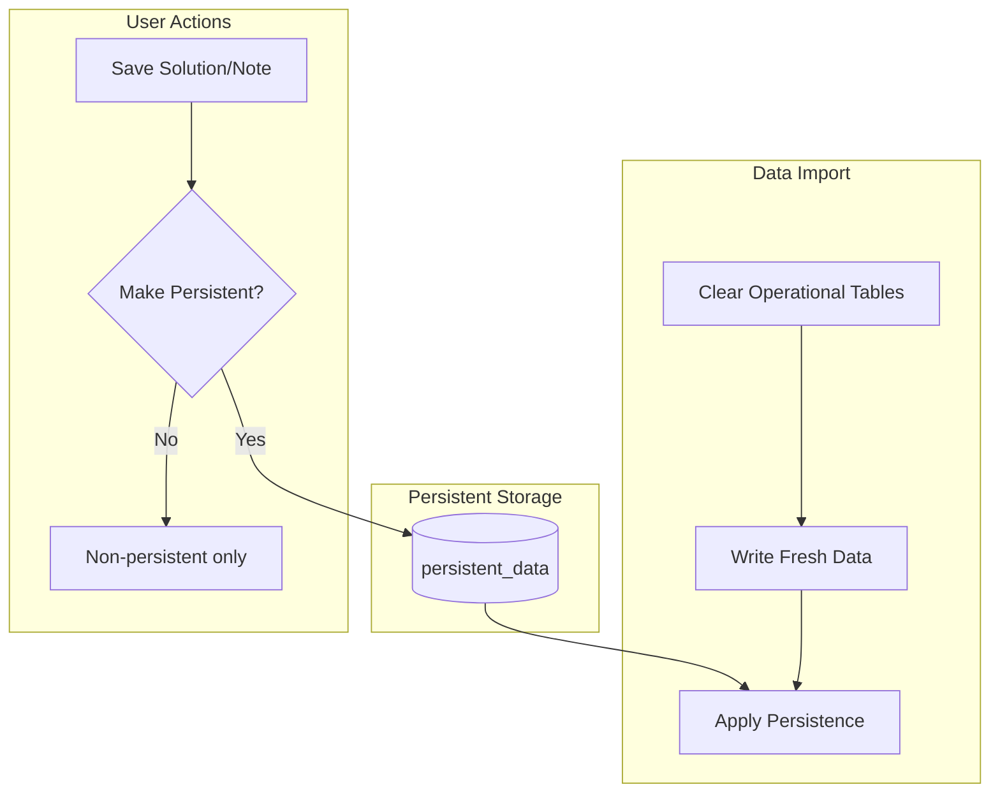

# Persistent Data

The persistent data system preserves user-created solutions and notes across data imports, allowing regular refreshes while maintaining institutional knowledge.

## Data Types

| Type | Behavior on Import |
|------|-------------------|
| **Operational** (stops, problems) | Cleared and repopulated |
| **Persistent** (solutions, notes) | Preserved and re-applied |

## Database Schema

| Column | Type | Description |
|--------|------|-------------|
| `sloid` | String | ATLAS identifier |
| `osm_node_id` | String | OSM identifier |
| `problem_type` | String | 'distance', 'unmatched', 'attributes', 'duplicates' |
| `solution` | String | Resolution description |
| `note_type` | String | 'atlas' or 'osm' |
| `note` | String | User annotation |
| `created_by_user_id` | Integer | Author user ID |
| `created_at` | DateTime | Creation timestamp |

**Unique constraint**: `(sloid, osm_node_id, problem_type, note_type)`

## Persistence Scenarios

| Scenario | Result |
|----------|--------|
| Stop exists, same problem | Solution re-applied |
| Stop exists, problem gone | Solution retained for future |
| Stop removed | Solution orphaned; may apply if stop returns |

## API Endpoints

### Solutions
| Endpoint | Method | Description |
|----------|--------|-------------|
| `/api/save_solution` | POST | Save solution (non-persistent by default) |
| `/api/make_solution_persistent` | POST | Mark solution as persistent |
| `/api/make_non_persistent/<id>` | POST | Revert solution to non-persistent |

### Notes
| Endpoint | Method | Description |
|----------|--------|-------------|
| `/api/save_note/atlas` | POST | Save note for ATLAS stop |
| `/api/save_note/osm` | POST | Save note for OSM node |
| `/api/make_note_persistent/<type>` | POST | Mark note as persistent |
| `/api/notes` | GET | Get all notes for an entity |

### Administration
| Endpoint | Method | Description |
|----------|--------|-------------|
| `/api/persistent_data` | GET | List all persistent items |
| `/api/persistent_data/<id>` | DELETE | Delete a persistent item |
| `/api/clear_all_persistent` | POST | Remove all persistent data (admin) |
| `/api/make_all_persistent` | POST | Mark all non-persistent as persistent |

## Permissions

Access to persistence features depends on user role—see [6.1 Permissions](6.1%20Permissions%20and%20Roles.md) for details.
