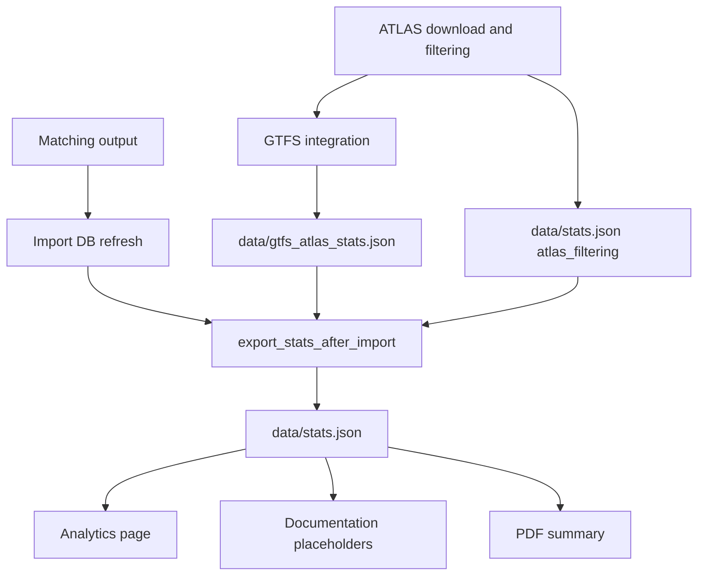

# 4.2 Stats export

The stats export path produces the JSON consumed by the analytics page, the documentation placeholders, and the PDF summary. The output is intentionally reproducible: every pipeline run rebuilds the stats from fresh pipeline artifacts and the current import database state.

## Output files

Two files matter:

| File | Role |
|------|------|
| `data/gtfs_atlas_stats.json` | GTFS-specific sidecar generated during GTFS integration. Contains the canonical `gtfs_atlas` block used later by the final export. |
| `data/stats.json` | Final aggregate stats file consumed by the web app and docs. Combines pipeline metrics, GTFS sidecar stats, route stats, quality metrics, and DB-derived problem counts. |

## High-Level Flow



## Generation stages

### 1. Early ATLAS filtering stats

The standalone ATLAS download step in [matching_and_import_db/downloader/get_atlas_data.py](../matching_and_import_db/downloader/get_atlas_data.py) records filter counts such as:

- raw ATLAS rows
- rows removed by country, geography, validity, and type filters
- final `BOARDING_PLATFORM` totals

Those values are written under `atlas_filtering` in `data/stats.json` before the main import runs.

### 2. GTFS sidecar generation

During GTFS integration, [matching_and_import_db/downloader/get_atlas_gtfs.py](../matching_and_import_db/downloader/get_atlas_gtfs.py) computes GTFS-to-ATLAS mapping statistics while matching GTFS `stop_id` values to ATLAS `sloid` values.

That stage writes `data/gtfs_atlas_stats.json` with the canonical structure:

```json
{
  "atlas": {
    "total": 0,
    "touched_by_gtfs_routes": 0,
    "coverage_percent": 0.0
  },
  "gtfs_stop_ids": {
    "total": 0,
    "matched_to_atlas": 0,
    "unmatched": 0,
    "coverage_percent": 0.0
  }
}
```

The final export embeds that object into `data/stats.json` under the `gtfs_atlas` key.

The GTFS sidecar covers:

- ATLAS-side route coverage: how many ATLAS stops are touched by GTFS-derived route rows
- GTFS-side mapping coverage: how many GTFS `stop_id` values map to an ATLAS `sloid`
- assignment counts for strict and unique-number fallback matching
- cardinality diagnostics (`1 → 1`, `1 → many`, `many → 1`)
- unmatched GTFS reason counts

### 3. Final aggregate export

After the import DB is refreshed, [matching_and_import_db/database/importer.py](../matching_and_import_db/database/importer.py) calls `export_stats_after_import()`.

That function delegates to [backend/services/stats_export.py](../backend/services/stats_export.py), which assembles the final `data/stats.json` from several sources:

| Source | What it contributes |
|------|------|
| Matching output (`matched`, `unmatched_atlas`, `unmatched_osm`) | summary counts, match stage breakdowns, duplicate counts, unmatched analysis |
| OSM stop units and route members | OSM route coverage and many-to-one analysis inputs |
| `data/gtfs_atlas_stats.json` | canonical `gtfs_atlas` block |
| Import DB | problem counts, route problem counts, route-route matching counts |
| Existing `data/stats.json` | only explicitly independent keys such as `atlas_filtering` |

The final export does not preserve arbitrary old keys. This is intentional: the file should reflect the current schema only.

## What `export_pipeline_stats()` computes

The main export function computes the pipeline-derived sections directly from in-memory matching output:

- `summary`
- `matching_stages`
- `unmatched_analysis`
- `duplicates`
- `osm_way_stops`
- `match_type_counts`
- `route_matching`
- `routes`
- `gtfs_atlas`

Then the importer augments that result with:

- `quality_metrics`
- `problems`
- `route_route_matching`

## Why the split exists

The GTFS sidecar is generated earlier than the final DB-backed export because GTFS mapping is known during GTFS integration, not during the later database import step. Keeping it as a separate intermediate artifact avoids recomputing GTFS matching just to build the final stats file.

## Consumers

The main readers of `data/stats.json` are:

- [backend/app.py](../backend/app.py) for the analytics page
- [backend/services/docs_stats.py](../backend/services/docs_stats.py) for `{{stat:...}}` placeholder replacement in docs
- [backend/services/stats_export.py](../backend/services/stats_export.py) for PDF summary generation

## Regeneration paths

There are two common ways to refresh stats:

1. Run the full pipeline/import flow. This regenerates both `data/gtfs_atlas_stats.json` and `data/stats.json`.
2. Run [scripts/regenerate_stats.py](../scripts/regenerate_stats.py). This only refreshes the DB-backed sections and summary from the current import database; it does not recompute the earlier GTFS or ATLAS download stages.

## Invariants

The current design assumes:

- `data/stats.json` is disposable and can be rebuilt at any time
- stats schema changes should update the exporter and consumers directly rather than adding compatibility aliases
- independent pre-export stats must be copied explicitly, not by preserving unknown keys from older files