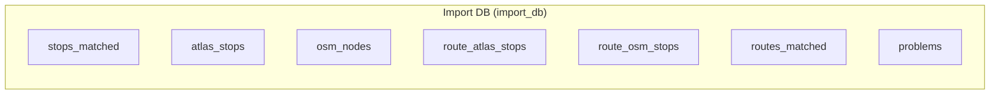

# 5. Database

The project uses a **PostgreSQL** database (named `import_db`) for Reproducible imported data.

The database is designed to be fully rebuilt from source files on every import run. This ensures that the application always presents data consistent with the latest pipeline results.

## Architecture



| Database | Env Var | Behavior | Contains |
|----------|---------|----------|----------|
| **Import DB** (`import_db`) | `DATABASE_URI` | **Wiped and rebuilt** on every import | Stops, problems, routes — all derived from source files |

`osm_nodes` currently stores node-level stop attributes and duplicate-group metadata only. OSM ways are imported as pseudo-nodes by computing their centroid, and they can be identified by having a `way_` prefix in their `osm_node_id`.

## Configuration

The import pipeline configures the database connection in [matching_and_import_db/database/session.py](../matching_and_import_db/database/session.py):

```python
DATABASE_URI = os.getenv('DATABASE_URI', '...')
engine = create_engine(DATABASE_URI)
```

The Flask web app initializes the same database in [backend/app.py](../backend/app.py).

## Docker Setup

The PostgreSQL container initializes the database on first boot. Schema is managed by Alembic migrations in [migrations/versions/](../migrations/versions/).

## Detailed Documentation

- **[5.1 Import DB Schema](5.1%20Import%20DB%20Schema.md)** — Tables, columns, indexes, and relationships in the import database
- **[5.2 Import Process](5.2%20Import%20Process.md)** — How `matching_and_import_db/database/importer.py` transforms pipeline output into database records