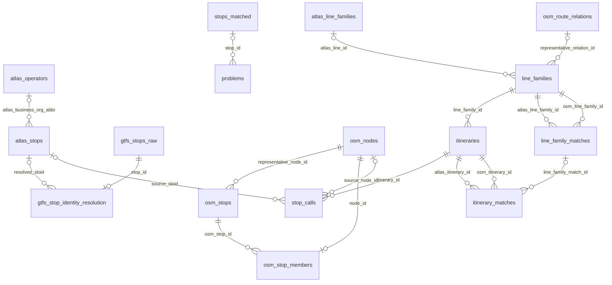

# 5. Database

The project uses a single PostgreSQL database (`import_db`) for imported stop data, GTFS identity resolution, route comparison data, and problem rows.

Imported result tables are reproducible snapshots. The engine exports results and the app validates them, loads a private schema, then atomically replaces its public tables. `dataset_publication` records the active bundle manifest and is updated in the same switch transaction.

Migrations own the SQL structure. `backend/importing/` owns persistence; the engine never connects to this database. The current `atlas_*` SQL names are an app compatibility projection of normalized source records.

## Active Schema

The active ORM schema (`backend/models.py`) is organized into five groups.

### 1. Stop and Identity

- `atlas_operators`
- `atlas_stops`
- `gtfs_stops_raw`
- `gtfs_stop_identity_resolution`
- `osm_nodes`
- `osm_stops`
- `osm_stop_members`
- `stops_matched`
- `problems`

### 2. Route Source Anchors

- `atlas_line_families`
- `osm_route_relations`

These are the only raw/source route tables still persisted. Legacy raw route detail tables are no longer part of the ORM schema.

### 3. Normalized Route Model

- `line_families`
- `itineraries`
- `stop_calls`

These tables are the route model consumed by the web application.

### 4. Route Match Results

- `line_family_matches`
- `itinerary_matches`

### 5. Relationship Summary

The `stop_id` unique constraint limits each raw GTFS stop to at most one identity-resolution row. Likewise, the `node_id` unique constraint assigns each OSM node to at most one canonical OSM stop unit. `o|` on the parent side marks nullable foreign keys. The ORM joins from `stops_matched.sloid` and `stops_matched.osm_node_id` are logical relationships without database foreign keys, so they are not shown as physical ERD edges.

## Snapshot Publication

Every import is a complete result bundle. Source download caches remain reusable in the engine, but the app never depends on earlier ATLAS/GTFS rows to interpret a bundle. Readers keep using the previous dataset during staging, and a failed load or switch preserves that dataset. See [publication details](5.1%20Import%20Process.md).

`dataset_publication` is outside the replaceable result tables. Future human review records must also be kept outside that set and refer to stable entity/problem keys.

## Related Documentation

- [5.1 Import Process](5.1%20Import%20Process.md)
- [5.2 Stats and timestamps](5.2%20Stats%20and%20timestamps.md)
- [3. Routes](3.%20Routes.md)
- [7.4 Atlas-Cached Import Optimization](7.4%20Atlas-Cached%20Import%20Optimization.md)
