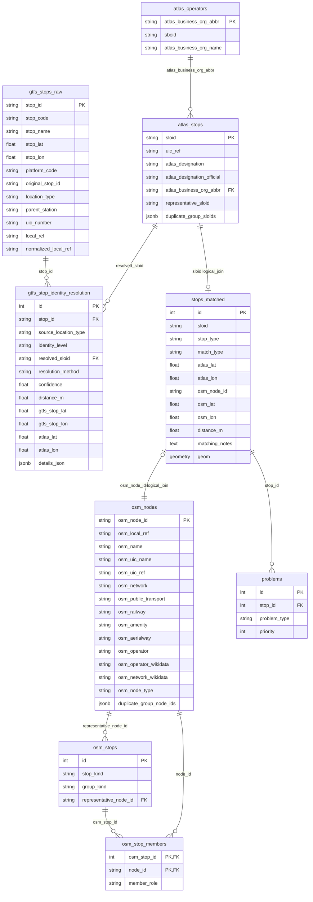
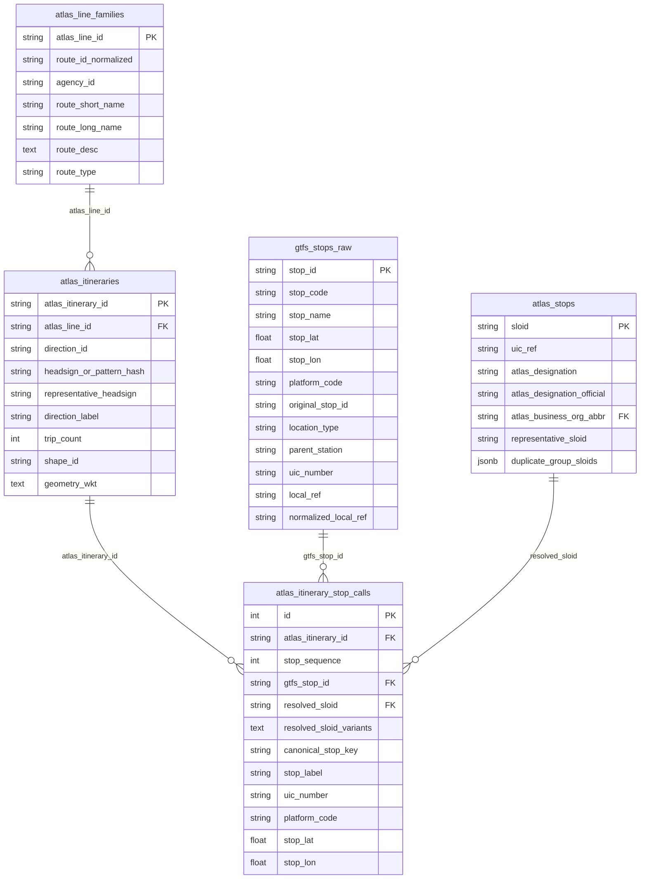
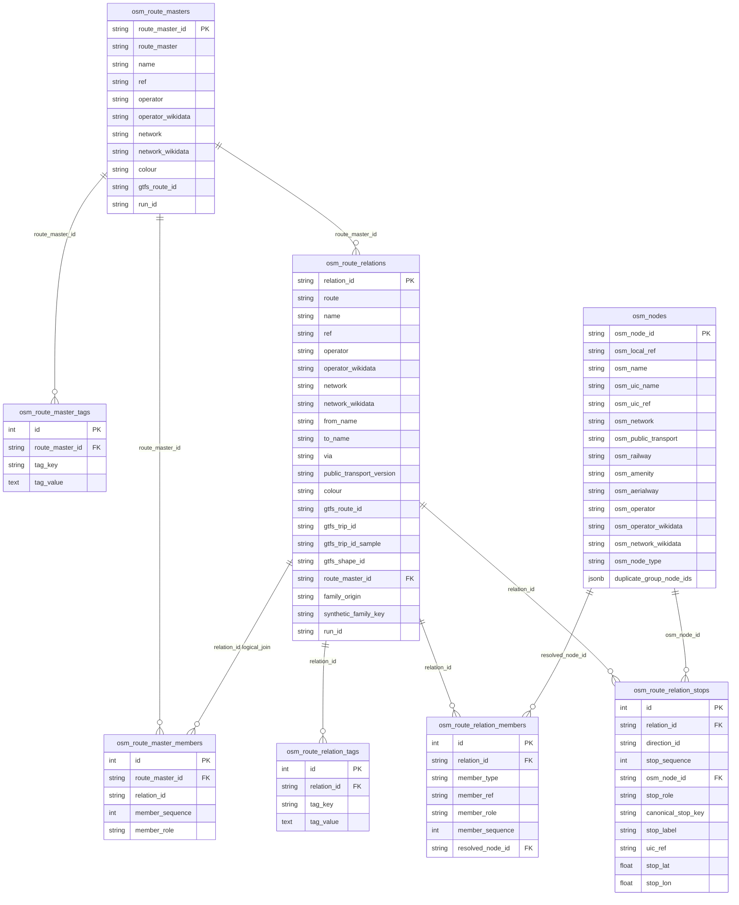
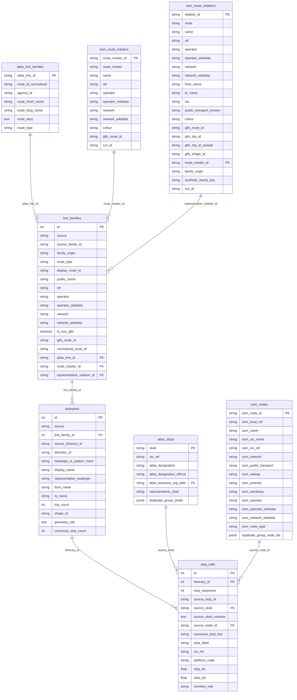
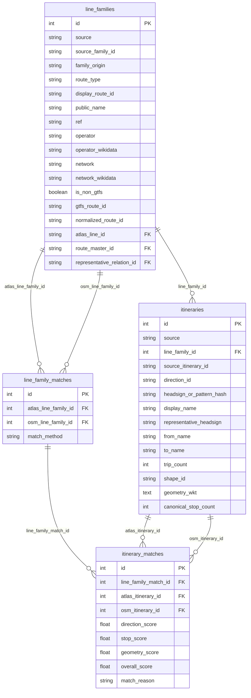

# 5. Database

The project uses one PostgreSQL database, `import_db`, for imported stops, GTFS identity state, route source tables, normalized route comparison tables, and problem rows.

The schema is treated as disposable:

1. the `migrator` container applies migrations
2. the importer truncates the selected import tables
3. the current pipeline output is bulk-inserted again

This keeps the database aligned with the current route and stop products generated by `matching_and_import_db/`.

| Database | Env Var | Behavior | Contains |
|----------|---------|----------|----------|
| **Import DB** (`import_db`) | `DATABASE_URI` | Migrations at startup, then full or partial refresh during import | stop-linking tables, GTFS identity tables, raw route source tables, normalized route tables, and problem rows |

We use **PostgreSQL** with **PostGIS**. The same database is initialized by `backend/app.py` for the web layer and by `matching_and_import_db/database/session.py` for the importer.

## Schema Layers

The active schema has four logical groups.

### 1. Stop and Identity Tables

- `atlas_operators`
- `atlas_stops`
- `gtfs_stops_raw`
- `gtfs_stop_identity_resolution`
- `osm_nodes`
- `osm_stops`
- `osm_stop_members`
- `stops_matched`
- `problems`

These tables power the main map, stop matching review, and the GTFS `stop_id` <-> `sloid` diagnostic view.

### 2. Raw Route Source Tables

- `atlas_line_families`
- `atlas_itineraries`
- `atlas_itinerary_stop_calls`
- `osm_route_masters`
- `osm_route_master_tags`
- `osm_route_master_members`
- `osm_route_relations`
- `osm_route_relation_tags`
- `osm_route_relation_members`
- `osm_route_relation_stops`

These preserve the source-side route products written by the downloader.

### 3. Normalized Route Comparison Tables

- `line_families`
- `itineraries`
- `stop_calls`

These tables are built by `matching_and_import_db/database/route_loader.py` so both the ATLAS and OSM sides can be queried through the same model.

### 4. Route Match Tables

- `line_family_matches`
- `itinerary_matches`

These tables store the deterministic route-level pairing produced during import preparation.

## Refresh Modes

The importer supports two refresh scopes.

### `complete`

All import tables are truncated and rewritten.

### `atlas_cached`

When the ATLAS and GTFS preprocessing inputs are unchanged, the importer reuses the static ATLAS/GTFS-side tables and rewrites only:

- OSM stop tables
- `stops_matched` and `problems`
- OSM raw route tables
- normalized route tables
- route match tables

The reused static tables are:

- `atlas_operators`
- `atlas_stops`
- `gtfs_stops_raw`
- `gtfs_stop_identity_resolution`
- `atlas_line_families`
- `atlas_itineraries`
- `atlas_itinerary_stop_calls`

See [7.5 Atlas-Cached Import Optimization](7.5%20Atlas-Cached%20Import%20Optimization.md) for the operational detail behind that mode.

## Domain ER Diagrams

The schema is easier to read as separate domain diagrams than as one large graph. The diagrams below include all model columns for the tables in each domain. Bridge tables such as `atlas_stops`, `gtfs_stops_raw`, `osm_nodes`, `line_families`, and `itineraries` are repeated where a domain depends on them.

Relationships labeled `logical_join` are intentional non-FK joins used by the application or pipeline; unlabeled relationships are declared database foreign keys.

### 1. Stop and Identity Domain

### 2. ATLAS Raw Route Source Domain

### 3. OSM Raw Route Source Domain

### 4. Normalized Route Comparison Domain

### 5. Route Match Domain

## Why `stops_matched` Uses Logical Joins

The central stop-linking table intentionally uses natural linkage keys instead of hard foreign keys for its ATLAS and OSM sides.

That choice allows:

1. unmatched ATLAS rows with `osm_node_id = NULL`
2. unmatched OSM rows with `sloid = NULL`
3. independent bulk loading of the stop tables before the web layer reads them

Other tables still use regular database FKs where a canonical parent entity exists, such as:

- `problems`
- `osm_stop_members`
- `gtfs_stop_identity_resolution`
- `atlas_itineraries`
- `atlas_itinerary_stop_calls`
- `stop_calls`
- `line_family_matches`
- `itinerary_matches`

## Why GTFS Coordinates Live on `gtfs_stop_identity_resolution`

The GTFS diagnostic map needs one table that can describe:

- GTFS stops with resolved ATLAS matches
- GTFS-only unresolved rows
- matched ATLAS coordinates alongside GTFS coordinates

To keep those queries self-contained, the importer copies both sides' coordinates onto `gtfs_stop_identity_resolution` rows.

## Key Tables

### `stops_matched`

The central map table representing matched pairs, unmatched ATLAS rows, unmatched OSM rows, and effectively matched trio middles.

Key columns:

- `sloid`
- `osm_node_id`
- `stop_type`
- `match_type`
- `atlas_lat` / `atlas_lon`
- `osm_lat` / `osm_lon`
- `distance_m`
- `matching_notes`
- `geom`

### `gtfs_stop_identity_resolution`

The canonical GTFS identity-state table used by the Routes diagnostic map.

Key columns:

- `stop_id`
- `source_location_type`
- `identity_level`
- `resolved_sloid`
- `resolution_method`
- `confidence`
- `distance_m`
- `gtfs_stop_lat` / `gtfs_stop_lon`
- `atlas_lat` / `atlas_lon`
- `details_json`

### `line_families`, `itineraries`, `stop_calls`

The shared route-comparison model used by the Routes page.

Key ideas:

- every row declares a `source` (`atlas` or `osm`)
- source IDs are preserved alongside normalized IDs
- stop calls keep both source-specific IDs and shared physical stop keys when available

### `line_family_matches`, `itinerary_matches`

These tables store the route-level equivalency results generated during import preparation.

`line_family_matches` is the family-level link.
`itinerary_matches` stores the chosen itinerary pairs and their debug scores.

## Related Documentation

- [5.1 Import Process](5.1%20Import%20Process.md)
- [5.2 Stats and timestamps](5.2%20Stats%20and%20timestamps.md)
- [2. Routes](2.%20Routes.md)
- [7.5 Atlas-Cached Import Optimization](7.5%20Atlas-Cached%20Import%20Optimization.md)
