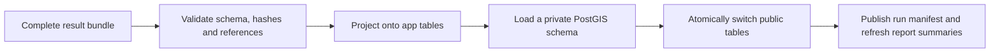

# 5.1 Result Bundle Import and Publication

The review application imports a complete, versioned result bundle. It does not load ATLAS/GTFS files, run predicates, reconstruct stop groups, or compare routes. The engine has already made those decisions.



`backend/importing/bundle.py` reads schema version 1. Required files, checksums, row counts, coordinates, identities, match coverage and group references are validated before database access. The wire format is documented in [the result contract](../engine/RESULT_FORMAT.md).

`backend/importing/projection.py` maps source-neutral fields onto the current SQL model. Swiss `atlas:<sloid>` keys retain native SLOID URLs; other datasets retain their complete namespaced keys. Legacy `atlas_*` SQL column names are local to the app and do not constrain the engine model. GTFS identity rows and statistics arrive as optional extensions; absent extensions produce empty optional views.

`backend/importing/importer.py` creates insert rows, geometry values and relationships from exported records. Problem decisions and effective trio matches are consumed from the bundle. No raw source files are consulted.

## Staging and failure behavior

`backend/importing/publication.py` creates a unique private schema, clones the application table definitions, and bulk-loads all rows there. Its foreign keys reference the staged tables. PostgreSQL constraints reject invalid row relationships before publication.

The final transaction obtains an advisory publication lock and locks the public result tables in a consistent order. It moves the old tables to a temporary previous schema and the new tables to `public`, updates `dataset_publication`, then commits. PostgreSQL table identity preserves each snapshot's internal references during the move. The importer owns these result tables; unrelated tables are outside the publication set.

Lock acquisition is bounded to three seconds and statements to 25 seconds during the switch. If staging or switching fails, the previous public tables and manifest remain active. After a successful switch, the old schema is removed. Cleanup errors are logged separately so successful publication is not incorrectly reported as rolled back.

The result schema and Alembic revision have distinct roles. Alembic owns the app's SQL structure; the engine's schema version owns the file interface. Run migrations before importing. The database account performing imports needs permission to create schemas and move its app-owned tables.

```bash
python -m backend.importing.importer /path/to/result-bundle
```

For an existing example without installing the engine:

```bash
docker compose run --rm --no-deps --entrypoint '' app python -m backend.importing.importer tests/fixtures/result-v1
```

Start `db` and run `migrator` first. The synthetic fixture is intended for a local development database and is available through the development Compose bind mount. Application images exclude test fixtures; deployed consumers import their own bundle path instead.

## Verification

`tests/test_result_bundle.py` covers malformed manifests, partial files, invalid coordinates and references, complete projection, and operation with engine imports blocked. `tests/test_snapshot_publication.py` uses an isolated real PostGIS database to verify publication, failed-load rollback, concurrent reader visibility during staging, and lock-timeout preservation.

The `TEST_POSTGRES_URI` database name must end in `_test`; the tests reset its public schema. These are integration tests, not production performance measurements.

## Bulk-loading performance

The default staging writer uses psycopg COPY. It preserves JSON, EWKT geometry, server defaults and foreign keys while loading. Primary/unique/FK constraints exist from table creation; secondary indexes are built after loading, followed by ANALYZE. Explicit map IDs connect problems without ordered INSERT RETURNING, and sequences are advanced before publication. Index-build failures leave the old public snapshot active.

`DB_IMPORT_METHOD=insert` selects the ORM comparison writer. See [Pipeline Performance](7.5%20Pipeline%20Performance.md) for transaction details, logs, settings and validation.
