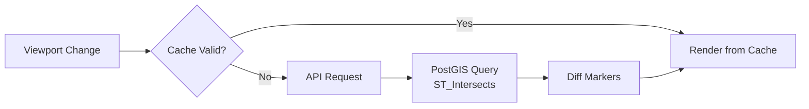

# Map Data Loading and Rendering

The application efficiently loads, filters, and renders stop markers on the interactive map using spatial queries, caching, and marker diffing.



## Data Pipeline

| Step | Component | Purpose |
|------|-----------|---------|
| 1 | PostGIS | Spatial index queries via GiST |
| 2 | API | `/api/data` with viewport bounds |
| 3 | Cache | Avoid redundant requests |
| 4 | Diff | Update only changed markers |

## PostGIS Spatial Query

```sql
SELECT * FROM stops
WHERE ST_Intersects(
    geom,
    ST_MakeEnvelope(min_lon, min_lat, max_lon, max_lat, 4326)
)
```

The `geom` column has a GiST spatial index for fast lookups.

## Zoom Level Modes

| Zoom | Mode | Behavior |
|------|------|----------|
| < 13 | Overview | Unmatched ATLAS only, capped |
| 13–14 | Capped | All types, limited count |
| ≥ 15 | Full | All markers in viewport |

## Frontend Caching

Cache reuse logic:
- **Zoom in + previous NOT capped** → Reuse (new viewport is subset)
- **Zoom out or pan beyond bounds** → Fetch new data
- **Filters changed** → Fetch new data

## Marker Diffing

Instead of recreating all markers:
1. Track markers by key (`atlas-{sloid}` or `osm-{node_id}`)
2. **Existing**: Update position with `setLatLng()`
3. **New**: Create and add to map
4. **Stale**: Remove from map

Benefits: No flickering, smooth transitions, efficient DOM operations

### Canvas vs DOM Markers

| Zoom | Marker Type | Implementation |
|------|-------------|----------------|
| < 18 | CircleMarker | Canvas-based, lightweight |
| ≥ 18 | L.Marker | DOM-based, supports icons |

At zoom 18, markers are recreated to switch rendering modes.

### Marker Colors

| Type | Color | CSS Class |
|------|-------|-----------|
| ATLAS (unmatched) | Green | `atlas-marker` |
| OSM (unmatched) | Orange | `osm-marker` |
| Matched (ATLAS) | Green with indicator | `matched-atlas` |
| Matched (OSM) | Orange with indicator | `matched-osm` |

## 7. Overlap Handling

The `MarkerClusterManager` handles stops at identical coordinates:

```javascript
// Coordinates rounded to tolerance grid
const key = `${Math.round(lat * 1e6)}_${Math.round(lon * 1e6)}`;

// Overlapping markers offset in circle pattern
const angle = (index / total) * 2 * Math.PI;
const offset = radius * { x: Math.cos(angle), y: Math.sin(angle) };
```

This prevents markers from stacking invisibly.

## 8. Troubleshooting

### Markers Not Appearing

1. **Check `geom` column**: Ensure populated in database
2. **Verify SRID**: Must be 4326 (WGS84)
3. **Check API response**: Network tab → `/api/data`
4. **Check console**: JavaScript errors

### "Zoom In" Banner Stuck

- Filters may be limiting results even at high zoom
- Clear filters and try again

### Slow Loading

- Check PostGIS index: `EXPLAIN ANALYZE` on query
- Verify GiST index exists on `geom` column
- Consider reducing marker count threshold

## Code Reference

| File | Purpose |
|------|---------|
| [backend/blueprints/data.py](../backend/blueprints/data.py) | API endpoint |
| [static/js/pages/main.js](../static/js/pages/main.js) | Map initialization |
| [static/js/components/map-renderer.js](../static/js/components/map-renderer.js) | Marker rendering |
| [import_data_db.py](../import_data_db.py) | Geometry import |

## Related Documentation

- [5. Web app](5.%20Web%20app.md) – Application overview
- [5.2 Map layers](5.2%20Map%20layers.md) – Tile layer options
- [4.1 Stops DB](4.1%20Stops%20DB.md) – Database schema
