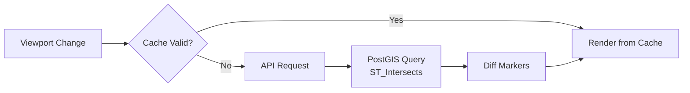

# Map Data Loading and Rendering

The application efficiently loads, filters, and renders stop markers on the interactive map using spatial queries, caching, and marker diffing.



## Data Pipeline

| Step | Component | Purpose |
|------|-----------|---------|
| 1 | PostGIS | Spatial index queries via GiST |
| 2 | API | `/api/data` with viewport bounds |
| 3 | Cache | Avoid redundant requests |
| 4 | Diff | Update only changed markers |

## PostGIS Spatial Query

```sql
SELECT * FROM stops_matched
WHERE ST_Intersects(
    geom,
    ST_MakeEnvelope(min_lon, min_lat, max_lon, max_lat, 4326)
)
```

The real `/api/data` query also includes a second branch for matched rows whose OSM point is inside the viewport even when the ATLAS-side display geometry is outside it. The `geom` column has a GiST spatial index for the primary lookup path.

## Zoom Level Modes

| Zoom | Mode | Behavior |
|------|------|----------|
| < 14 | Overview / Low Zoom | Unmatched ATLAS only (if no filters) or capped filtered results |
| 14–15 | Capped / Mid Zoom | All types (or filters), limited to a capped count to maintain performance |
| ≥ 16 | Full / Uncapped Zoom | All matched markers in viewport naturally rendered without clipping |

## Zoom Banner Policy

The application intelligently restricts the number of rendered markers to maintain performance, and communicates this state via the map's zoom banner.

- **High Zoom (≥ 16)**: The banner is hidden. The data isn't artificially capped.
- **Mid-Zoom (14-15)**: Results are capped (e.g., typically 2,000 matches). If filters are inactive, the banner advises the user to zoom in. If filters are active, it indicates that results are capped (e.g., `Showing first 2000 filtered results...`). If the real query size naturally drops below the cap, the banner is hidden.
- **Low Zoom (< 14)**: By default, the map runs an "Overview mode" displaying only unmatched ATLAS components to save resources. The banner indicates this mode. If explicit active filters are applied, the map respects the filter instead of Overview mode, applies a heavy cap, and updates the banner accordingly.
- **Top N Filters**: Bypasses all zoom-based warning banners, since the data slice is targeted and strictly constrained natively.

## Frontend Caching

Cache reuse logic:
- **Zoom in + previous NOT capped** → Reuse (new viewport is subset)
- **Zoom out or pan beyond bounds** → Fetch new data
- **Filters changed** → Fetch new data

## Marker Diffing

Instead of recreating all markers:
1. Track markers by key (`atlas-{sloid}` or `osm-{node_id}`)
2. **Existing**: Update position with `setLatLng()`
3. **New**: Create and add to map
4. **Stale**: Remove from map

Benefits: No flickering, smooth transitions, efficient DOM operations

### Canvas vs DOM Markers

| Zoom | Marker Type | Implementation |
|------|-------------|----------------|
| < 18 | CircleMarker | Canvas-based, lightweight |
| ≥ 18 | L.Marker | DOM-based, supports icons |

At zoom 18, markers are recreated to switch rendering modes.

### Marker Colors

| Type | Color | CSS Class |
|------|-------|-----------|
| ATLAS (unmatched) | Green | `atlas-marker` |
| OSM (unmatched) | Orange | `osm-marker` |
| Matched (ATLAS) | Green with indicator | `matched-atlas` |
| Matched (OSM) | Orange with indicator | `matched-osm` |

## 5.1.7. Overlap Handling

The `MarkerClusterManager` handles stops at identical coordinates:

```javascript
// Coordinates rounded to tolerance grid
const key = `${Math.round(lat * 1e6)}_${Math.round(lon * 1e6)}`;

// Overlapping markers offset in circle pattern
const angle = (index / total) * 2 * Math.PI;
const offset = radius * { x: Math.cos(angle), y: Math.sin(angle) };
```

This prevents markers from stacking invisibly.

## Code Reference

| File | Purpose |
|------|---------|
| [backend/blueprints/data.py](../backend/blueprints/data.py) | API endpoint |
| [static/js/pages/main.js](../static/js/pages/main.js) | Map initialization |
| [static/js/components/map-renderer.js](../static/js/components/map-renderer.js) | Marker rendering |
| [matching_and_import_db/database/importer.py](../matching_and_import_db/database/importer.py) | Geometry import |

## Related Documentation

- [5. Web app](5.%20Web%20app.md) – Application overview
- [5.2 Map layers](5.2%20Map%20layers.md) – Tile layer options
- [4. Databases](4.%20Databases.md) – Database schema
