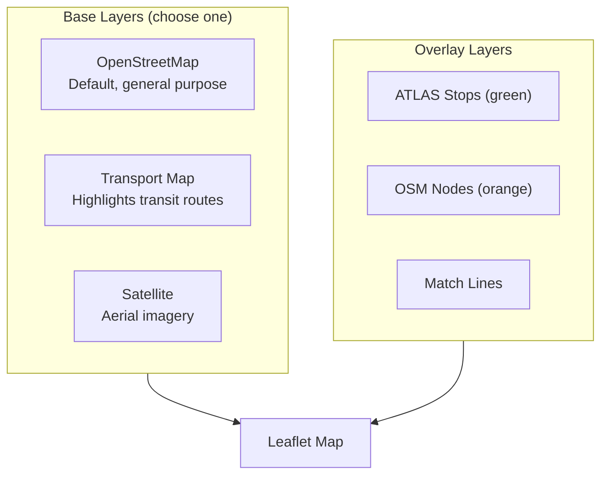

# Map Layers

The interactive map provides multiple tile layer options.

## Base Layers

| Layer | URL | Use Case |
|-------|-----|----------|
| **OpenStreetMap** | `tile.openstreetmap.org` | General editing (default) |
| **Transport** | `tile.memomaps.de` | Route verification |
| **Satellite** | `arcgisonline.com` | Physical location confirmation |

## Overlay Layers

| Layer | Description |
|-------|-------------|
| ATLAS Stops | Green markers for official platforms |
| OSM Nodes | Orange markers for OpenStreetMap nodes |
| Match Lines | Connections between matched pairs |

## Notes

- Tiles are browser-cached automatically
- All providers require attribution (bottom-right corner)
- Beyond max native zoom, tiles are upscaled
