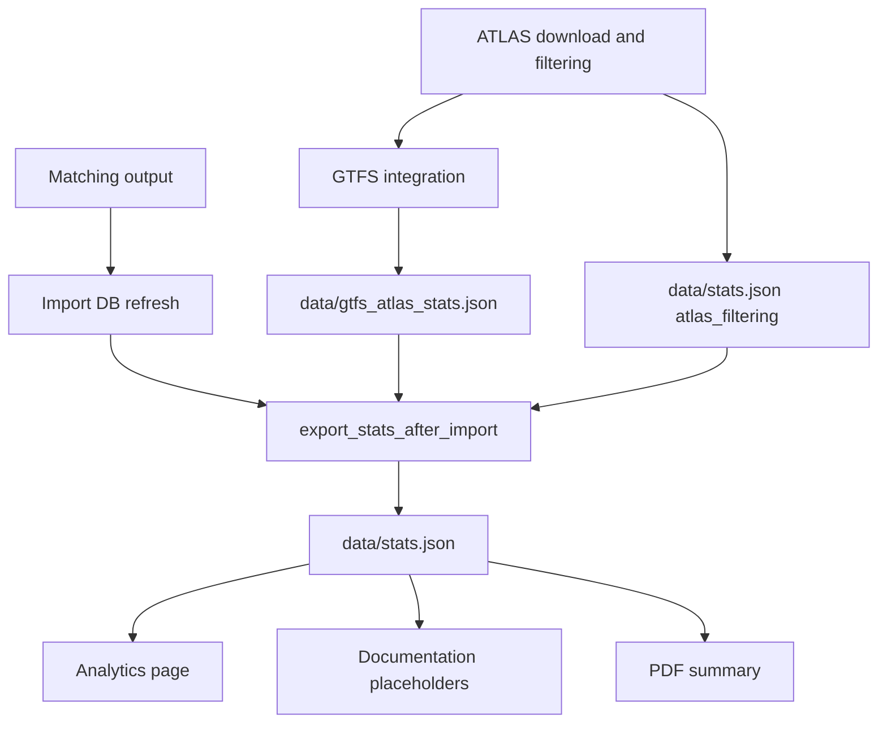

# 5.2 Stats and timestamps

The stats export path produces the JSON consumed by the analytics page, the documentation placeholders, and the PDF summary. The export scheduled after an import rebuilds the aggregate file from the current matching output and import database state; preprocessing artifacts are reused when the scheduler selects an ATLAS-cached run.

## Timestamps

The system tracks several layers of timestamps to ensure data freshness and traceability. Source and pipeline metadata is stored in `data/data_meta.json` and copied into `data/stats.json` during export. Stats-generation and ATLAS-filtering times are written directly to `data/stats.json`.

| Timestamp | Source | Meaning |
| :--- | :--- | :--- |
| `last_modified` (ATLAS/GTFS) | Server Header | When the original source data file was last updated by the provider on their servers. |
| `atlas_downloaded_at` / `gtfs_downloaded_at` | Local Clock | The shared timestamp recorded after a successful ATLAS/GTFS preprocessing subprocess when the scheduler persists the probed source snapshots. These are not separate per-request transfer times. |
| `last_overpass_query_at` | Local Clock | When the pipeline successfully queried and fetched the OpenStreetMap data. |
| `preprocessing_completed_at` | Local Clock | When the scheduler finished the complete ATLAS/GTFS preprocessing subprocess and persisted its source-validator snapshot. |
| `last_pipeline_data_import_ended_at` | Local Clock | When the database import transaction completed. The scheduler records it before stats finalization and before the overall run is marked successful. |
| `generated_at` / `stats_computed_at` | Local Clock | When the statistics and `stats.json` file were generated for the dashboard. |
| `atlas_filtering.downloaded_at` | Local Date | The calendar date on which the ATLAS download/filter step ran; despite the key name, it is stored as `YYYY-MM-DD`, not as a timestamp. |

## Output files

Two files matter:

| File | Role |
|------|------|
| `data/gtfs_atlas_stats.json` | GTFS-specific sidecar generated during GTFS integration. Contains the canonical `gtfs_atlas` block used later by the final export. |
| `data/stats.json` | Final aggregate stats file consumed by the web app and docs. Combines pipeline metrics, GTFS sidecar stats, route stats, quality metrics, and DB-derived problem counts. |

## High-Level Flow



## Generation stages

### 1. Early ATLAS filtering stats

The standalone ATLAS download step in [matching_and_import_db/downloader/get_atlas_data.py](../matching_and_import_db/downloader/get_atlas_data.py) records filter counts such as:

- raw ATLAS rows
- rows removed by country, geography, validity, and type filters
- final `BOARDING_PLATFORM` totals

Those values are written under `atlas_filtering` in `data/stats.json` before the main import runs.

### 2. GTFS sidecar generation

During GTFS integration, [matching_and_import_db/downloader/get_atlas_gtfs.py](../matching_and_import_db/downloader/get_atlas_gtfs.py) computes GTFS-to-ATLAS mapping statistics while matching GTFS `stop_id` values to ATLAS `sloid` values.

That stage writes `data/gtfs_atlas_stats.json` with the following core structure (additional assignment and diagnostic keys are omitted here):

```json
{
  "atlas": {
    "total": 0,
    "touched_by_gtfs_routes": 0,
    "coverage_percent": 0.0
  },
  "gtfs_stop_ids": {
    "total": 0,
    "matched_to_atlas": 0,
    "unmatched": 0,
    "coverage_percent": 0.0
  }
}
```

The final export embeds that object into `data/stats.json` under the `gtfs_atlas` key.

The final export also projects the scheduler's preprocessing metadata from `data/data_meta.json` into a `source_downloads` block so docs can render the latest ATLAS and GTFS download timestamps.

The GTFS sidecar covers:

- ATLAS-side identity coverage: the legacy key `touched_by_gtfs_routes` counts unique ATLAS SLOIDs reached by canonical GTFS stop-identity assignments before route-row joins
- GTFS-side mapping coverage: how many GTFS `stop_id` values map to an ATLAS `sloid`
- assignment counts for original-stop-ID, strict UIC/platform, coordinate-proximity, and unique-number fallback matching
- cardinality diagnostics (`1 → 1`, `1 → many`, `many → 1`)
- unmatched GTFS reason counts

### 3. Final aggregate export

After the import DB is refreshed, [matching_and_import_db/database/importer.py](../matching_and_import_db/database/importer.py) calls `export_stats_after_import()`.

That function delegates to [backend/services/stats_export.py](../backend/services/stats_export.py), which assembles the final `data/stats.json` from several sources:

| Source | What it contributes |
|------|------|
| Matching output (`matched`, `unmatched_atlas`, `unmatched_osm`) | summary counts, match stage breakdowns, duplicate counts, unmatched analysis |
| OSM stop units and route members | OSM route coverage and many-to-one analysis inputs |
| `data/gtfs_atlas_stats.json` | canonical `gtfs_atlas` block |
| `data/data_meta.json` | `last_pipeline_data_import_ended_at` plus docs-facing `source_downloads` metadata and `last_overpass_query_at` |
| Import DB | stop-problem counts and route-route linking counts |
| Existing `data/stats.json` | only explicitly independent keys such as `atlas_filtering` |

The final export does not preserve arbitrary old keys. This is intentional: the file should reflect the current schema only.

## What `export_pipeline_stats()` computes

The main export function computes the pipeline-derived sections directly from in-memory matching output:

- `summary`
- `matching_stages`
- `unmatched_analysis`
- `duplicates`
- `osm_way_stops`
- `match_type_counts`
- `route_matching`
- `routes`
- `gtfs_atlas`

Then the importer augments that result with:

- `quality_metrics`
- `problems`
- `route_route_matching`

The `problems` block in `data/stats.json` is the DB-backed stop-problem summary. It includes top-level counts for `distance`, `attributes`, `contradicts_route_matching`, `unmatched`, and `duplicates`, plus aggregate fields such as `total_stops`, `stops_with_problems`, `clean_entries`, and the nested `by_priority` breakdown.

## Why the split exists

The GTFS sidecar is generated earlier than the final DB-backed export because GTFS mapping is known during GTFS integration, not during the later database import step. Keeping it as a separate intermediate artifact avoids recomputing GTFS matching just to build the final stats file.

## Consumers

The main readers of `data/stats.json` are:

- [backend/app.py](../backend/app.py) for the analytics page
- [backend/services/docs_stats.py](../backend/services/docs_stats.py) for `{{stat:...}}` placeholder replacement in docs
- [backend/services/stats_export.py](../backend/services/stats_export.py) for on-demand PDF summary generation

## Regeneration paths

There are two common ways to refresh stats:

1. Run the pipeline/import flow. A `complete` preprocessing run regenerates `data/gtfs_atlas_stats.json`; an `atlas_cached` run reuses it. Both paths rebuild the final `data/stats.json`.
2. Run [scripts/regenerate_stats.py](../scripts/regenerate_stats.py). This updates only `summary`, `problems`, and `generated_at` from the current import database, preserves the other existing keys, and regenerates the PDF. It does not refresh `route_route_matching`, recompute matching-derived metrics, or rerun the earlier GTFS/ATLAS stages.

## Invariants

The current design assumes:

- `data/stats.json` is disposable and can be rebuilt at any time
- stats schema changes should update the exporter and consumers directly rather than adding compatibility aliases
- independent pre-export stats must be copied explicitly, not by preserving unknown keys from older files
