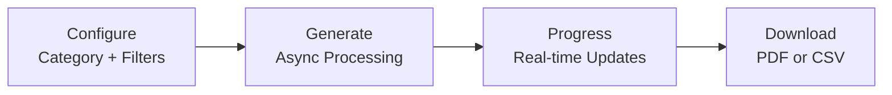

# Generate Reports

The Reports page exports matching data and problems as PDF or CSV files.

## Report Categories

| Category | Description |
|----------|-------------|
| **Distance** | Matched pairs ordered by distance |
| **Unmatched** | Stops without matches (ATLAS, OSM, or both) |
| **Problems** | Detected issues with type/priority/status filters |

## Configuration Options

| Option | Values |
|--------|--------|
| Operator | All / Selected |
| Entries | All / Up to N |
| Sort | Operator A↔Z, Distance ↑↓, Priority ↑↓ |
| Format | PDF / CSV |

## Problem Filters

- **Types**: Distance, Unmatched, Attributes, Duplicates
- **Priority**: P1 (High), P2 (Medium), P3 (Low)
- **Status**: Solved, Unsolved

## API Endpoints

| Endpoint | Method | Purpose |
|----------|--------|---------|
| `/api/reports/generate` | POST | Start generation |
| `/api/reports/status/{task_id}` | GET | Check progress |
| `/api/reports/download/{task_id}` | GET | Download file |

## Output Formats

- **PDF**: ReportLab with paginated tables, headers, footers
- **CSV**: UTF-8 with BOM for Excel compatibility

## Limits

| Limit | Value |
|-------|-------|
| Reports per IP per day | 20 |
| Concurrent generations | 1 per user |

## Related Documentation

- [5. Web app](5.%20Web%20app.md) – Application overview
- [3. Problems](3.%20Problems.md) – Problem detection

