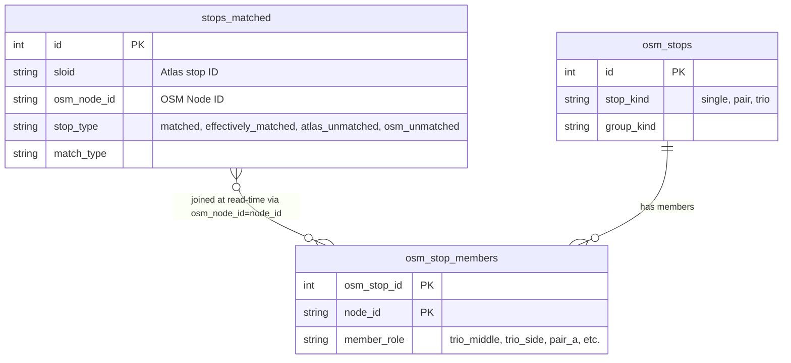

# Global Stats

## Overview

This document details the architecture, filtering mechanisms, aggregation logic, and performance optimizations powering the global statistics endpoint (`/api/global_stats`). This system calculates live, overarching statistics about the synchronization of public transport stops between ATLAS and OpenStreetMap (OSM) based on active filter criteria.

## Data Schema Context

To understand the global stats aggregation, it's essential to map out how stops are modeled and relate to each other:



In our domain, an **OSM stop** can represent complex logical units (e.g., pairs or trios of nodes). Statistics must properly track these logical units, treating them as matched when their constituent nodes meet specific success criteria.

## Request Filtering & Query Builder

The global stats query mirrors the active filter state from the UI, but it is not viewport-scoped. The endpoint does not consume map bounding-box parameters (`min_lat`, `max_lat`, `min_lon`, `max_lon`).

Implementation-wise, `/api/global_stats` reuses shared filtering helpers (`parse_filter_params`, `QueryBuilder.apply_common_filters`, `resolve_stop_type_match_filters`, `build_stop_scope_condition`) to keep scope and attribute semantics aligned with other filtered endpoints.

### Supported Filter Parameters

The `build_stats_cache_key` and `_build_scoped_global_stats_query` extract the following parameters:

1. **Stop & Match Methods** (`stop_filter`, `match_method`): Narrows down the target match status (e.g., "Exact", "Name", or specific distance-based logic).
2. **Transportation & Node Types** (`transport_types`, `node_type`): Selectively filters domains such as `ferry_terminal`, `tram_stop`, `station`, `platform`, `stop_position`, or `aerialway_station` by introspecting respective OSM fields.
3. **Atlas Operators** (`atlas_operator`): Filters by the `atlas_business_org_abbr`.
4. **Targeted Station Search** (`station_filter_triples`): Handles smart-bar search capabilities (e.g., UIC references, OSM IDs, ATLAS SLOIDs, and Routes).
5. **OSM Groups** (`osm_group_types`): Isolates specific logic units (`osm_pair_uic`, `osm_trio`, etc.).
6. **Top N & Duplicates** (`top_n`, `show_duplicates_only`): Optional modifiers.

All array payload parameters are canonically sorted to guarantee deterministic results.

## Aggregation Logic & Optimizations

Calculating precise statistics in real-time requires navigating large relationships, leading to complex count logic. 

### Denormalization of Match States

Historically, evaluating if a complex entity (like a trio) was successfully paired involved expensive cross-database subqueries. We bypassed this by utilizing **denormalization**.

During the data import/ingestion process, if a composite structure meets its match criteria (e.g., both side nodes of a trio are successfully matched), the node is natively flagged via a `stop_type` equal to `effectively_matched`. At read-time, the stats engine simply validates: `WHERE stop_type IN ('matched', 'effectively_matched')`, avoiding massive relational lookups entirely.

### Consolidated Metric Aggregation

To drastically cut down PostgreSQL processing overhead, ATLAS aggregations and OSM aggregations are processed simultaneously in a single, distinct-heavy aggregate query. 

```sql
WITH f AS (
    SELECT 
        sloid, 
        osm_node_id, 
        effective_stop_type
    FROM stops_matched
    WHERE <Complex Build Conditions>
)
SELECT 
    COUNT(DISTINCT f.sloid) AS total_atlas,
    COUNT(DISTINCT CASE WHEN f.effective_stop_type = 'matched' THEN f.sloid END) AS matched_atlas,
    COUNT(DISTINCT CASE WHEN f.effective_stop_type = 'atlas_unmatched' THEN f.sloid END) AS unmatched_atlas,
    COUNT(CASE WHEN f.effective_stop_type = 'matched' THEN 1 END) AS matched_pairs,
    COUNT(DISTINCT osm_stop_members.osm_stop_id) AS total_osm_stops,
    ...
FROM f
LEFT OUTER JOIN osm_stop_members ON osm_stop_members.node_id = f.osm_node_id
```

By pushing a `LEFT OUTER JOIN` out to `osm_stop_members` onto a derived base CTE (`f`), the database evaluates the heavy filter conditions exactly *once*, rather than constructing independent execution trees for ATLAS and OSM separately. The join is by value (`osm_stop_members.node_id = f.osm_node_id`), not a declared foreign key from `stops_matched`.

## Caching Architecture

Given the computational density of calculating distinct aggregates dynamically over thousands of geometries, an application-level memory cache is critical for endpoint responsiveness.

```python
_GLOBAL_STATS_CACHE_MAX_SIZE = 5
_GLOBAL_STATS_CACHE = OrderedDict()
_GLOBAL_STATS_CACHE_LOCK = threading.Lock()
```

### Strategy Mechanics

- **LRU Invalidation:** The cache maintains a strict limit of 5 entries to restrict arbitrary memory bloat. Standard **Least-Recently-Used (LRU)** behavior pushes active queries to the end, popping the oldest elements from the `collections.OrderedDict`.
- **Concurrency Control:** Multi-threaded web server variants (like Gunicorn threads) are protected by a traditional Python `threading.Lock()` object to ensure mutually exclusive writes and reordering under concurrent API loads.
- **Deterministic Keys:** As parameters arrive in randomized order from the client, the `_canonicalize_list_param` and `_canonicalize_station_filter_triples` functions trim, strip, and sort items. The resultant `tuple` creates a stable, repeatable dictionary key ensuring cache hits regardless of HTTP array order stringification.
- **Cache Volatility:** Due to the relatively small cache size, it acts predominantly as a localized debounce against multiple concurrent views loading the same global scope (e.g., users launching the unmodified `/` portal root), drastically sparing unneeded database CPU cycles.

## UI Integration

These metrics feed the top summary layer over the Leaflet interactive map found in `templates/pages/index.html`. The frontend `stats_overlay()` macro polls the endpoint whenever users tweak filter controls (for example "Exact matching", "OSM Pairs", or "Duplicate ATLAS").

Important scope note: this summary is filter-scoped, not viewport-scoped.
