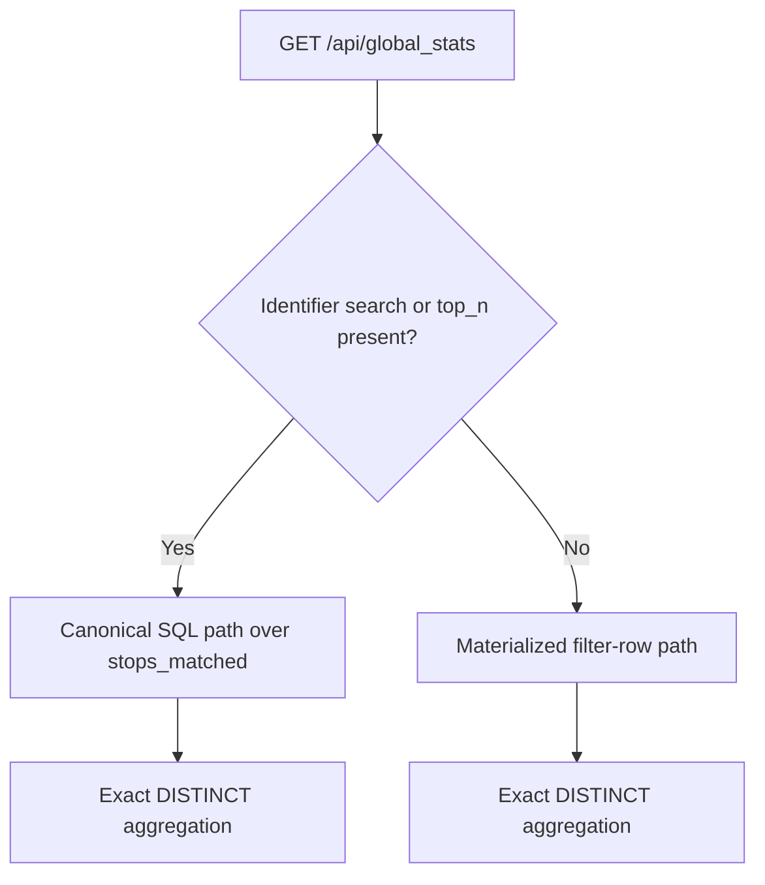

# Global Stats

## Overview

`/api/global_stats` returns global, filter-scoped synchronization metrics for ATLAS and OSM.

It is:

- filter-scoped (uses active filters)
- not viewport-scoped (ignores map bounds)
- exact (no approximation)

The implementation now uses **query routing**:

- broad filter requests use a precomputed materialized table (`global_stats_filter_rows`)
- identifier/search or top-N requests fall back to canonical source-table SQL

This keeps response time low for common filter interactions while preserving exact semantics for selective lookups.

## 1. Routing Model



Decision criteria:

- canonical path is used when:
   - `station_filter` is present (UIC, SLOID, OSM node, route-based lookup)
   - `top_n` is a positive integer
- materialized path is used otherwise for normal filter combinations (`stop_filter`, `match_method`, `transport_types`, `node_type`, `atlas_operator`, `osm_group_types`, `show_duplicates_only`)

| Request kind | Route | Primary source | Reason |
| :--- | :--- | :--- | :--- |
| Broad filters only | Materialized | `global_stats_filter_rows` | No `station_filter` and no `top_n` |
| Identifier search | Canonical SQL | `stops_matched` + joins | `station_filter` is present |
| Top N mode | Canonical SQL | `stops_matched` + distance | `top_n > 0` |
| Materialized table missing | Canonical SQL | `stops_matched` + joins | Safety fallback |

## 2. Materialized Table: `global_stats_filter_rows`

### 2.1 Why this table exists

Earlier additive bucket attempts could overcount `DISTINCT` entities when summed across buckets.

`global_stats_filter_rows` solves this by storing one enriched row per `stops_matched` row, so the API can still compute exact `COUNT(DISTINCT ...)` metrics without expensive read-time joins.

### 2.2 Stored dimensions

Each row includes:

- identity columns: `sloid`, `osm_node_id`, `osm_stop_id`
- scope and matching columns: `scope`, `stop_type`, `effective_stop_type`, `match_type`
- attribute dimensions: `atlas_operator`, `atlas_duplicate`, `stop_kind`, `osm_group_kind`
- transport flags: `is_ferry_terminal`, `is_tram_stop`, `is_station`, `is_platform`, `is_stop_position`, `is_aerialway_station`

`effective_stop_type` uses:

- `matched` for both `stop_type = matched` and `stop_type = effectively_matched`
- original `stop_type` otherwise

## 3. Filter Semantics

The endpoint follows the same predicate grammar documented in `5.3 Filters and Search logic.md`.

Shared helper semantics for stop scope still apply:

- `resolve_stop_type_match_filters()`
- `build_stop_scope_condition()`
- `build_trio_middle_with_matched_side_condition()`

This preserves trio-middle behavior and matched-scope parity between map data and global stats.

## 4. Aggregation Semantics

For both routed paths, metrics remain exact:

```sql
SELECT
   COUNT(DISTINCT sloid) AS total_atlas,
   COUNT(DISTINCT CASE WHEN effective_stop_type = 'matched' THEN sloid END) AS matched_atlas,
   COUNT(DISTINCT CASE WHEN effective_stop_type = 'atlas_unmatched' THEN sloid END) AS unmatched_atlas,
   COUNT(CASE WHEN effective_stop_type = 'matched' THEN 1 END) AS matched_pairs,
   COUNT(DISTINCT osm_stop_id) AS total_osm_stops,
   COUNT(DISTINCT CASE WHEN effective_stop_type = 'matched' THEN osm_stop_id END) AS matched_osm_stops,
   COUNT(DISTINCT osm_node_id) AS total_osm_nodes
FROM filtered_rows
```

`unmatched_entities_count` is derived as:

$$
	ext{unmatched\_atlas} + \max(0,\;\text{total\_osm\_stops} - \text{matched\_osm\_stops})
$$

## 5. Population Lifecycle

The table is rebuilt during import by `populate_global_stats_filter_rows()`.

High-level steps:

1. Truncate `global_stats_filter_rows`
2. Read from `stops_matched`
3. Left-join ATLAS/OSM dimension tables needed for filtering
4. Insert enriched rows into `global_stats_filter_rows`

This keeps request-time logic simple and pushes denormalization cost into ingestion.

## 6. Fallback Behavior and Safety

- If materialized-table routing is eligible but the table is missing, the service falls back to canonical SQL.
- Non-missing-table exceptions are not swallowed.
- Endpoint-level missing-table handling still returns a zeroed payload during cold-start/uninitialized DB states.

## 7. Testing Coverage

`tests/test_global_stats_service.py` validates:

- materialized routing for broad filters
- fallback to canonical SQL for identifier search
- fallback to canonical SQL for top-N
- fallback to canonical SQL when materialized table is unavailable

## 8. Operational Notes

- This endpoint no longer relies on in-process LRU cache machinery.
- Performance gains come from reducing join complexity on the dominant filter-only path while retaining exact counts.
- Smart-search/selective lookups continue to use canonical source tables by design.
