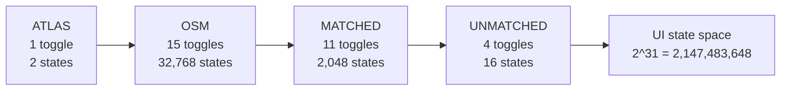
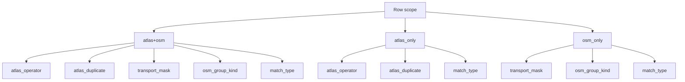
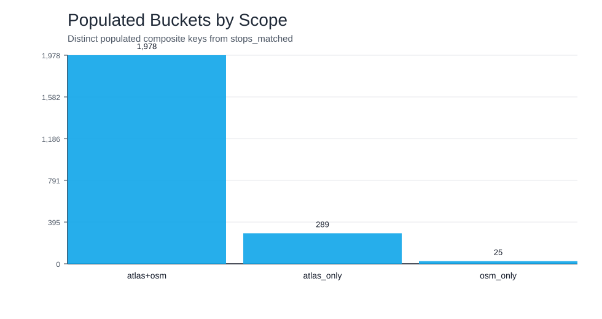
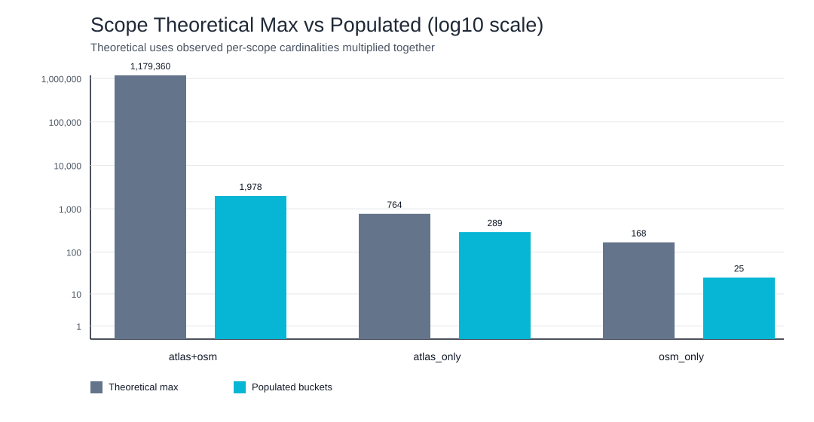
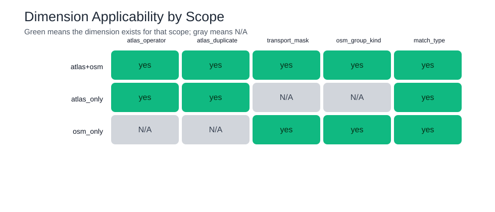

# Filter Combinations & Data Structures

This note reframes filter math for `/api/global_stats` using real database measurements, not only UI checkbox combinatorics.

All counts below come from the current DB snapshot, generated by:

- `documentation/scripts/analyze_filter_buckets.py`
- Output JSON: `documentation/generated/filter_bucket_analysis.json`
- Generated visuals: `documentation/images/filter_bucket_*.svg`

## 1) Naive UI-State Combinatorics (Still Useful, But Not the Right Storage Model)

If we multiply independent UI toggles as binary states, we get a massive interaction space:



This explains frontend interaction complexity, but not the backend storage requirement.

## 2) Measured Cardinalities (Current DB)

### ATLAS operators (requested)

- Distinct non-empty ATLAS operator values in `atlas_stops`: **432**.
- Blank operator rows in `atlas_stops`: **39**.
- So ATLAS-bearing rows effectively have **433 operator states** if we include a "missing operator" state.

### Stop scope distribution (from `stops_matched`)

- `atlas+osm` scope (`sloid` and `osm_node_id` both present): **60,648 rows**.
- `atlas_only` scope (`sloid` present, `osm_node_id` missing): **6,323 rows**.
- `osm_only` scope (`osm_node_id` present, `sloid` missing): **9,347 rows**.
   - This includes `osm_unmatched` and `effectively_matched`.

### Transport filter overlap reality

Transport filter checkboxes are **not fully disjoint** in data:

- OSM nodes with exactly 1 active transport flag: **57,597**.
- OSM nodes with 2 active transport flags: **3,865**.
- OSM nodes with 0 active transport flags: **1,309**.

So transport is better modeled as a **6-bit mask** (ferry, tram, station, platform, stop_position, aerialway), not a single exclusive enum.

## 3) What Is Actually Mutually Exclusive?

The accurate exclusivity is scope-driven:



Concretely:

1. ATLAS fields (`atlas_operator`, duplicate membership) are N/A for `osm_only`.
2. OSM fields (`transport_mask`, `osm_group_kind`) are N/A for `atlas_only`.
3. `stop_type` categories are exclusive per row.
4. `match_type` is one value per row, but its allowed set depends on scope/stop_type.
5. OSM group membership is exclusive at node level (no node belongs to multiple OSM stop units in current data).
6. Transport checkboxes are not exclusive; they overlap and should be encoded as a mask.

## 4) Corrected Scope-Aware Bucket Math

Using measured scope cardinalities from the current dataset:

- `atlas+osm` scope cardinalities:
   - operators: 420
   - duplicate states: 2
   - transport masks: 13
   - OSM group states: 9
   - match_type states: 12
- `atlas_only` scope cardinalities:
   - operators: 191
   - duplicate states: 2
   - match_type states: 2
- `osm_only` scope cardinalities:
   - transport masks: 14
   - OSM group states: 6
   - match_type states: 2

### Piecewise theoretical maximum

$$
\begin{aligned}
B_{atlas+osm} &= 420 \times 2 \times 13 \times 9 \times 12 = 1{,}179{,}360 \\
B_{atlas\_only} &= 191 \times 2 \times 2 = 764 \\
B_{osm\_only} &= 14 \times 6 \times 2 = 168 \\
B_{theoretical} &= 1{,}179{,}360 + 764 + 168 = 1{,}180{,}292
\end{aligned}
$$

### Actual populated buckets

From live distinct composite keys:

- `atlas+osm`: 1,978
- `atlas_only`: 289
- `osm_only`: 25
- **Total populated buckets: 2,292**

Occupancy of scope-aware state space:

$$
\frac{2{,}292}{1{,}180{,}292} \approx 0.194\%
$$

For this dataset: **2,292 populated signatures**.

## 5) Data Structure Shape

A practical structure is a sparse cube keyed by scope and applicable dimensions:

```python
buckets = {
      (
            scope,              # atlas+osm | atlas_only | osm_only
            atlas_operator,     # value or <NA>
            atlas_duplicate,    # duplicate | not_duplicate | <NA>
            transport_mask,     # 6-bit string or <NA>
            osm_group_kind,     # group kind or <NA>
            match_type,         # explicit value incl <NULL>
      ): {
            "total_atlas_stops": int,
            "matched_atlas_stops": int,
            "total_osm_stops": int,
            "matched_osm_stops": int,
            "total_osm_nodes": int,
            "matched_osm_nodes": int,
            "matched_pairs_count": int,
            "unmatched_entities_count": int,
      }
}
```

This stays sparse and additive: query-time work becomes selecting keys that satisfy filter constraints and summing counters.

## 6) Python-Generated Visuals

### Populated buckets by scope



### Theoretical vs populated (log scale)



### Dimension applicability matrix



## Relevant files:

Then inspect:

- `documentation/generated/filter_bucket_analysis.json`
- `documentation/images/filter_bucket_populated_by_scope.svg`
- `documentation/images/filter_bucket_sparsity_log.svg`
- `documentation/images/filter_bucket_applicability_matrix.svg`
