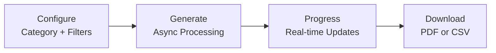

# Generate Reports

The Reports page exports matching data and problems as PDF or CSV files. It supports both a legacy synchronous endpoint and the newer async task-based flow used by the UI.

## Report Categories

| Category | Description |
|----------|-------------|
| **Distance** | Matched pairs ordered by distance |
| **Unmatched** | Stops without matches (ATLAS, OSM, or both) |
| **Problems** | Detected issues with type/priority/status filters |

## Configuration Options

| Option | Values |
|--------|--------|
| Operator | All / Selected |
| Entries | All / Up to N |
| Sort | Operator A↔Z, Distance ↑↓, Priority ↑↓ |
| Format | PDF / CSV |

For unmatched reports, the UI can also restrict the source set to ATLAS, OSM, or both, and PDF/CSV exports can optionally include coordinate columns.

## Problem Filters

- **Types**: Distance, Unmatched, Attributes, Duplicates
- **Priority**: P1 (High), P2 (Medium), P3 (Low)
- **Status**: Solved, Unsolved

## API Endpoints

| Endpoint | Method | Purpose |
|----------|--------|---------|
| `/api/generate_report_async` | POST | Start async generation and return a `task_id` |
| `/api/report_progress/{task_id}` | GET | Check async progress |
| `/api/download_report/{task_id}` | GET | Download an async-generated file |
| `/api/cancel_report/{task_id}` | POST | Cancel an async job and clean up any temp file |
| `/api/generate_report` | GET | Legacy synchronous export endpoint |

## Output Formats

- **PDF**: Server-rendered HTML converted with `pdfkit` / `wkhtmltopdf`
- **CSV**: Standard UTF-8 CSV written with Python's `csv` module

## Limits

| Limit | Value |
|-------|-------|
| Legacy synchronous export | 20/day |
| Async generation start | 10/hour |
| Async progress polling | 60/minute |
| Async download | 20/minute |

Async report state is currently stored in process memory (`report_progress` and `completed_reports`) and cleaned up by a background thread. That means long-running tasks are tied to the current Flask process; there is no Redis-backed job queue yet.

## Related Documentation

- [5. Web app](5.%20Web%20app.md) – Application overview
- [3. Problems](3.%20Problems.md) – Problem detection

