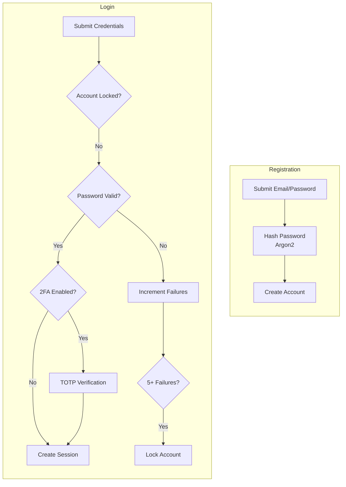

# Authentication and Permissions

The authentication system secures Stop Sync with email/password accounts, optional two-factor authentication, and robust security controls.



## Components

| Component | File | Purpose |
|-----------|------|---------|
| User Model | `backend/auth_models.py` | User entity, password hashing, 2FA fields |
| Auth Routes | `backend/blueprints/auth.py` | Login, register, 2FA, logout |
| Crypto Service | `backend/services/crypto.py` | TOTP secret encryption (Fernet) |
| Extensions | `backend/extensions.py` | Flask-Login, CSRF, Limiter setup |

## Authentication Flows

### Registration
1. User submits email + password
2. Email normalized, checked for duplicates
3. Account auto-verified and created with Argon2-hashed password

### Login
1. Credentials submitted → Lockout checked
2. Password verified against Argon2 hash
3. Failed attempts increment on failure (lockout after 5 with exponential backoff)
4. If 2FA enabled → TOTP verification required
5. Success → session created

### Two-Factor Authentication
- **Enable**: Generate encrypted TOTP secret → Display QR code → Verify code → Generate backup codes
- **Use**: Enter 6-digit TOTP or single-use backup code after password verification

## Security Controls

| Control | Implementation | Details |
|---------|----------------|---------|
| Password Hashing | Argon2 | No plaintext storage |
| Session Cookies | HttpOnly, SameSite=Lax | Secure flag in production |
| CSRF Protection | Flask-WTF | Token in forms + AJAX header |
| Rate Limiting | 10/min login, 5/min register | Prevent brute force |
| Account Lockout | Exponential backoff | After 5 failed attempts |
| 2FA Encryption | Fernet | TOTP secrets encrypted at rest |
| Security Headers | Flask-Talisman | CSP, HSTS, X-Frame-Options |

## Configuration

| Variable | Required | Description |
|----------|----------|-------------|
| `SECRET_KEY` | Yes | Flask secret for sessions |
| `USER_INPUT_DATABASE_URI` | Yes | User-input database connection (auth, notes, persistent solutions) |
| `TOTP_SECRET_ENC_KEY` | For 2FA | Fernet key for TOTP encryption |
| `FORCE_HTTPS` | Production | Enable HTTPS enforcement |

## Admin Management

```bash
# List users
docker compose exec app python manage.py list-users

# Create admin
docker compose exec app python manage.py create-user \
  --email admin@example.com --password 'SecurePass123' --admin

# Grant/revoke admin
docker compose exec app python manage.py set-admin --email user@example.com --on
```

## Related Documentation

- [6.1 Permissions and Roles](6.1%20Permissions%20and%20Roles.md) – Role-based access control
