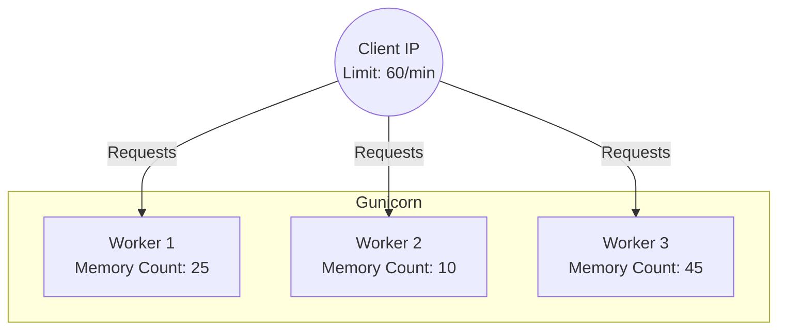
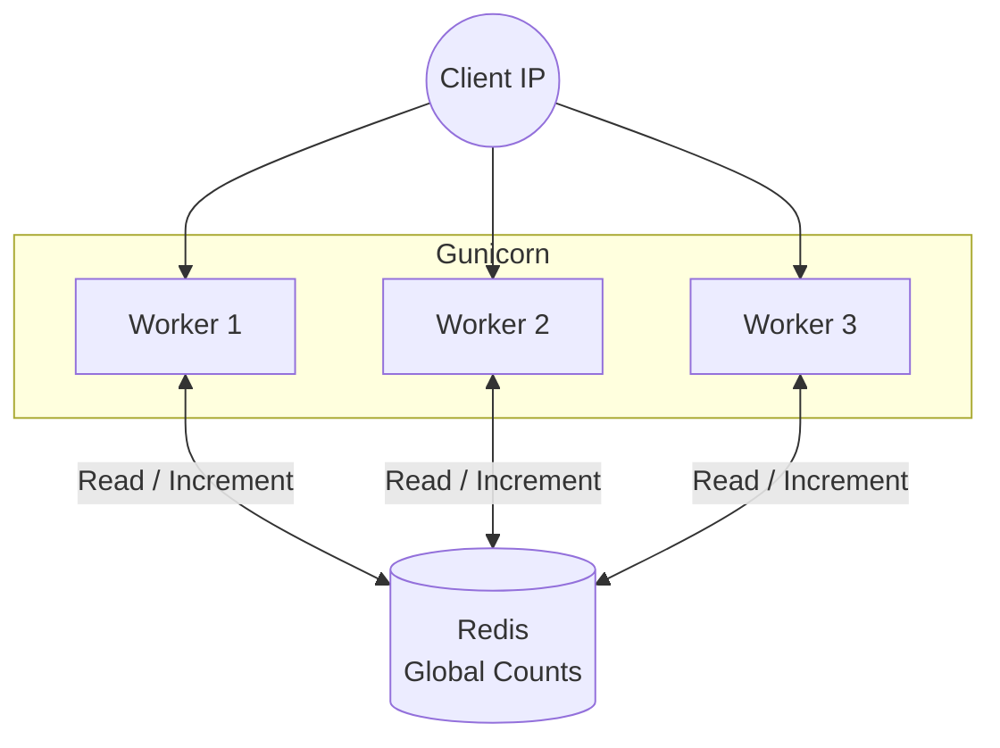

# Security and Rate Limits

This document outlines the application's current API rate limits, the current security middleware that is active in the Flask app, and the main request-path risks that still need hardening.

## 1. Current Rate Limits

The backend API is shielded by `Flask-Limiter` to prevent abuse and ensure fair usage across our infrastructure. Limits are enforced based on the client's IP address (`get_remote_address`).

### Global Defaults
- **All unannotated endpoints:** `500 per minute` (defined in `backend/extensions.py`)

### Storage Backend

`Flask-Limiter` is configured with `RATELIMIT_STORAGE_URI`, defaulting to `memory://` when no shared backend is provided. In local development this is fine. In a multi-process deployment, a shared backend such as Redis is preferable so all workers see the same counters.

### Specific Endpoints
Certain expensive or easily abusable endpoints have stricter throttles:

| Endpoint | Limit | Location |
|---|---|---|
| `/api/search` | **60 / minute** | `backend/blueprints/search.py` |
| `/api/top_matches` | **60 / minute** | `backend/blueprints/search.py` |
| `/api/stop_by_id` | **60 / minute** | `backend/blueprints/search.py` |
| `/api/random_stop` | **30 / minute** | `backend/blueprints/search.py` |

---

## 2. Shared Rate-Limit Storage

The codebase is structured so a shared storage backend can be plugged in without changing endpoint decorators. The default `memory://` backend remains process-local, so deployments that use multiple workers should point `RATELIMIT_STORAGE_URI` at Redis or another supported shared store.

### Why In-Memory Storage Is Only a Development Default
With in-memory storage, each worker process maintains a separate bucket of request counts.


*In the scenario above, the client has actually made 80 requests (25 + 10 + 45), violating the 60/min limit. However, because no single worker has hit 60 internally, none of the workers will block the client.*

### Why Redis Is the Usual Production Choice
To enforce an accurate, global limit across workers, a centralized backend such as Redis is the typical choice.

1. When a request arrives, the Gunicorn worker handling it connects to Redis.
2. The worker increments a counter specific to the `[Endpoint] + [Client IP]` key.
3. If the returned counter exceeds the allowed limit, the worker immediately rejects the request with a **HTTP 429 Too Many Requests**.



Because Redis handles atomic increments and expirations efficiently, it provides a unified source of truth without requiring changes to the endpoint code.

## 3. Other Active Middleware

The Flask app also initializes `flask_talisman.Talisman` in [backend/app.py](../backend/app.py). The current configuration disables CSP enforcement (`content_security_policy=None`) and only forces HTTPS when the relevant environment flag is enabled, so this is useful hardening but not a full browser-security policy yet.

---

## 4. Security Risks and Attack Vectors

While the infrastructure is reasonably resilient, there are active security items—particularly localized around the search implementation—that must be mitigated.

### Search Input Vulnerabilities (Denial of Service)

The core attack vector resides in `backend/blueprints/search.py`. The `/api/search` endpoint operates by passing the user's `q` parameter directly into a wildcard `ILIKE` statement against multiple columns in the database:

```python
# snippet from search.py
query_str = request.args.get('q', '').lower()
search_pattern = f"%{query_str}%"

# ... (applied to over 10 columns across multiple tables)
db.or_(
    AtlasStop.atlas_designation.ilike(search_pattern),
    OsmNode.osm_name.ilike(search_pattern),
    # ...
)
```

**Why this is dangerous:**
1. **Full Table Scans (Heavy DB Load):** Placing a wildcard (`%`) at the beginning of a `LIKE` or `ILIKE` query prevents PostgreSQL from utilizing standard B-Tree indexes efficiently. The database is forced into a sequential full-table scan, checking every single record.
2. **Resource Exhaustion (Application DoS):** An attacker can submit lengthy, complex search strings specifically designed to maximize CPU processing and database memory. Since they are allowed 60 requests a minute, bombarding the search endpoint could quickly exhaust the DB connection pool and spike the server load to 100%, causing a Denial of Service for legitimate users.

### Mitigation Tasks

- **Input Length Restrictions:** Enforce strict minimum and maximum lengths on the `q` query string (e.g., Min: 3 chars, Max: 50 chars) before routing the query to the DB.
- **Index Optimization (`pg_trgm`):** Implement `pg_trgm` (Trigram) indexing on the heavily searched text columns in PostgreSQL. Trigram indexes optimize `ILIKE '%...%'` text searches safely and quickly without full-table scans.
- **Circuit Breakers / Timeout Limits:** Enforce strict query execution timeouts on SQLAlchemy. If a search takes more than `N` seconds, it should automatically abort rather than locking resources indefinitely.
