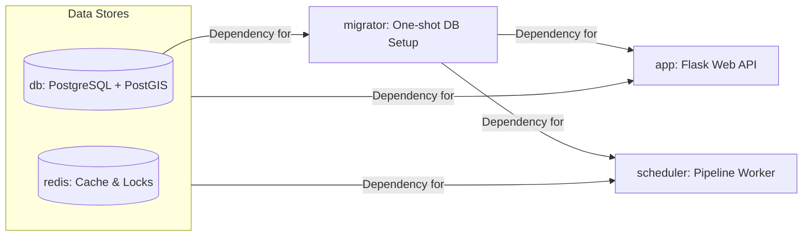

# 6. System Architecture

This section describes the implemented container architecture, migration flow, and runtime ownership boundaries and GITHUB ACTIONS.

## Compose Services

`docker-compose.yml` defines these primary services to isolate workflows:

- `app`: Flask web API/UI. Depends on successful `migrator` completion. Exposes port 5001.
- `scheduler`: APScheduler worker running the data pipeline in the background. Depends on successful `migrator` completion.
- `db`: PostgreSQL + PostGIS container.
- `redis`: Shared cache/status/lock backend for rate limiting and pipeline coordination.
- `migrator`: Fast, one-shot migration service (`flask db upgrade`). Starts, applies migrations, and dies.

Also defined for local test workflows:
- `test`: Uses a merged `test-stage` image for full-suite pytest execution.

## Migration Ownership

Migrations are owned solely by a dedicated one-shot container:
- Service: `migrator`
- Command: `python matching_and_import_db/database/init.py && flask db upgrade`

By isolating migrations, we prevent race conditions where multiple app containers try to alter the database simultaneously. It ensures the DB schema is safely updated and 100% ready before the `app` or `scheduler` are even allowed to boot.

`app` and `scheduler` start only after the migration container succeeds via `depends_on: condition: service_completed_successfully`.

`entrypoint.sh` performs a final application-level connection check to the database to ensure it's accepting connections before booting the server.

## Operational Notes
- Production vs Development is strictly separated via Compose.
- **Production (`docker-compose.yml`)**: Uses pre-built images from GitHub Container Registry (`ghcr.io/opentdatach/stop_sync_osm_atlas-*`) and avoids source code bind mounts.
- **Development (`docker-compose.override.yml`)**: Restores image `build:` targets and mounts the local directory (`.:/app`) to allow live-reloading of modifications on the host machine.

## Subpages

- [6.1 Dependency Management & Build Strategy](6.1%20Dependency%20Management%20&%20Build%20Strategy.md): Python dependency split, Dockerfile stages, and build matrix
- [6.2 Security and Rate Limits](6.2%20Security%20and%20Rate%20Limits.md): Flask-Talisman, CSP, and rate limiting configuration
- [6.3 Background Scheduler](6.3%20Background%20Scheduler.md): APScheduler pipeline worker and job coordination
- [6.4 Deployment & GitHub Actions](6.4%20Deployment%20&%20GitHub%20Actions.md): CI/CD pipeline, container registry, and deployment workflow
- [6.5 Frontend Asset Management](6.5%20Frontend%20Asset%20Management.md): Vendored frontend libraries, Font Awesome optimization, and sync pipeline
