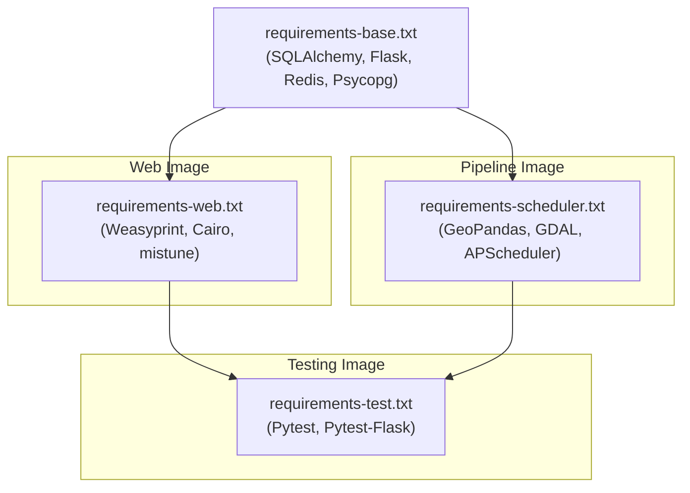

# 6.1 Dependency Management & Build Strategy

To optimize image sizes, improve load times, and isolate dependencies, the architecture utilizes a multi-stage Dockerfile and heavily modularized requirement files.

## Dependency Split

Dependencies are strictly split by runtime responsibility. This ensures that the web application stays slim (avoiding heavy geospatial binaries) and the scheduler avoids unnecessary web-routing libraries.

## Dependency Overlap Matrix

The following matrix visualizes the specific libraries included in each build stage. Note how `base` is inherited by all stages, and `test` aggregates everything to ensure a complete integration environment.

*Generated via `documentation/scripts/generate_dependency_overlap.py`*

- `requirements-base.txt`: Shared core backend foundations requested by all containers (`SQLAlchemy`, `psycopg`, `GeoAlchemy2`, `requests`, `Flask`, `Flask-SQLAlchemy`, `redis`).
- `requirements-web.txt`: Web-only stack for the API and UI (`Flask-Limiter`, `Flask-Talisman`, `weasyprint`, `mistune`, `bleach`, `Werkzeug`, `Flask-Migrate`).
- `requirements-scheduler.txt`: Heavy geospatial stack required for the data pipeline (`pandas`, `geopandas`, `shapely`, `APScheduler`, `numpy`, `scipy`).
- `requirements-test.txt`: Testing frameworks (`pytest`, `pytest-flask`).

## Dockerfile Stages

Because the web application does not need heavy Geospatial GDAL libraries, and the pipeline does not need PDF generation engines, the `Dockerfile` resolves four distinct logical build targets:

1. **`base` Stage**
   - Establishes normal Python environment.
   - Installs `requirements-base.txt`.

2. **`app-stage` Stage**
   - Used by the `app` service.
   - Installs UI/PDF system level libraries (Cairo/Pango).
   - Installs `requirements-web.txt`.

3. **`scheduler-stage` Stage**
   - Used by the `scheduler` service.
   - Installs heavy C++ geospatial system libraries (GDAL/GEOS/PROJ).
   - Installs `requirements-scheduler.txt`.

4. **`test-stage` Stage**
   - Used by the `test` service.
   - Starts from `app-stage`, but forcibly adds the scheduler geospatial libraries.
   - Installs both `requirements-scheduler.txt` and `requirements-test.txt`.
   - This merged image allows integration tests to test both web routes and pipeline functions simultaneously.

## Validation and Tasks

Local VS Code tasks point to these isolated builds to guarantee clean testing environments:
- `Docker: Run All Tests` and `Docker: Run Small Pipeline Test` utilize the `test` compose service.
- Manual pipeline bumps (e.g. `Docker: Trigger Scheduled Pipeline Now`) execute purely inside the `scheduler` scope.
