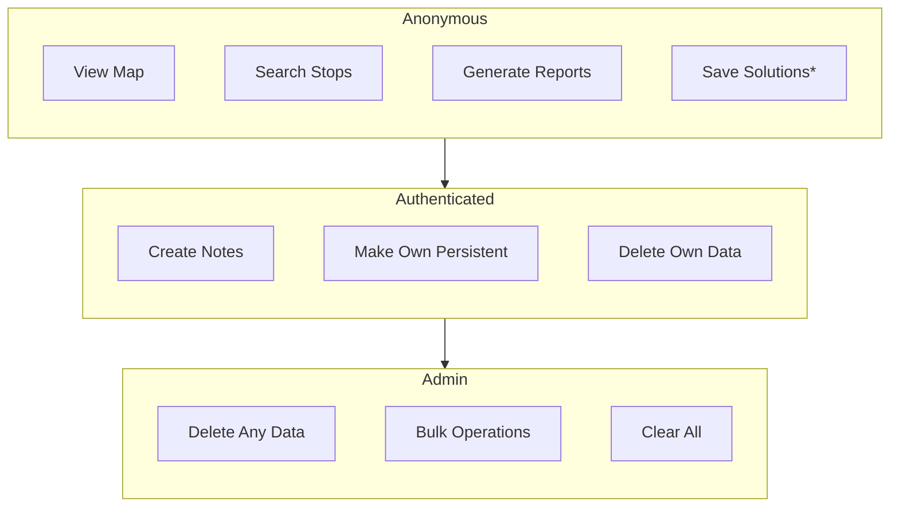

# Permissions and Roles

Role-based access control determines what actions users can perform based on their authentication status.


*Non-persistent only

## Role Hierarchy

```
Admin → Authenticated User → Anonymous
```

Each role inherits all permissions from lower roles.

## Permission by Role

### Anonymous (Not Logged In)

| Action | Endpoint |
|--------|----------|
| View map, search, data | `GET /`, `/api/search`, `/api/data` |
| View persistent solutions | `GET /api/persistent_data` |
| Save non-persistent solutions | `POST /api/save_solution` |
| Generate reports | `POST /api/reports/generate` |

### Authenticated User

| Action | Endpoint |
|--------|----------|
| Create notes (1 per entity) | `POST /api/save_note/{type}` |
| Make own notes persistent | `POST /api/make_note_persistent/{type}` |
| Delete/revert own data | `DELETE /api/persistent_data/{id}` |

### Admin

| Action | Endpoint |
|--------|----------|
| Delete any user's data | `DELETE /api/persistent_data/{id}` |
| Clear all persistent | `POST /api/clear_all_persistent` |
| Clear all non-persistent | `POST /api/clear_all_non-persistent` |
| Bulk make persistent | `POST /api/make_all_persistent` |

## API Permission Matrix

| Endpoint | Anon | User | Admin |
|----------|:----:|:----:|:-----:|
| `GET /api/data` | ✓ | ✓ | ✓ |
| `GET /api/search` | ✓ | ✓ | ✓ |
| `GET /api/problems` | ✓ | ✓ | ✓ |
| `POST /api/save_solution` | ✓* | ✓ | ✓ |
| `GET /api/persistent_data` | ✓ | ✓ | ✓ |
| `POST /api/save_note/{type}` | ✗ | ✓ | ✓ |
| `GET /api/notes` | ✓ | ✓ | ✓ |
| `POST /api/make_note_persistent/{type}` | ✗ | own | ✓ |
| `DELETE /api/persistent_data/{id}` | ✗ | own | any |
| `DELETE /api/user_notes/{id}` | ✗ | own | any |
| `POST /api/make_non_persistent/{id}` | ✗ | own | any |
| `POST /api/clear_all_persistent` | ✗ | ✗ | ✓ |
| `POST /api/clear_all_non-persistent` | ✗ | ✗ | ✓ |
| `POST /api/make_all_persistent` | ✗ | ✗ | ✓ |

*Anonymous solutions are non-persistent only

## Related Documentation

- [6. Authentication](6.%20Authentication%20and%20permissions.md) – Authentication system
- [4.2 User Input DB](4.2%20User%20Input%20DB.md) – Data persistence model
