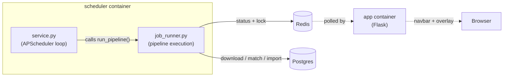
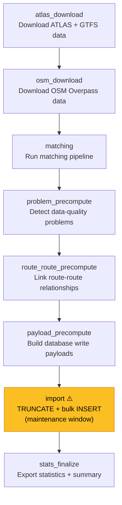
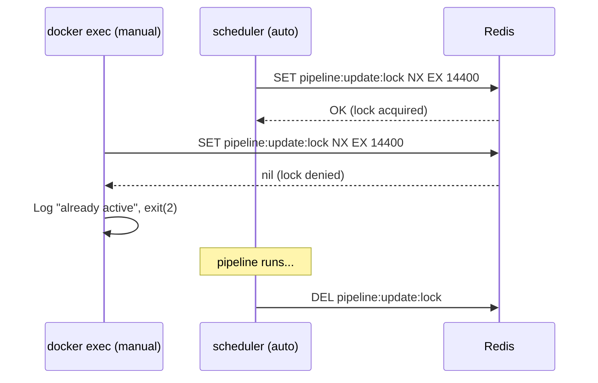
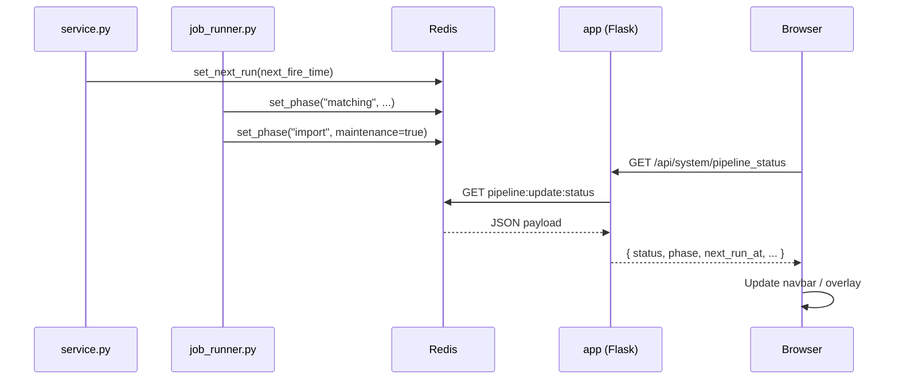

# 6.3 Background Scheduler

The **Background Scheduler** is a dedicated Docker service that automatically runs the full data pipeline at a configurable interval. It coordinates downloads, matching, problem detection, and database import — then publishes progress and timing metadata so the web app can keep users informed.

## Architecture Overview

The scheduler lives in its own container (`scheduler`) and is composed of two Python modules:

| Module | Role |
| :--- | :--- |
| `matching_and_import_db/scheduler/service.py` | Owns the APScheduler loop, computes the next-run timestamp, and delegates work to the job runner |
| `matching_and_import_db/scheduler/job_runner.py` | Executes the pipeline phases in order, manages the distributed lock, and reports progress to Redis |



The `app` container never runs the pipeline itself. It only reads pipeline status from Redis to drive the UI (navbar timestamp, maintenance overlay, progress bar).

---

## Pipeline Phases

When a run is triggered (scheduled or manual), the job runner walks through these phases in sequence. Each phase publishes its name and a human-readable message to Redis so the web app can display live progress.



Only the **import** phase sets `blocking_maintenance = true`. During that window the web app shows a full-screen overlay to users. All other phases run silently in the background.

The `match-import` mode skips the first two download steps and jumps straight to `matching`, reusing whatever data files are already on disk.

---

## Timing Model

### How APScheduler's `IntervalTrigger` works

The scheduler uses `IntervalTrigger(hours=N)` which creates a **fixed-cadence clock anchored to the moment the job is first registered**. Fire times are computed independently of how long each run takes:

```
Container starts at T₀
First fire:   T₀ + N hours
Second fire:  T₀ + 2N hours
Third fire:   T₀ + 3N hours
...
```

This means the interval is measured **start-to-start on a fixed grid**, not end-to-end and not relative to when a run finishes.

### What if a run is still going when the next fire time arrives?

Two safeguards prevent overlapping runs:

| Setting | Effect |
| :--- | :--- |
| `max_instances=1` | APScheduler will not launch a second instance of the job while the first is still running. The fire is simply skipped. |
| `coalesce=True` | If multiple fires were missed (e.g. because a run was very long), they collapse into a single execution rather than queuing up a burst. |

### Practical example

With `PIPELINE_SCHEDULE_INTERVAL_HOURS=24` and a pipeline that takes ~10 minutes:

```
T₀        : container starts
T₀ + 24h  : first run starts, finishes at ~T₀ + 24h 10m
T₀ + 48h  : second run starts
...
```

The 10 minutes of execution time do not push the next fire later. The schedule stays on the original 24-hour grid.

### What happens when the container is stopped and restarted?

The scheduler uses an **in-memory `BlockingScheduler`** with no persistent job store. All scheduling state is lost when the container stops. On restart:

1. `service.py → main()` runs fresh.
2. A new `IntervalTrigger` is created → the first fire is scheduled at `now + N hours`.
3. Any runs that were "supposed" to happen while the container was down are **silently lost**.

```mermaid
gantt
    title Container stop / restart scenario (N = 24h)
    dateFormat HH:mm
    axisFormat %H:%M

    section Container A
    Running            :a1, 00:00, 10h
    Run at 00:00+24h   :milestone, 24:00, 0h

    section Downtime
    Container stopped  :crit, 10:00, 6h

    section Container B
    Restarted at 16:00       :a2, 16:00, 8h
    First run at 16:00+24h   :milestone, 40:00, 0h
```

> **Key insight**: if the container was down when a run was due, that run is lost. The clock resets from the moment the container starts, not from any previously scheduled time. In the diagram above, the 24:00 run never happens; the next actual run is at 40:00 (16:00 + 24h).

---

## Distributed Locking

Before executing any pipeline phase, the job runner acquires a Redis lock (`pipeline:update:lock`) using `SET NX EX`. This prevents two triggers — for example a scheduled run and a manual `docker exec` — from running simultaneously.



### Lock heartbeat

Long-running pipelines could outlive the lock TTL. To prevent this, a background daemon thread (`_RunLockHeartbeat`) periodically refreshes the lock's expiry while the run is active:

| Variable | Purpose | Default |
| :--- | :--- | :--- |
| `PIPELINE_LOCK_TTL_SECONDS` | Initial (and refresh) TTL for the lock | `14400` (4 hours) |
| `PIPELINE_LOCK_HEARTBEAT_SECONDS` | How often the heartbeat thread refreshes | `TTL ÷ 4` (clamped to 5–60s) |

If the scheduler crashes without releasing the lock, the lock auto-expires after `PIPELINE_LOCK_TTL_SECONDS` seconds. Additionally, the `acquire_run_lock` function includes stale-lock recovery: if the lock key exists but the persisted status is not `running`, the lock is forcibly deleted and re-acquired.

---

## Status Reporting and the "Next Run" Timestamp

### How status flows to the UI



The browser polls `/api/system/pipeline_status` every **10 seconds** when idle and every **1.5 seconds** while a run is active. The response drives:

- **Navbar label**: shows "Data updated: YYYY-MM-DD HH:MM" or "Pipeline running in the background"
- **Info tooltip**: shows the next scheduled run time (ℹ️ icon)
- **Maintenance overlay**: full-screen blocker during the `import` phase
- **Progress timer**: elapsed time and ETA during maintenance

### When `next_run_at` is updated

The `_update_next_run_timestamp()` function reads `job.next_run_time` from APScheduler and writes it to Redis. It is called at four points:

1. **On startup** — right after the job is registered, before `scheduler.start()`.
2. **When the scheduler fires the `EVENT_SCHEDULER_STARTED` event** — to ensure Redis has the correct value even if the scheduler loop takes a moment to begin.
3. **Before each run** — inside `_scheduled_job()`, so the UI shows the *next* fire time while the current run is in progress.
4. **After each run** — so the timestamp reflects the updated schedule after the run completes.

---

## Configuration

All values are set via environment variables on the `scheduler` service in `docker-compose.yml`, with optional overrides in `.env`:

| Variable | Description | Default |
| :--- | :--- | :--- |
| `PIPELINE_SCHEDULE_INTERVAL_HOURS` | Hours between automatic runs | `24` |
| `PIPELINE_TIMEZONE` | Timezone for fire-time computation and display | `Europe/Zurich` |
| `PIPELINE_LOG_LEVEL` | Log verbosity (`DEBUG`, `INFO`, `WARNING`, etc.) | `INFO` |
| `PIPELINE_IMPORT_ETA_SECONDS` | Estimated duration of the import phase (drives the UI countdown) | `150` |
| `PIPELINE_LOCK_TTL_SECONDS` | Redis lock TTL | `14400` |
| `PIPELINE_LOCK_HEARTBEAT_SECONDS` | Lock refresh interval | `TTL ÷ 4` |

---

## Operational Commands

### Manual trigger

Force a full pipeline run immediately by executing the job runner inside the scheduler container:

```bash
docker compose exec scheduler python -m matching_and_import_db.scheduler.job_runner --mode full --trigger manual
```

To re-run matching and import without re-downloading data:

```bash
docker compose exec scheduler python -m matching_and_import_db.scheduler.job_runner --mode match-import --trigger manual
```

Both commands respect the distributed lock — if a scheduled run is already in progress, the manual trigger will log `"Another pipeline run is already active"` and exit with code `2`.

### Checking status

```
GET /api/system/pipeline_status
```

Returns the full status object including `status`, `phase`, `message`, `blocking_maintenance`, `next_run_at`, `data_updated_at`, and more.

---

## Error Handling

If any phase fails (e.g. a network timeout during OSM download, a matching assertion, or a database error):

1. The traceback is logged to `stdout` (visible via `docker compose logs scheduler`).
2. Redis status is set to `{ status: "failed", phase: "failed", last_error: "..." }`.
3. The distributed lock is released in the `finally` block, so subsequent runs are not blocked.
4. **Data Integrity**: 
   - **Database**: The previous state is preserved. The destructive `TRUNCATE + INSERT` only happens in the `import` phase, which is only reached if all downloads and matching succeed.
   - **Files**: Raw data files are protected. Downloads use atomic writes or `.part` files, ensuring that a failed download does not leave a corrupted file that would break the next run.
5. **UI Stability**: The "Data updated" timestamp in the navbar remains unchanged. It only refreshes at the very end of a successful run, so it always accurately reflects the freshness of the data currently in the database.
6. **Self-Healing**: The scheduler loop continues running. The next fire at `T₀ + N` will automatically attempt a fresh run from scratch.

---

## Key Source Files

| File | Description |
| :--- | :--- |
| `service.py` | APScheduler setup, interval trigger, next-run publishing |
| `job_runner.py` | Pipeline orchestration, phase sequencing, lock management |
| `pipeline_status.py` | Redis read/write for status, locking primitives |
| `pipeline-status.js` | Browser-side polling, navbar/overlay updates |
| `navbar.html` | Server-rendered "Data updated" label + next-run tooltip |
| `docker-compose.yml` | Container definition, env vars, depends_on ordering |
