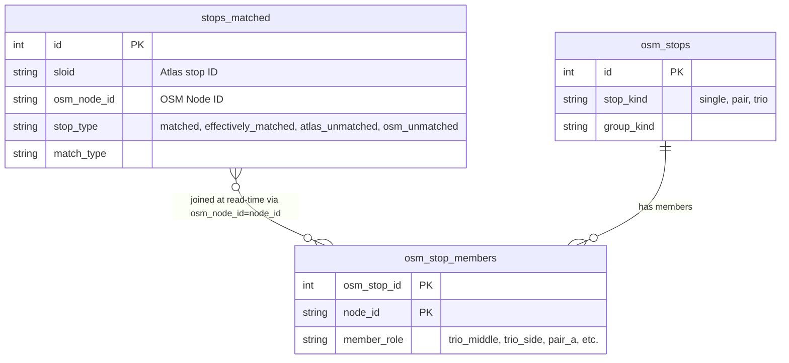

# Global Stats

## Overview

This document details the architecture and aggregation logic powering the global statistics endpoint (`/api/global_stats`). This system calculates live, overarching statistics about the synchronization of public transport stops between ATLAS and OpenStreetMap (OSM) based on active filter criteria.

## Data Schema Context

To understand the global stats aggregation, it's essential to map out how stops are modeled and relate to each other:



In our domain, an **OSM stop** can represent complex logical units (e.g., pairs or trios of nodes). Statistics must properly track these logical units, treating them as matched when their constituent nodes meet specific success criteria.

## Request Filtering Contract

The global stats query uses the canonical filter model defined in [6.2 Filters and Search logic](./6.2%20Filters%20and%20Search%20logic.md). This includes stop scope, match methods, smart-search tokens, ATLAS attributes, OSM attributes, OSM groups, duplicate filtering, and Top N distance mode.

The stats-specific rule is scope: `/api/global_stats` is filter-scoped, not viewport-scoped. It mirrors the active UI filters, but it does not consume map bounding-box parameters (`min_lat`, `max_lat`, `min_lon`, `max_lon`).

Implementation-wise, `/api/global_stats` reuses shared filtering helpers (`parse_filter_params`, `QueryBuilder.apply_common_filters`, `resolve_stop_type_match_filters`, `build_stop_scope_condition`) to keep scope and attribute semantics aligned with other filtered endpoints.

### Supported Request Parameters

`_build_scoped_global_stats_query` reads the same active filter parameters as the map summary:

| Parameter | Purpose |
|-----------|---------|
| `stop_filter`, `match_method` | Stop scope and matched/unmatched sub-filters |
| `station_filter`, `filter_types`, `route_directions` | Smart-search tokens and route filters |
| `transport_types`, `osm_entity_types`, `osm_operator`, `osm_group_types` | OSM-side attribute and group filters |
| `atlas_operator` | ATLAS operator filter |
| `show_duplicates_only` | Structural ATLAS duplicate membership filter |
| `top_n` | Matched-only largest-distance slice |

There is no stats-specific cache-key builder in the current implementation.

## Aggregation Logic & Optimizations

Calculating precise statistics in real time requires navigating large relationships, leading to complex count logic.

### Denormalization of Match States

Historically, evaluating if a complex entity (like a trio) was successfully paired involved expensive cross-database subqueries. We bypassed this by utilizing **denormalization**.

During the data import/ingestion process, if a composite structure meets its match criteria (for example, both side nodes of a trio are successfully matched), the relevant node is flagged with `stop_type = effectively_matched`. At read time, the stats engine computes an internal `effective_stop_type` that treats `matched` and `effectively_matched` as matched for aggregation.

### Consolidated Metric Aggregation

ATLAS aggregations and OSM aggregations are processed simultaneously in a single aggregate query.

```sql
WITH f AS (
    SELECT 
        sloid, 
        osm_node_id, 
        effective_stop_type
    FROM stops_matched
    WHERE <Complex Build Conditions>
)
SELECT 
    COUNT(DISTINCT f.sloid) AS total_atlas,
    COUNT(DISTINCT CASE WHEN f.effective_stop_type = 'matched' THEN f.sloid END) AS matched_atlas,
    COUNT(DISTINCT CASE WHEN f.effective_stop_type = 'atlas_unmatched' THEN f.sloid END) AS unmatched_atlas,
    COUNT(CASE WHEN f.effective_stop_type = 'matched' THEN 1 END) AS matched_pairs,
    COUNT(DISTINCT osm_stop_members.osm_stop_id) AS total_osm_stops,
    ...
FROM f
LEFT OUTER JOIN osm_stop_members ON osm_stop_members.node_id = f.osm_node_id
```

By pushing a `LEFT OUTER JOIN` out to `osm_stop_members` onto a derived base subquery (`f`), the database evaluates the shared filter conditions once, then derives both ATLAS and OSM metrics from that filtered row set. The join is by value (`osm_stop_members.node_id = f.osm_node_id`), not a declared foreign key from `stops_matched`.

The payload fields are:

| Field | Meaning |
|-------|---------|
| `total_atlas_stops` | Distinct ATLAS SLOIDs in the filtered set |
| `matched_atlas_stops` | Distinct ATLAS SLOIDs whose effective stop type is matched |
| `total_osm_stops` | Distinct logical OSM stop units reached through `osm_stop_members` |
| `matched_osm_stops` | Distinct logical OSM stop units reached from matched rows |
| `total_osm_nodes` | Distinct raw OSM node IDs in the filtered set |
| `matched_osm_nodes` | Count of matched rows, currently aligned with `matched_pairs_count` |
| `matched_pairs_count` | Number of rows whose effective stop type is matched |
| `unmatched_entities_count` | Unmatched ATLAS count plus unmatched logical OSM stop count |

## Runtime Behavior

The current service computes stats directly from SQL on each request. `backend/services/global_stats.py` does not maintain an application-level memory cache, LRU, or explicit invalidation hook.

The frontend still protects the user experience during rapid filter changes:

- it aborts any in-flight `/api/global_stats` request before starting the next one
- it increments a sequence counter and ignores stale responses
- it sends the same filter params as the active map summary, including `top_n` and `show_duplicates_only`

## UI Integration

These metrics feed the top summary layer over the Leaflet interactive map found in `templates/pages/index.html`. The `stats_overlay()` macro provides the DOM container, and `updateHeaderSummary()` in `static/js/pages/main.js` requests `/api/global_stats` whenever users tweak filter controls (for example "Exact matching", "OSM Pairs", or "Duplicate ATLAS").

Important scope note: this summary is filter-scoped, not viewport-scoped.
