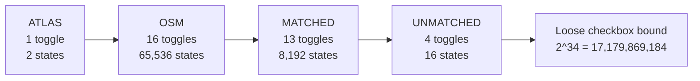
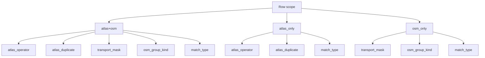
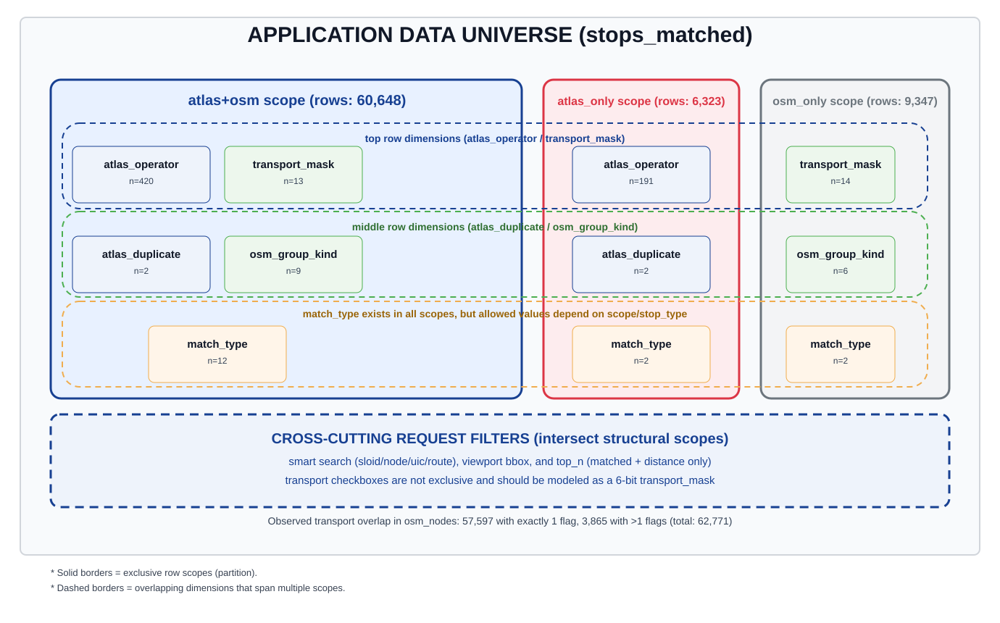
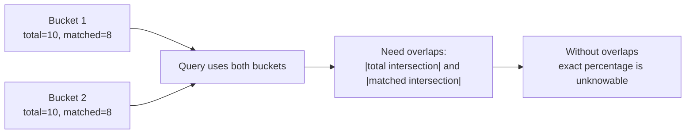
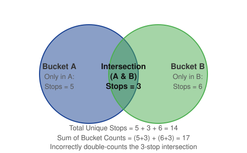
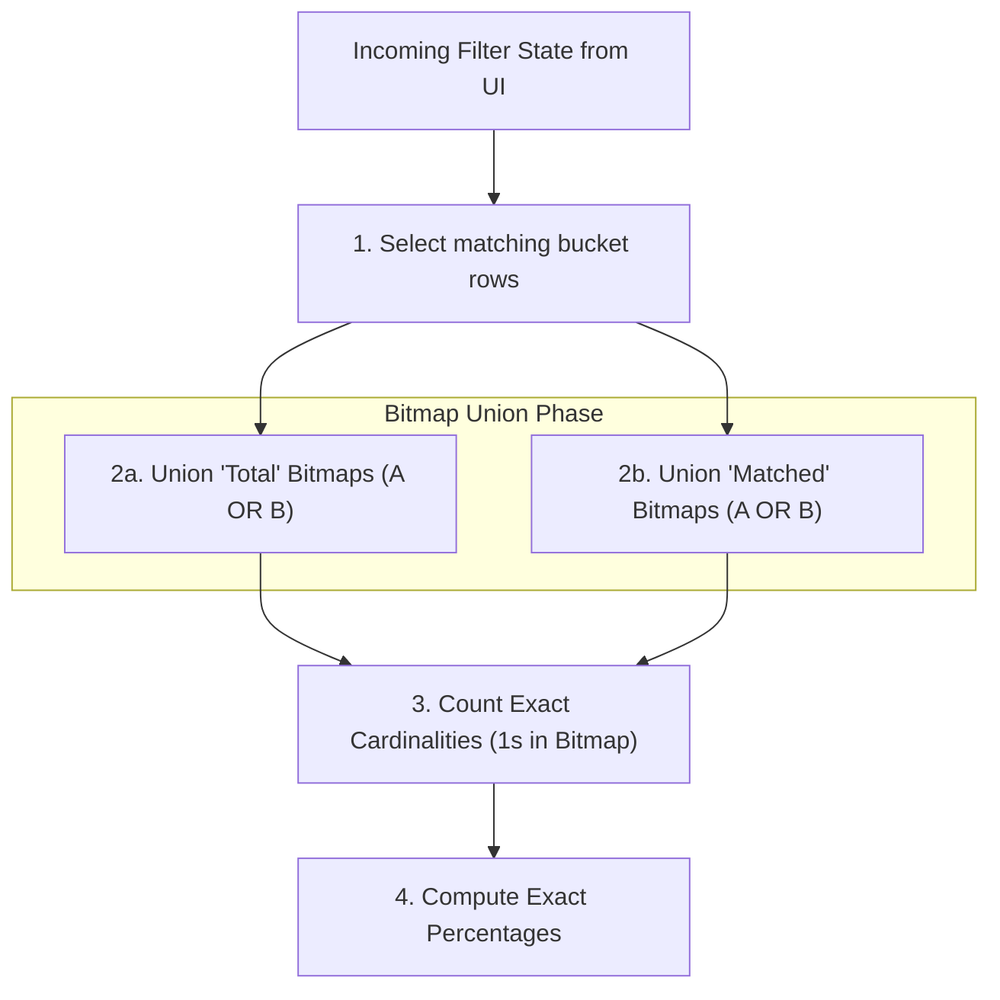

# Global Stats precomputed approach

This document reframes an approach for `/api/global_stats` using math, database measurements and UI checkbox combinatorics.
> [!WARNING]
> **This approach is not implemented; it is a design under consideration.**

The summary stats have the following info, for the applied filters, the OSM stops counts, the ATLAS stops count and the percentage of matched stops for each dataset.

In order to simplify, let's start by ignoring the percentage. 
The idea is that we can precompute the (OSM stops, ATLAS stops) count for all possible combinations (excluding search) that the summary stats can have. So we don't need to query the database and have a faster implementation.

For example, here are three typical combinations that could occur (numbers are just an example):

| Applied Filters | Precomputed Count (OSM stops, ATLAS stops) |
| :--- | :--- |
| Ferry Terminal, Unmatched | (230, 325) |
| Exact Match, ATLAS Duplicate | (125, 0) |
| ATLAS Unmatched, No OSM < 50m | (4000, 0) |

The question is, how many filter combinations do we have?

## 1) Naive UI-State Combinatorics

If we incorrectly treat every visible checkbox as an independent binary state, the current UI gives this deliberately loose upper bound:

This is not a count of reachable semantic states. Several checkboxes are parent controls whose states are derived from, or propagated to, their children.

The ATLAS operator control adds another source of combinatorics.

### ATLAS operators

- Distinct non-empty ATLAS operator values in `atlas_stops`: **432**.
- Blank operator rows in `atlas_stops`: **39**.
- ATLAS-bearing rows therefore have **433 data values** for a bucket dimension if "missing operator" is included.
- The UI operator control is a multi-select, however, so it has up to $2^{432}$ operator subsets—not 433 UI states. Missing operator is not an exposed selection.

Combining the loose checkbox bound with every operator subset gives an upper bound of $2^{34} \times 2^{432} = 2^{466}$ UI combinations. The hierarchy and filter algebra make many of these states equivalent or unreachable, but the number is still enough to rule out precomputing one result per UI selection.

## 2) Overlap vs. Non-Overlap

However, many filters are mutually exclusive (they do not overlap in the data). When filters are mutually exclusive, we do not need to precompute their combined intersections because we can simply combine them at query time by adding them together. 

**Example:**
A stop is either *Matched* or *Unmatched*; it cannot be both. Therefore, we do not need to store a combined bucket for them. We only store the separate base states:
- `Matched` bucket
- `Unmatched` bucket

If a user selects both *Matched* and *Unmatched*, the backend simply retrieves the counts from both buckets and adds them together (`Total = Matched + Unmatched`).

### What overlaps?

### How to read the scope overlap map

This diagram is a visual key for filter applicability and overlap.

1. The three large rounded rectangles are **exclusive row scopes**:
   - `atlas+osm`: rows with both `sloid` and `osm_node_id`
   - `atlas_only`: rows with `sloid` only
   - `osm_only`: rows with `osm_node_id` only
2. Each small card is a dimension that can be applied in that scope.
   - `n=...` is the measured cardinality for that dimension in that scope (from `filter_bucket_analysis.json`).
3. Dashed rounded guides show the **shared horizontal levels** used to compare scopes consistently:
   - top row: `atlas_operator` / `transport_mask`
   - middle row: `atlas_duplicate` / `osm_group_kind`
   - bottom row: `match_type` (present in all three scopes)
4. The bottom dashed panel shows **cross-cutting request filters** (search, bbox, top-N) that intersect the structural scope model.
5. Transport checkboxes are represented as a mask dimension because transport tags are overlapping on real OSM nodes.

Concretely:

1. ATLAS fields (`atlas_operator`, duplicate membership) are N/A for `osm_only`.
2. OSM fields (`transport_mask`, `osm_group_kind`) are N/A for `atlas_only`.
3. `stop_type` categories are exclusive per row.
4. `match_type` is one value per row, but its allowed set depends on scope/stop_type.
5. OSM group membership is exclusive at node level (no node belongs to multiple OSM stop units in current data).
6. Transport checkboxes are not exclusive; they overlap and should be encoded as a mask.

### Dimension applicability matrix

### Transport filter overlap

Transport filter checkboxes are **not fully disjoint** in data:

- OSM nodes with exactly 1 active transport flag: **57,597**.
- OSM nodes with 2 active transport flags: **3,865**.
- OSM nodes with 0 active transport flags: **1,309**.

So transport is better modeled as a **6-bit mask** (ferry, tram, station, platform, stop_position, aerialway), not a single exclusive enum.

## 3) Corrected Scope-Aware Bucket Math

Using measured scope cardinalities from the current dataset:

- `atlas+osm` scope cardinalities:
   - operators: 420
   - duplicate states: 2
   - transport masks: 13
   - OSM group states: 9
   - match_type states: 12
- `atlas_only` scope cardinalities:
   - operators: 191
   - duplicate states: 2
   - match_type states: 2
- `osm_only` scope cardinalities:
   - transport masks: 14
   - OSM group states: 6
   - match_type states: 2

### Piecewise theoretical maximum

$$
\begin{aligned}
B_ {atlas+osm} &= 420 \times 2 \times 13 \times 9 \times 12 = 1{,}179{,}360 \\
B_ {atlas-only} &= 191 \times 2 \times 2 = 764 \\
B_ {osm-only} &= 14 \times 6 \times 2 = 168 \\
B_ {theoretical} &= 1{,}179{,}360 + 764 + 168 = 1{,}180{,}292
\end{aligned}
$$

### Actual populated buckets

From live distinct composite keys:

- `atlas+osm`: 1,978
- `atlas_only`: 289
- `osm_only`: 25
- **Total populated buckets: 2,292**

Occupancy of scope-aware state space:

$$
\frac{2{,}292}{1{,}180{,}292} \approx 0.194\%
$$

For this dataset: **2,292 populated signatures**.

## 4) Table example

A count-only prototype could store one row per populated signature:

| Scope | ATLAS operator | Duplicate | Transport mask | OSM group kind | Match type | ATLAS IDs | OSM stop IDs |
| :--- | :--- | :---: | :--- | :--- | :--- | ---: | ---: |
| `atlas+osm` | `SBB` | `false` | `tram_stop + platform` | `osm_pair_tram` | `exact` | 84 | 42 |
| `atlas+osm` | `SBB` | `true` | `platform` | `single` | `distance_matching_1_uic_ref` | 12 | 12 |
| `atlas_only` | `PostAuto` | `false` | N/A | N/A | `no_nearby_counterpart` | 37 | 0 |
| `osm_only` | N/A | N/A | `ferry_terminal` | `single` | `no_nearby_counterpart` | 0 | 9 |

The numbers are illustrative. This table is useful for understanding the signature dimensions, but the count columns alone are not sufficient for exact unions because the same logical ATLAS or OSM stop can be represented in more than one selected bucket. Section 7 replaces those count columns with identity bitmaps.

## 5) What about percentages?

Percentages depend on exact numerators and denominators:

$$
atlas\_percent = matched\_atlas\_stops / total\_atlas\_stops,
\quad
osm\_percent = matched\_osm\_stops / total\_osm\_stops
$$

If a query spans multiple buckets, exact totals require overlap information.

$$
|A \cup B| = |A| + |B| - |A \cap B|
$$

Counts (and per-bucket percentages) do not contain $|A \cap B|$. Therefore:

- arithmetic average of bucket percentages is wrong,
- weighted average is also wrong unless buckets are truly disjoint partitions for that metric.

## 6) Why Simple Counting Fails (The Double-Counting Problem)

At first glance, it might seem like we could just store a simple "Count" integer for each of our 2,292 buckets. However, if a user's filter selects *multiple* buckets, adding those counts together often leads to double-counting. 

Why? Because a single entity (like a specific OSM stop or ATLAS platform) can belong to multiple buckets at the same time. 

Consider a user answering the question: **"Show me stops that are Ferry Terminals OR Tram Stops"**.

If we only stored numbers:
- `Bucket A (Ferry Terminals)` = 8 stops
- `Bucket B (Tram Stops)` = 9 stops 

If we simply add $8 + 9 = 17$, the result is wrong because 3 stops are *both* ferry terminals and tram stops. The true answer is 14 unique stops. We need the mathematical union of these sets, not just their sum!

**The Core Takeaway:** 
To calculate exact intersections and unions without scanning the database, we cannot just store numbers. We must store the **exact identity (IDs)** of which stops belong to which bucket. Information theory proves that a simple count permanently loses the identity information required to compute a correct union cardinality.

---

## 7) The Solution: Buckets + Bitmaps Design

The practical, exact design is a persisted **"Bucket + Bitmap"** model. This provides the speed of precomputation without sacrificing the accuracy of individual records.

### A) The Bucket Table
We keep one row in the database per populated bucket signature across the filter dimensions:
- Dimensions like `atlas_operator`, `match_type`, and the transport flags (`is_tram_stop`, etc.).

### B) Bitmaps (Compressed ID Sets)
Instead of storing a single integer count like `total_osm: 50` in each bucket row, we store a highly compressed list of the actual database IDs, known as a **Bitmap** (e.g., using a library like Roaring Bitmaps).

For each bucket, we store a separate bitmap for:
- `atlas_total_ids`
- `atlas_matched_ids`
- `osm_stop_total_ids`
- `osm_stop_matched_ids`

### C) The Query Algorithm
When a user requests stats with filters applied:

1. **Find Buckets:** The database selects the rows (buckets) that match the filter criteria.
2. **Merge Bitmaps:** Rather than adding numbers, the backend performs a fast bitwise `OR` union on the matching bitmaps. If Stop ID #123 appears in three different buckets, the bitwise union ensures it is only counted *once*.
3. **Get Exact Count:** Once the bitmaps are united, we simply ask the bitmap, "How many bits are set to 1?" That gives us the exact cardinality.
4. **Compute Percentages:** Finally, we compute accurate match percentages based on the exact totals.

This design can keep the statistics exact while solving the Venn-overlap problem. Its actual performance and storage cost would still need to be validated against the production dataset and PostgreSQL deployment.
